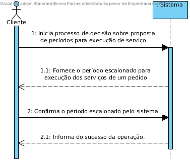

# UC11 - Decidir Sobre Periodo Proposto Para Realização de Serviços

## Formato Breve

O cliente inicia o caso de uso. O sistema informa o cliente sobre os períodos escalonados para realização dos serviços de um determinado pedido de prestação de serviço por ele realizado. O cliente confirma ou rejeita os horários fornecidos pelo sistema. Se confirmado, o sistema gera ordens de execução de serviços para cada serviço do pedido. Se rejeitado, o sistema tenta gerar outra proposta de período para realização dos serviços durante a próxima execução do processo de escalonamento. Em ambos casos a opção selecionada pelo cliente é guardada.

## SSD

## Formato Completo

### Ator principal

Cliente

### Partes interessadas e seus interesses
* **Empresa:** pretende gerar as ordens de execução de serviço.
* Cliente: pretende que as ordens de execução de serviço sejam geradas para que os serviços do seu pedido sejam realizados.
* Prestador de Serviço: pretende que as ordens de execução sejam geradas para poder realizar serviços.

### Pré-condições
Devem ser geradas as propostas para realização dos serviços (UC10) para o pedido de prestação de serviço do cliente.

### Pós-condições
A decisão do cliente é guardada no sistema.
Se o período proposto for aceito, são geradas ordens de execução de serviço para os serviços do pedido.
Se o período proposto for rejeitado, uma nova proposta de para realização dos serviços deve ser gerada (UC10).

## Cenário de sucesso principal (ou fluxo básico)

1. O Cliente inicia o processo de decisão sobre a proposta para realização dos serviços.
2. O Sistema fornece a proposta de período para realização dos serviços definidos no pedido de prestação de serviço do cliente.
3. O Cliente confirma a proposta de horários.
4. O Sistema regista a decisão do Cliente e gera ordens de execução de serviço para cada serviço do pedido.

### Extensões (ou fluxos alternativos)

*a. O Cliente cancela o processo de decisão sobre periodo proposto para realização dos serviços.

> O caso de uso termina.

3a. O Cliente rejeita a proposta fornecida pelo sistema.
>	1. O Sistema regista a decisão do Cliente.
>	2. O Sistema tenta gerar outra proposta de período para realização dos serviços do pedido durante a próxima execução do processo de escalonamento (UC10).
>	3. O caso de uso termina.

### Requisitos especiais
\-

### Lista de Variações de Tecnologias e Dados
\-

### Frequência de Ocorrência
\-

### Questões em aberto
\-

