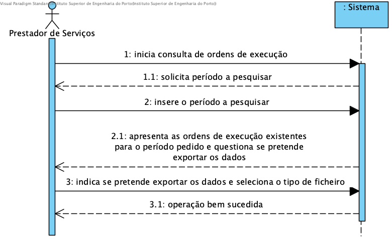

# UC12 - Consultar Ordens de Execução de Serviço

## Formato Breve

O Prestador de Serviços inicia a consulta de ordens de execução de serviços. O sistema solicita o período referente às ordens de execução. O prestador indica o período. O sistema mostra as ordens de execução de serviços e questiona se o prestador pretende exportar estes dados.

## SSD

## Formato Completo

### Ator principal

Prestador de Serviços

### Partes interessadas e seus interesses
* **Prestador de serviços:** tem interesse em consultar as ordens de execução que lhe estão atribuídas num dado período.
* **Empresa:** tem interesse em manter os prestadores informados acerca das suas ordens de execução.

### Pré-condições

### Pós-condições

## Cenário de sucesso principal (ou fluxo básico)
1. O Prestador de Serviços inicia a consulta de ordens de execução de serviços.
2. O sistema pede que seja indicado qual o período a pesquisar.
3. O Prestador de Serviços indica o período a pesquisar.
4. O sistema mostra as ordens de execução de serviços existentes para o período selecionado e questiona o Prestador de Serviços se este pretende exportar os dados exibidos.
5. O Prestador de Serviços indica se pretende exportar os dados e seleciona o formato.
6. Operação bem sucedida.

### Extensões (ou fluxos alternativos)

### Requisitos especiais
\-

### Lista de Variações de Tecnologias e Dados
\-

### Frequência de Ocorrência
\-

### Questões em aberto

\-
