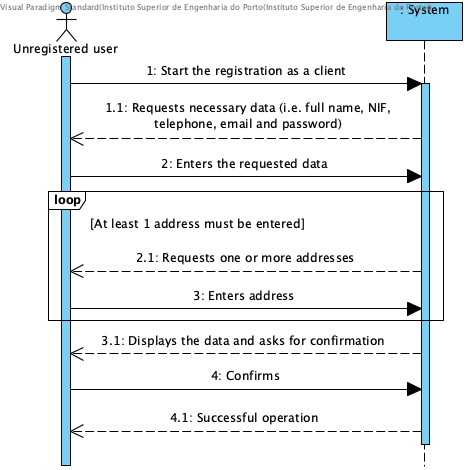

# UC1 - Register as a Client

## Brief Description

The unregistered user starts the registration as a client. The system requests the necessary data (i.e. the person's full name, NIF, telephone contact, email, password, and at least one postal address). The unregistered user enters the requested data. The system validates and displays the data, asking you to confirm them. The unregistered user confirms. The system records the customer and registered user data and informs the unregistered user of the success of the operation.

## SSD

## Full Description

### Primary Actor

Unregistered user

### Stakeholders and their interests
* **Unregistered User:** intends to register so that you can enjoy the services provided by the company.
* **Company:** intends that the person concerned becomes a client in order to request services.

### Preconditions
n/a

### Postconditions
The registration information is stored in the system.

## Main Success Scenario

1. The unregistered user starts the registration as a client.
2. The system requests the necessary data (i.e. the person's full name, NIF, telephone contact, email and password).
3. The unregistered user enters the requested data.
4. The system requests a postal address.
5. The unregistered user enters the postal address.
6. The system validates and stores the entered address.
7. Steps 4 to 6 are repeated until all the required postal addresses are entered (minimum 1).
8. The system validates and displays the data, asking you to confirm them.
9. The unregistered user confirms.
10. system registers the customer and registered user data and informs the unregistered user of the success of the operation.

### Exception conditions (alternative flow)

*a. The unregistered user requests the cancellation of the registration.

> The use case ends.

** 4a. NIF and / or duplicate e-mail address **
> 1. The system informs the user about the duplication of the data.
> 2. The system allows you to enter new data (step 3)
>
> 2a. The unregistered user does not change the data. The use case ends.

6b. Incomplete Postal Address Information.
> 1. The system informs you of missing data.
> 2. The system allows the missing data to be entered (step 5)
>
> 2a. The unregistered user does not change the data. The use case ends.

8a. Required minimum data missing.
> 1. The system informs you of missing data.
> 2. The system allows the missing data to be entered (step 3)
>
> 2a. The unregistered user does not change the data. The use case ends.

8b. The system detects that the data (or some subset of the data) entered must be unique and already exist in the system.
> 1. The system alerts the unregistered user to the fact.
> 2. The system allows you to change it (step 3)
>
> 2a. The unregistered user does not change the data. The use case ends.

8c. The system detects that the entered data (or some subset of the data) is invalid.
> 1. The system alerts the unregistered user to the fact.
> 2. The system allows you to change it (step 3).
>
> 2a. The unregistered user does not change the data. The use case ends.

### Special Requirements
\ -

### Variations in Technologies and Data
\ -

### Frequency of Occurrence
\ -

### Open questions

* Are there any other mandatory data besides those already known?
* What data together allow you to detect duplicate customers?
* Is there any additional security mechanism required to confirm that the customer is in fact who he or she claims to be?
* What are the security rules applicable to the password?
* How often does this use case occur?
