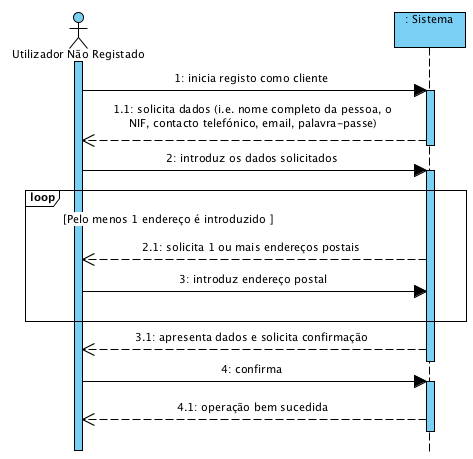

# UC1 - Efetuar Registo como Cliente

## Formato Breve

O utilizador não registado inicia o registo como cliente. O sistema solicita os dados necessários (i.e. nome completo da pessoa, o NIF, contacto telefónico, email, palavra-passe e pelo menos um endereço postal). O utilizador não registado introduz os dados solicitados. O sistema valida e apresenta os dados, pedindo que os confirme. O utilizador não registado confirma. O sistema regista os dados de cliente e de utilizador registado e informa o utilizador não registado do sucesso da operação.

## SSD

## Formato Completo

### Ator principal

Utilizador Não Registado

### Partes interessadas e seus interesses
* **Utilizador Não Registado:** pretende registar-se para que possa usufruir dos serviços prestados pela empresa.
* **Empresa:** pretende que a pessoa em causa se torna cliente de modo a solicitar serviços.

### Pré-condições
n/a

### Pós-condições
A informação do registo é guardada no sistema.

## Cenário de sucesso principal (ou fluxo básico)

1. O utilizador não registado inicia o registo como cliente. 
2. O sistema solicita os dados necessários (i.e. nome completo da pessoa, o NIF, contacto telefónico, email e palavra-passe). 
3. O utilizador não registado introduz os dados solicitados. 
4. O sistema solicita um endereço postal.
5. O utilizador não registado introduz o endereço postal.
6. O sistema valida e guarda o endereço introduzido.
7. Os passos 4 a 6 repetem-se enquanto não forem introduzidos todos os endereços postais pretendidos (minimo 1).
8. O sistema valida e apresenta os dados, pedindo que os confirme. 
9. O utilizador não registado confirma. 
10. sistema **regista os dados de cliente e de utilizador registado** e informa o utilizador não registado do sucesso da operação.

### Extensões (ou fluxos alternativos)

*a. O utilizador não registado solicita o cancelamento da registo.

> O caso de uso termina.

**4a. NIF e/ou endereço de correio eletrônico duplicados.**
>	1. O sistema informa  o utilizador sobre a duplicação dos dados.
>	2. O sistema permite a introdução de novos dados (passo 3)
>
	>	2a. O utilizador não registado não altera os dados. O caso de uso termina.

6b. Dados de Endereço Postal incompletos.
>	1. O sistema informa quais os dados em falta.
>	2. O sistema permite a introdução dos dados em falta (passo 5)
>
	>	2a. O utilizador não registado não altera os dados. O caso de uso termina.
	
8a. Dados mínimos obrigatórios em falta.
>	1. O sistema informa quais os dados em falta.
>	2. O sistema permite a introdução dos dados em falta (passo 3)
>
	>	2a. O utilizador não registado não altera os dados. O caso de uso termina.

8b. O sistema deteta que os dados (ou algum subconjunto dos dados) introduzidos devem ser únicos e que já existem no sistema.
>	1. O sistema alerta o utilizador não registado para o facto.
>	2. O sistema permite a sua alteração (passo 3)
>
	>	2a. O utilizador não registado não altera os dados. O caso de uso termina.

8c. O sistema detecta que os dados introduzidos (ou algum subconjunto dos dados) são inválidos.
> 1. O sistema alerta o utilizador não registado para o facto. 
> 2. O sistema permite a sua alteração (passo 3).
> 
	> 2a. O utilizador não registado não altera os dados. O caso de uso termina. 

### Requisitos especiais
\-

### Lista de Variações de Tecnologias e Dados
\-

### Frequência de Ocorrência
\-

### Questões em aberto

* Existem outros dados obrigatórios para além dos já conhecidos?
* ~~Quais os dados que em conjunto permitem detetar a duplicação de clientes?~~
* É necessário existir algum mecanismo de segurança adicional para confirmar que o cliente é de facto quem diz ser?
* Quais são as regras de segurança aplicaveis à palavra-passe?
* Qual a frequência de ocorrência deste caso de uso?