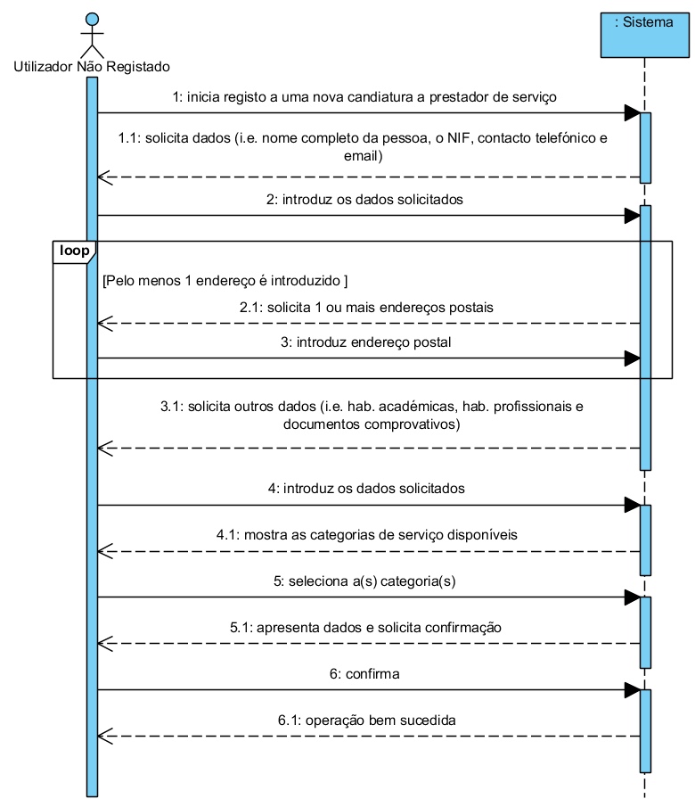

UC2 - Submeter candidatura a prestador de serviço
=================================================

**(Não foi modificado neste iteração)**

Formato breve
-------------

O utilizador não registado inicia o registo de uma nova candidatura a prestador
de serviço. O sistema solicita os dados necessários à candidatura (nome completo
da pessoa, NIF, telefone, email, endereço(s) postal, habilitações académicas e
profissionais, documentos comprovativos). O utilizador não registado introduz os
dados solicitados. O sistema mostra as categorias de serviço e solicita a
seleção daquelas que se propõe vir a realizar. O utilizador não registado
seleciona as categorias pretendidas. O sistema valida e apresenta os dados,
pedindo que os confirme. O utilizador não registado confirma os dados da
candidatura. O sistema regista a nova candidatura e informa o utilizador não
registado do sucesso da operação.

### SSD

Formato completo
----------------

### Ator primário

Utilizador não registado

### Partes interessadas e seus interesses

**Utilizador não registado:** pretende apresentar a sua candidatura a prestador
de serviços prestados pela empresa.

**Empresa:** pretende que qualquer pessoa que deseje colaborar com a empresa
apresente a sua a candidatura a prestador de serviço.

### Pré-condições

n/a

### Pós-condições

A candidatura a prestador de serviço fica registada no sistema.

### Cenário de sucesso principal (ou fluxo básico)

1. O utilizador não registado inicia a submissão de uma nova candidatura.

2. O sistema solicita os dados necessários (i.e. nome completo da pessoa, o NIF, contacto telefónico e email). 

3. O utilizador não registado introduz os dados solicitados.

4. O sistema solicita um endereço postal. 

5. O utilizador não registado introduz o endereço postal. 

6. O sistema valida e guarda o endereço introduzido.

7. Os passos 4 a 6 repetem-se enquanto não forem introduzidos todos os endereços postais pretendidos (minimo 1).

8. O sistema solicita uma habilitação académica.

9. O utilizador não registado introduz a habilitação académica

10. O sistema valida e guarda a habilitação académica.

11. Os passos 8 a 10 repetem-se enquanto não forem introduzidos todas as habilitações académicas.

12. O sistema solicita uma habilitação profissional.

13. O utilizador não registado introduz a habilitação profissional.

14. O sistema valida e guarda a habilitação profissional.

15. Os passos 12 a 14 repetem-se enquanto não forem introduzidos todos as habilitações profissionais.         

16. O sistema solicita documentos comprovativos. 

17. O utilizador não registado introduz documento comprovativo.

18. O sistema valida e guarda documento comprovativo. 

19. Os passos 16 a 18 repetem-se enquanto não forem introduzidos todos os documentos comprovativos.           

20. O sistema mostra as categorias de serviços disponíveis no sistema.

21. O utilizador não registado seleciona a categoria dos serviços que se propõe realizar. 

22. O sistema valida e guarda a categoria selecionada. 

23. Os passos 20 a 22 repetem-se enquanto não forem introduzidas todas as categorias. 

24. O sistema valida e apresenta os dados da candidatura ao utilizador não registado, pedindo que os confirme. 

25. O utilizador não registado confirma os dados da candidatura. 

26. O sistema regista a nova candidatura e informa o utilizador não registado do sucesso da operação.   

### Extensões (ou fluxos alternativos)

\*a. O utilizador não registado solicita o cancelamento da candidatura.

>	O caso de uso termina.

6a. Dados de Endereço Postal incompletos.

>	1.  O sistema informa quais os dados em falta.

>	2.  O sistema permite a introdução dos dados em falta (passo 5)

>	>   2a. O utilizador não registado não altera os dados. O caso de uso termina.

10a. Dados de Habilitação Académica incompletos.

>	1.  O sistema informa quais os dados em falta.

>	2.  O sistema permite a introdução dos dados em falta (passo 9)

>	>   2a. O utilizador não registado não altera os dados. O caso de uso termina.

14a. Dados de Habilitação Profissional incompletos.

>	1.  O sistema informa quais os dados em falta.

>	2.  O sistema permite a introdução dos dados em falta (passo 13)

>	>   2a. O utilizador não registado não altera os dados. O caso de uso termina.

14a. Formato do documento não é suportado.

>	1.  O sistema informa para tal facto.

>	2.  O sistema permite a introdução de outro documento (passo 13)

>	>   2a. O utilizador não registado não altera os dados. O caso de uso termina.

20a. O sistema não tem categorias de serviço para apresentar.

>	1.  O sistema informa que não existem categorias de serviço.

> 	>	O caso de uso avança para o passo 24.

24a. Dados mínimos obrigatórios em falta.

>	1.  O sistema informa quais os dados em falta.

>	2.  O sistema permite a introdução dos dados em falta (passo 3)

>	>   2a. O utilizador não registado não altera os dados. O caso de uso termina.

24b. O sistema deteta que os dados (ou algum subconjunto dos dados) introduzidos
devem ser únicos e que já existem no sistema.

>	1.  O sistema alerta o utilizador não registado para o facto.

>	2.  O sistema permite a sua alteração (passo 3)

>	>   2a. O utilizador não registado não altera os dados. O caso de uso termina.
 
24c. O sistema detecta que os dados introduzidos (ou algum subconjunto dos
dados) são inválidos.

>	1.  O sistema alerta o utilizador não registado para o facto.

>	2.  O sistema permite a sua alteração (passo 3).

>	>   2a. O utilizador não registado não altera os dados. O caso de uso termina.

### Requisitos especiais

n/a

### Lista de variações em tecnologias e dados

n/a

### Frequência de Ocorrência

n/a

### Questões em aberto

-   Quais são os dados obrigatórios para uma candidatura válida?

-   Quais são os dados necessários referentes a uma Habilitação Académica?

-   Quais são os dados necessários referentes a uma Habilitação Profissional?

-   Quais são os dados que identificam univocamente uma candidatura?

-   Como sabe o utilizador não registado que a sua candidatura foi aceite?

-   Existe limite de categorias de serviços a que o utilizador não registado se
    pode candidatar?

-   Quem é responsável por passar o candidato a um prestador de serviço efetivo
    na empresa?
