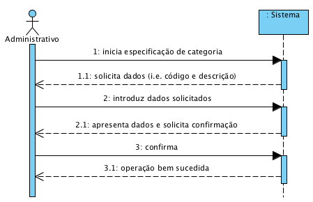

# UC3 - Especificar Categoria (de Serviço)

**(Não foi modificado neste iteração)**

## Formato Breve

O administrativo inicia a especificação de uma nova categoria. O sistema solicita os dados necessários (i.e. código único e descrição). O administrativo introduz os dados solicitados. O sistema valida e apresenta os dados ao administrativo, pedindo que os confirme. O administrativo confirma. O sistema regista os dados e informa o administrativo do sucesso da operação.

## SSD

## Formato Completo

### Ator principal

Administrativo

### Partes interessadas e seus interesses
* **Administrativo:** pretende especificar as categorias de serviços para que possa posteriormente catalogar os vários serviços prestados.
* **Cliente:** a catalogação dos serviços em categorias facilita a realização das suas ações.
* **Empresa:** pretende que seja possível catalogar os seus serviços.

### Pré-condições
n/a

### Pós-condições
A informação da categoria é registada no sistema.

## Cenário de sucesso principal (ou fluxo básico)

1. O administrativo inicia a especificação de uma nova categoria. 
2. O sistema solicita os dados necessários (i.e. código único e descrição). 
3. O administrativo introduz os dados solicitados. 
4. O sistema valida e apresenta os dados ao administrativo, pedindo que os confirme. 
5. O administrativo confirma. 
6. O sistema regista os dados e informa o administrativo do sucesso da operação.

### Extensões (ou fluxos alternativos)

*a. O administrativo solicita o cancelamento da especificação de categoria.

> O caso de uso termina.

4a. Dados mínimos obrigatórios em falta.
>	1. O sistema informa quais os dados em falta.
>	2. O sistema permite a introdução dos dados em falta (passo 3)
>
	>	2a. O administrativo não altera os dados. O caso de uso termina.

4b. O sistema deteta que os dados (ou algum subconjunto dos dados) introduzidos devem ser únicos e que já existem no sistema.
>	1. O sistema alerta o administrativo para o facto.
>	2. O sistema permite a sua alteração (passo 3)
>
	>	2a. O administrativo não altera os dados. O caso de uso termina.

4c. O sistema detecta que os dados introduzidos (ou algum subconjunto dos dados) são inválidos.
> 1. O sistema alerta o administrativo para o facto. 
> 2. O sistema permite a sua alteração (passo 3).
> 
	> 2a. O administrativo não altera os dados. O caso de uso termina. 

### Requisitos especiais
\-

### Lista de Variações de Tecnologias e Dados
\-

### Frequência de Ocorrência
\-

### Questões em aberto

* Existem outros dados que são necessários?
* Quais são os dados obrigatórios para a especificação de uma categoria?
* Quais os dados que em conjunto permitem detectar a duplicação de categorias?
* O código único é sempre introduzido pelo administrativo ou o sistema deve gerá-lo automaticamente?
* Qual a frequência de ocorrência deste caso de uso?