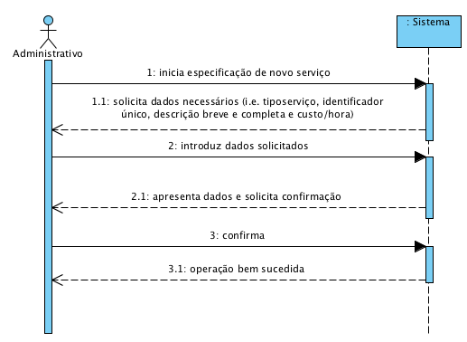

# UC4 - Especificar Serviço

## Formato Breve

O administrativo inicia a especificação de um novo serviço. O sistema solicita os dados necessários (i.e. **tipo de serviço**, o identificador único, descrição breve e completa, a categoria em que é catalogado, e custo/hora). O administrativo introduz os dados solicitados. O sistema valida e apresenta os dados ao administrativo, pedindo que os confirme. O administrativo confirma. O sistema regista os dados e informa o administrativo do sucesso da operação.

## SSD

## Formato Completo

### Ator principal

Administrativo

### Partes interessadas e seus interesses
* **Administrativo:** pretende especificar os serviços prestados para que estes possam ser solicitados pelos clientes.
* **Cliente:** pretende conhecer os serviços que pode solicitar.
* **Empresa:** pretende que os serviços estejam descritos em rigor/detalhe e bem catalogados.

### Pré-condições
n/a

### Pós-condições
A informação do serviço é registada no sistema.

## Cenário de sucesso principal (ou fluxo básico)

1. O administrativo inicia a especificação de um novo serviço. 
2. **O sistema mostra os tipos de serviços suportados e pede para selecionar um.**
3. **O administrativo seleciona o tipo de serviço pretendido.**
4. O sistema solicita os dados necessários (i.e. identificador único, descrição breve e completa e o custo/hora). 
5. O administrativo introduz os dados solicitados. 
6. O sistema mostra a lista de categorias existentes para que seja selecionada uma.
7. O administrativo seleciona a categoria em que pretende catalogar o serviço.
8. **O sistema pede dados adicionais caso o tipo de serviço o justifique.**
9. **O adminstrativo introduz os dados pedidos.**
10. O sistema valida e apresenta os dados ao administrativo, pedindo que os confirme. 
11. O administrativo confirma. 
12. O sistema regista os dados e informa o administrativo do sucesso da operação.

### Extensões (ou fluxos alternativos)

*a. O administrativo solicita o cancelamento da especificação de serviço.

> O caso de uso termina.

**2a. Não existem tipos de serviços definidos no sistema.**
> 1. **O sistema informa o administrativo de tal facto. O caso de uso termina.**

6a. Não existem categorias de serviços definidas no sistema.
>   1. O sistema informa o administrativo de tal facto.
>   2. O sistema permite a criação de uma nova categoria (UC 3).
>
	> 2a. **O administrativo não cria uma categoria. O caso de uso termina.**

**8a. Não é necessário solicitar mais dados.**
> 1. **O sistema avança imediatamente para o passo 10.**
	
10a. Dados mínimos obrigatórios em falta.
>	1. O sistema informa quais os dados em falta.
>	2. O sistema permite a introdução dos dados em falta (passo 3)
>
	>	2a. O administrativo não altera os dados. O caso de uso termina.

10b. O sistema deteta que os dados (ou algum subconjunto dos dados) introduzidos devem ser únicos e que já existem no sistema.
>	1. O sistema alerta o administrativo para o facto.
>	2. O sistema permite a sua alteração (passo 3)
>
	>	2a. O administrativo não altera os dados. O caso de uso termina.

10c. O sistema detecta que os dados introduzidos (ou algum subconjunto dos dados) são inválidos.
> 1. O sistema alerta o administrativo para o facto. 
> 2. O sistema permite a sua alteração (passo 3).
> 
	> 2a. O administrativo não altera os dados. O caso de uso termina. 

### Requisitos especiais
\-

### Lista de Variações de Tecnologias e Dados
\-

### Frequência de Ocorrência
\-

### Questões em aberto

* Todos os dados são obrigatórios para a especificação de um serviço?
* É possível especificar um serviço sem categoria associada?
* Pode um serviço pertencer a mais do que uma categoria?
* Quais os dados que em conjunto permitem detetar a duplicação de serviços?
* O identificador único é sempre introduzido pelo administrativo ou o sistema deve gerá-lo automáticamente?
* Qual é a diferença entre descrição breve e completa? Apenas o comprimento de texto? Outra?
* É preciso guardar o histório de alteração de custo de um serviço?
* Qual a frequência de ocorrência deste caso de uso?