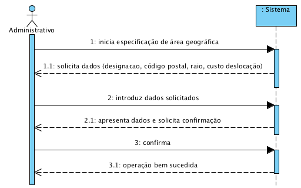

# UC5 - Especificar Área Geográfica

## Formato Breve

O administrativo inicia a especificação de uma nova área geográfica. O sistema solicita os dados necessários (i.e. designação, **código postal, raio,** custo de deslocação). O administrativo introduz os dados solicitados. **O sistema obtém os códigos postais cobertos pela nova area geográfica**, valida e apresenta os dados e ao administrativo, pedindo que os confirme. O administrativo confirma. O sistema regista a nova area geográfica e informa o administrativo do sucesso da operação.

## SSD

## Formato Completo

### Ator principal

Administrativo

### Partes interessadas e seus interesses
* **Administrativo:** pretende especificar as áreas geográficas e os custos de deslocação associados.
* **Cliente:** pretende saber em que áreas geográficas a empresa presta serviços e os custos de deslocação.
* **Empresa:** pretende que as áreas geográficas estejam descritas em rigor/detalhe.

### Pré-condições
n/a

### Pós-condições
A informação da área geográfica é registada no sistema.

## Cenário de sucesso principal (ou fluxo básico)

1. O administrativo inicia a especificação de uma nova área geográfica.
2. O sistema solicita os dados necessários (i.e. designação, **código postal, raio**, custo de deslocação). 
3. O administrativo introduz os dados solicitados. 
4. **O sistema obtém os códigos postais cobertos pela nova area geográfica**, valida e apresenta os dados e ao administrativo, pedindo que os confirme. 
5. O administrativo confirma. 
6. O sistema a nova area geografica e informa o administrativo do sucesso da operação.

### Extensões (ou fluxos alternativos)

*a. O administrativo solicita o cancelamento da especificação da area geográfica.

> O caso de uso termina.
	
4a. Dados mínimos obrigatórios em falta.
> 1. O sistema informa quais os dados em falta.
> 2. O sistema permite a introdução dos dados em falta (passo 3)
>
	> 2a. O administrativo não altera os dados. O caso de uso termina.

4b. O sistema deteta que os dados (ou algum subconjunto dos dados) introduzidos devem ser únicos e que já existem no sistema.
>	1. O sistema alerta o administrativo para o facto.
>	2. O sistema permite a sua alteração (passo 3)
>
	>	2a. O administrativo não altera os dados. O caso de uso termina.

4c. O sistema detecta que os dados introduzidos (ou algum subconjunto dos dados) são inválidos.
> 1. O sistema alerta o administrativo para o facto. 
> 2. O sistema permite a sua alteração (passo 3).
> 
	> 2a. O administrativo não altera os dados. O caso de uso termina. 

**4d. O sistema não consegue determinar os códigos postais cobertos pela área geográfica**
> 1. O sistema alerta o administrativo para o facto. 
>  O caso de uso termina. 

### Requisitos especiais
\-

### Lista de Variações de Tecnologias e Dados
\-
**O sistema deve recorrer a um serviço externo definido por configuração para obter os códigos postais abrangidos pela area geográfica** 

### Frequência de Ocorrência
\-

### Questões em aberto

* ~~Existem outros dados que são necessários para identificar a área geográfica?~~
* ~~Quais  os dados que são obrigatórios para identificar uma área geográfica?~~
* Quais os dados que em conjunto permitem detectar a duplicação de áreas geográficas?
* É necessário manter algum histórico do custo de deslocalção associada à área geográfica?
* Qual a frequência de ocorrência deste caso de uso?
* **O sistema deve alertar para sobreposições territoriais entre áreas geográficas?**
* **Os códigos postais obtidos através do serviço externo podem ser modificados (adicionados, removidos) pelo administrativo?** 
