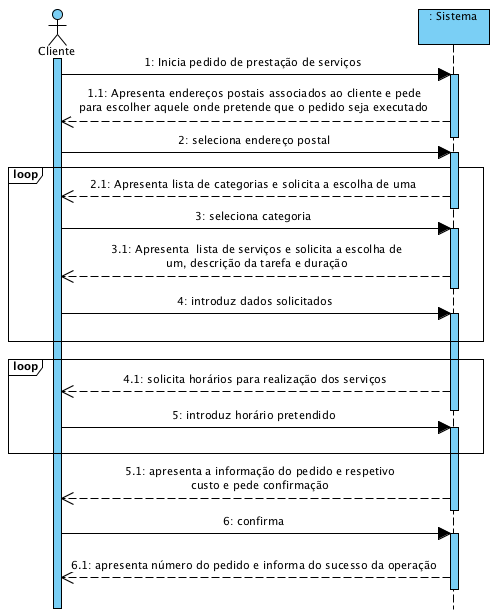

# UC6 - Efetuar Pedido de Prestação de Serviços

## Formato Breve

O cliente inicia o pedido de prestação de serviços. O sistema mostra os endereços postais associados ao cliente e pede-lhe para escolher o endereço no qual pretende que os serviços sejam prestados. O cliente seleciona o endereço postal pretendido. O sistema apresenta as categorias de serviços e pede ao cliente para selecionar uma. O cliente seleciona a categoria e o sistema apresenta os serviços dessa categoria, pedindo ao cliente para selecionar um deles. O cliente seleciona o serviço pretendido, complementa o pedido com uma descrição representativa da tarefa que pretende que seja executada e, no caso de serviços que permitam a especificação da duração, também informa qual é a duração esperada para a execução da tarefa. A seleção de categorias e serviços descrita anteriormente repete-se até que todos os serviços pretendidos pelo cliente estejam especificicados. Posteriormente, o sistema solicita a introdução de um ou mais horários (data e hora de início) preferidos para a execução da tarefa. O cliente introduz esses horários. O sistema valida o pedido, calcula o seu custo estimado e apresenta o resultado ao cliente pedindo-lhe que confirme. O cliente confirma o pedido. O sistema regista-o, atribui-lhe um número sequencial, **envia a informação do pedido por email ao cliente** e apresenta-o ao cliente juntamente com uma mensagem de sucesso.

## SSD

## Formato Completo

### Ator principal

Cliente

### Partes interessadas e seus interesses
* **Cliente:** pretende registar o pedido para que possa usufruir dos serviços prestados pela empresa.
* **Empresa:** pretende que os clientes possam solicitar serviços.

### Pré-condições
- Existir pelo menos um serviço definido no sistema.

### Pós-condições
A informação do pedido é guardada no sistema.

## Cenário de sucesso principal (ou fluxo básico)

1. O cliente inicia o pedido de prestação de serviços. 
2. O sistema mostra os endereços postais associados ao cliente e pede-lhe para escolher o endereço no qual pretende que os serviços sejam prestados. 
3. O cliente seleciona o endereço postal pretendido. 
4. O sistema apresenta as categorias de serviços e pede ao cliente para selecionar uma. 
5. O cliente seleciona a categoria pretendida.
6. O sistema apresenta os serviços dessa categoria, pedindo ao cliente para selecionar um deles e complemente com uma descrição representativa da tarefa a executar e, no caso de serviços que permitam a especificação da duração, também informa qual é a duração esperada para a execução da tarefa. 
7. O cliente seleciona o serviço pretendido e introduz a descrição e duração estimada.
8. O sistema valida e guarda a informação introduzida. 
9. Os passos 4 a 8 repetem-se até que todos os serviços pretendidos pelo cliente estejam especificicados. 
10. O sistema solicita a introdução de um horário (data e hora de início) preferido para a execução da tarefa. 
11. O cliente introduz o horário pretendido. 
12. O sistema valida e guarda o horário introduzido.
13. Os passos 10 a 12 repetem-se até que pelo menos um horário esteja definido.
14. O sistema valida o pedido, calcula o custo estimado e apresenta o resultado ao cliente pedindo-lhe que confirme. 
15. O cliente confirma o pedido. 
16. O sistema regista-o, atribui-lhe um número sequencial, **envia a informação do pedido por email ao cliente**  e apresenta-o ao cliente juntamente com uma mensagem de sucesso.

### Extensões (ou fluxos alternativos)

*a. O cliente solicita o cancelamento da registo.

> O caso de uso termina.

2a. O sistema deteta que o cliente apenas possui um endereço postal.
>	1. O sistema assume o endereço postal conhecido e informa o cliente disso.
>	2. O sistema avança para o passo 4.

**3a. O cliente informa que pretende usar um outro endereço postal.**
>	1. O sistema permite que o cliente associe um outro endereço postal à sua informação (UC7).
>	2. O sistema volta para o passo 2.

6a. Não existem serviços especificados para a categoria pretendida.
> 1. O sistema informa o cliente de tal facto.
> 2. O sistema permite a selecção de outra categoria (passo 5).

	
8a. Dados mínimos obrigatórios em falta.
>	1. O sistema informa quais os dados em falta.
>	2. O sistema permite a introdução dos dados em falta (passo 7)

12a. Dados mínimos obrigatórios em falta.
>	1. O sistema informa quais os dados em falta.
>	2. O sistema permite a introdução dos dados em falta (passo 10)

14a. O sistema detecta que os dados introduzidos (ou algum subconjunto dos dados) são inválidos.
> 1. O sistema alerta o cliente para o facto. 
> 2. O sistema permite a sua alteração (passo 3).
> 
	> 2a. O cliente não altera os dados. O caso de uso termina. 

### Requisitos especiais
- **O tempo mínimo para execução de um qualquer serviço é de 30 minutos, sendo apenas possível solicitar múltiplos deste valor.**
- **A indicação de duração está limitada pelo (tipo de) serviço selecionado.**

### Lista de Variações de Tecnologias e Dados
\-

### Frequência de Ocorrência
\-

### Questões em aberto

* O cliente pode fazer um pedido sem especificar uma categoria?
* A descrição da tarefa a executar é um dado obrigatório?
* Qual é o número máximo de horários possíveis?
* ~~Para os serviços que requerem a indicação da quantidade de tempo, esta deverá ser interpretada como sendo a quantidade de tempo máxima ou mínima? É um dado obrigatório?~~
* ~~A quantidade de tempo é um valor em horas. É um valor inteiro ou admite parte decimal?~~
* O sistema deve assumir que existe capacidade infinita para a realização dos serviços?
* Em que consiste a validação do pedido por parte do sistema?
* Pode ser aceite um serviço sem que exista pelo menos um prestador de serviços para a execução da tarefa?
* ~~Existe um horário de disponibilidades para os prestadores de serviços?~~
* O sistema deve aceitar pedidos de todos os clientes, ou existe uma lista de clientes banidos/admitidos (por exemplo blacklist/whitelist de clientes)?
* A aceitação de um pedido de serviço deve implicar o escalonamento de um prestador de serviços para a tarefa?
* O número do pedido (gerado pelo sistema) vai ser apenas mostrado ao cliente ou devemos prever o envio de um email de confirmação?
* Sabendo que o custo é estimado, devemos permitir que o cliente especifique um valor máximo para a execução da tarefa?