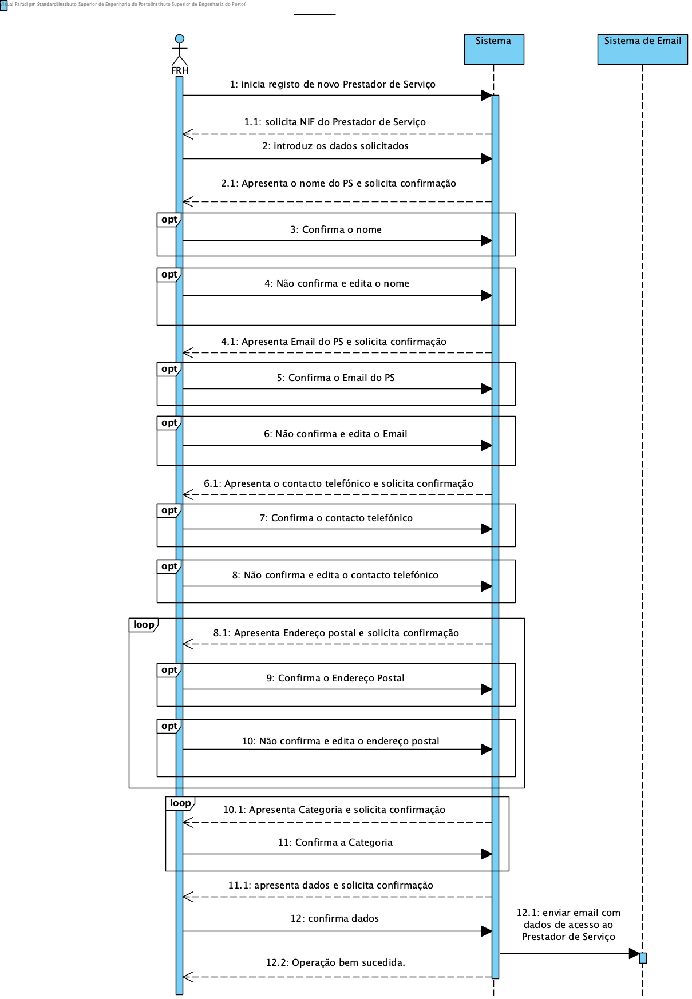

# UC8 - Registar Prestador de Serviço

## Formato Breve

O FRH inicia o registo do novo Prestador de Serviço. O sistema solicita o NIF do prestador de serviços a registar. O FRH indica o NIF do prestador de serviços a registar. O sistema apresenta os dados do prestador de serviços (i.e. nome completo, NIF, email institucional, endereço postal, contacto telefónico, categorias de serviços) indicado e solicita confirmação. O FRH confirma os dados ou procede à sua edição. O sistema valida e apresenta os dados, pedindo que os confirme. O FRH confirma os dados apresentados pelo sistema. O sistema regista os dados do novo Prestador de Serviço e informa o FRH do sucesso da operação. O sistema envia os dados de acesso ao novo Prestador de Serviço.

## SSD

## Formato Completo

### Ator principal

Funcionário de Recursos Humanos (FRH)

### Partes interessadas e seus interesses
* **FRH** pretende registar os Prestadores de Serviço para que seja possível disponibilizar os serviços prestados pela empresa.
* **Empresa:** pretende que o Prestador de Serviço esteja disponível para realizar os serviços solicitados pelos seus clientes.
* **Prestador de Serviço** necessita de ter um perfil de acesso para indicar a sua disponibilidade por forma a realizar os serviços solicitados pelos clientes da Empresa.

### Pré-condições
Existirem Categorias de Serviços e Áreas Geográficas definidas no sistema.

### Pós-condições
A informação do registo é guardada no sistema.

## Cenário de sucesso principal (ou fluxo básico)

1. O FRH inicia o registo dum novo Prestador de Serviço.
2. O sistema solicita o NIF do prestador de serviços a registar.
3. O FRH indica o NIF do prestador de serviços.
4. O Sistema apresenta o nome e solicita confirmação.
5.
	a. O FRH confirma o nome.
	b. O FRH não confirma e edita o nome.
6. O Sistema apresenta o Email e solicita confirmação.
7.
	a. O FRH confirma o Email.
	b. O FRH não confirma e edita o Email.
8. O Sistema apresenta o contacto telefónico e solicita confirmação.
9.
	a. O FRH confirma o contacto telefónico.
	b. O FRH não confirma e edita o contacto telefónico.
10. O Sistema apresenta o apresenta o Endereço Postal e solicita confirmação.
11.
	a. O FRH confirma o Endereço Postal.
	b. O FRH não confirma e edita o Endereço Postal.
12. Os passos 10 e 11 repetem-se para todos os Endereços Existentes na candidatura.
13. O Sistema apresenta Categoria e solicita confirmação.
14. O FRH confirma a categoria.
15. Os passos 13 e 14 repetem-se para todas as categorias presentes na candidatura.
16. O Sistema apresenta todos os dados e solicita confirmação.
17. O FRH confirma os dados.
18. O sistema regista os dados do novo Prestador de Serviço, envia os dados de acesso ao novo Prestador de Serviço e informa o FRH do sucesso da operação.

### Extensões (ou fluxos alternativos)

*a. O FRH solicita o cancelamento da registo.

> O caso de uso termina.

3a. dados de numero mecanográfico e/ou nome completo/abreviado e/ou email duplicados.
>	1. O sistema informa o FRH sobre a duplicação dos dados.
>	2. O sistema permite a introdução de novos dados
>
	>	2a. O FRH não altera os dados. O caso de uso termina.

6a. Dados de Categoria incompletos/duplicados.
>	1. O sistema informa quais os dados em falta ou duplicados
>	2. O sistema permite a introdução de novos dados
>
	>	2a. O FRH não altera os dados. O caso de uso termina.

10a. Dados de Área Geográfica incompletos/duplicados.
  >	1. O sistema informa quais os dados em falta ou duplicados
  >	2. O sistema permite a introdução de novos dados
  >
  	>	2a. O FRH não altera os dados. O caso de uso termina.

12a. O sistema deteta que os dados (ou algum subconjunto dos dados) introduzidos devem ser únicos e que já existem no sistema.
>	1. O sistema alerta o FRH para o facto.
>	2. O sistema permite a sua alteração
>
	>	2a. O FRH não altera os dados. O caso de uso termina.

12b. O sistema detecta que os dados introduzidos (ou algum subconjunto dos dados) são inválidos.
> 1. O sistema alerta o FRH para o facto.
> 2. O sistema permite a sua alteração.
>
	> 2a. O FRH não altera os dados. O caso de uso termina.

### Requisitos especiais
\-

### Lista de Variações de Tecnologias e Dados
\-

### Frequência de Ocorrência
\-

### Questões em aberto

* Existem outros dados obrigatórios para além dos já conhecidos?
* Quais os dados que em conjunto permitem detetar a duplicação de Prestadores de Serviço?
* Quais são as regras de segurança aplicáveis aos dados de acesso?
* Qual é o sistema de email a adotar?
* Temos que suportar mais do que um sistema de email?
* Como é definido qual é o sistema de email a usar?
* Qual a frequência de ocorrência deste caso de uso?
