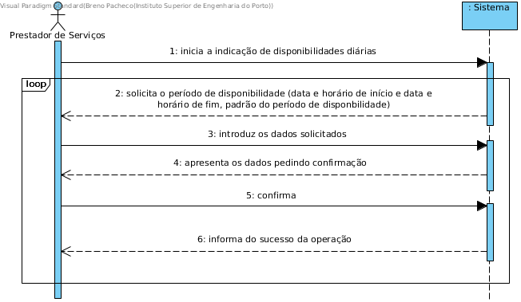

# UC9 - Indicar Disponibilidade Diária

## Formato Breve

O prestador de serviços inicia a identificação da sua disponibilidade diária. O sistema solicita os dados necessários (i.e. data/hora início e fim). O prestador de serviços introduz os dados solicitados. O sistema solicita o padrão do período de disponibilidade (mensal, semanal, quinzenal, nenhum). O prestador de serviços introduz o padrão do período de disponibilidade (se houver). O sistema valida e apresenta os dados ao prestador de serviços pedindo confirmação. O prestador de serviços confirma. O sistema regista a disponibilidade do prestador de serviços e informa o prestador de serviços do sucesso da operação.

## SSD

## Formato Completo

### Ator principal

Prestador de serviços

### Partes interessadas e seus interesses
* **Prestador de serviços:** pretende indicar as suas disponibilidades diárias para efetuar serviços.
* **Empresa:** pretende que as disponibilidades diárias dos prestadores de serviços estejam especificadas no sistema.

### Pré-condições
n/a

### Pós-condições
A informação sobre a(s) disponibilidade(s) diária(s) do prestador de serviços é registada no sistema.

## Cenário de sucesso principal (ou fluxo básico)

1. O prestador de serviços inicia a identificação da sua disponibilidade diária.
2. O sistema solicita um período (data e horário de início, data e horário de fim, padrao do periodo de disponibilidade) em que o prestador de serviços tem disponibilidade para efetuar serviços.
3. O prestador de serviços introduz os dados solicitados.
4. O sistema valida e apresenta os dados pedindo confirmação.
5. O prestador de serviços confirma.
6. O sistema regista o período de disponibilidade do prestador de serviços e informa o prestador de serviços do sucesso da operação.
7. Os passos 2 a 6 repetem-se até que o prestador de serviços tenha indicado todas as suas disponibilidades.

### Extensões (ou fluxos alternativos)

*a. O prestador de serviços solicita o cancelamento da indicação da disponibilidade horária.

> O caso de uso termina.

4a. Dados que identificam o período de disponibilidade estão incompletos.
>	1. O sistema informa quais os dados em falta.
>	2. O sistema permite a introdução dos dados em falta (passo 3)
>
	>	2a. O prestador de serviços não altera os dados. O caso de uso termina.

4b. O sistema deteta que os dados introduzidos (ou algum subconjunto dos dados) são inválidos.
> 1. O sistema alerta o prestador de serviços para o facto.
> 2. O sistema permite a sua alteração (passo 3).
>
	> 2a. O prestador de serviços não altera os dados. O caso de uso termina.
	
4c. O sistema deteta que a disponibilidade indicada se sobrepõe (i.e. interseta) com outra disponibilidade indicada anteriormente.
>	1. O sistema alerta o prestador de serviços para o facto.
>	2. O sistema permite a sua alteração (passo 3)
>
	>	2a. O prestador de serviços não altera os dados. O caso de uso termina.

### Requisitos especiais

### Lista de Variações de Tecnologias e Dados
\-

### Frequência de Ocorrência
\-

### Questões em aberto

* O prestador de serviços deve indicar a disponibilidade diária para cada tipo de serviço?
* Qual a frequência de ocorrência deste caso de uso?
