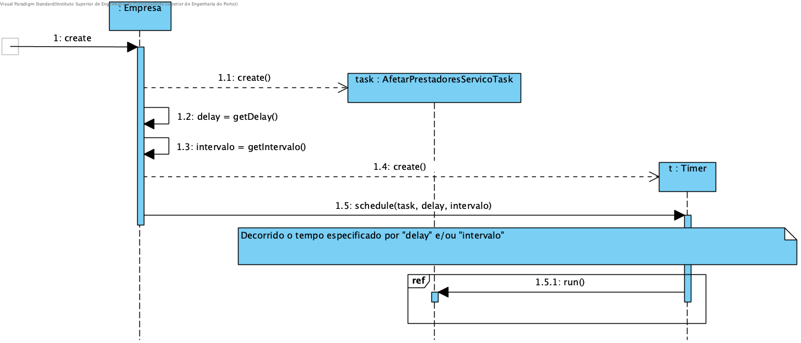
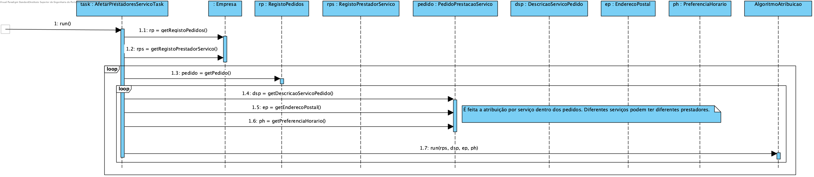
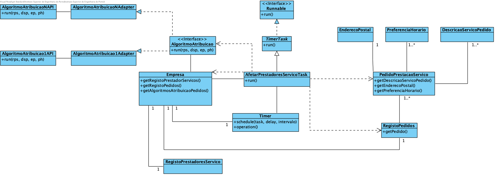

# Realização de UC10 - Afetar Prestadores a Pedidos

## Racional

| Fluxo Principal                                                                                        | Questão: Que Classe...                                      | Resposta                                       | Justificação                                                                                                         |
|:-------------------------------------------------------------------------------------------------------|:------------------------------------------------------------|:-----------------------------------------------|:---------------------------------------------------------------------------------------------------------------------|
|1. Inicia a atribuição de pedidos a Prestadores de Serviços. É fornecido o algoritmo de atribuição e os períodos de execução.|... conhece as configurações do Scheduler (i.e. algoritmo de atribuição e períodos de execução)?|Empresa|IE|
||... cria a instância de AfetarPrestadoresServicoTask?|Empresa|Creator|
||... cria a instância de Timer?|Empresa|Creator|
||... guarda os detalhes e o agendamento da execução?|Timer|IE|
||... acciona o processo de atribuição?|Timer|Desencadeador de ações|
||... conhece o Registo de Pedidos?|Empresa|IE|
||... conhece o Registo de Prestadores de Serviços?|Empresa|IE|
||... conhece os algoritmos de atribuição?|Empresa|IE|
||... conhece os Pedidos?|RegistoPedidos|IE|
||... conhece os detalhes dos Pedidos?|PedidoPrestacaoServico|IE|
||... atribui os Pedidos aos Prestadores?| AlgoritmoAtribuicao |PF|
|2. Operação concluída.||||

## Sistematização ##

 Do racional resulta que as classes conceptuais promovidas a classes de software são:

* AfetarPrestadoresServicoTask
* Timer
* AlgoritmoAtribuicao
* Empresa
* RegistoPedidos
* PedidoPrestacaoServico

##	Diagrama de Sequência

##	Diagrama de Classes

