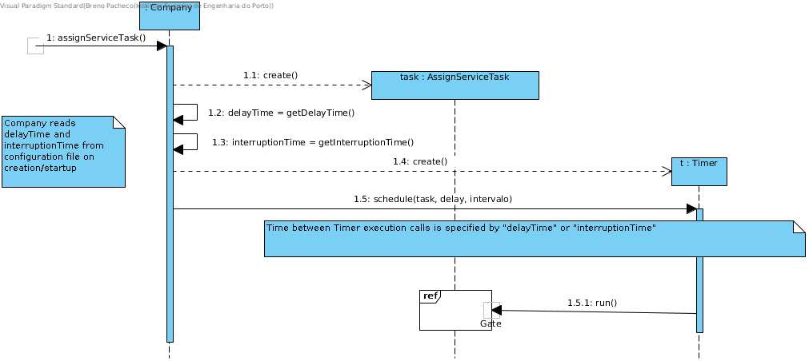
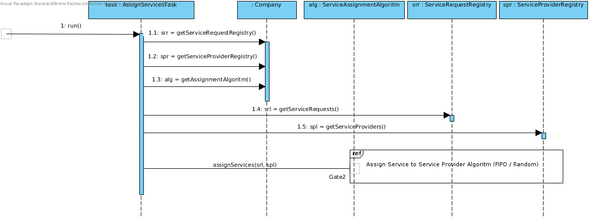
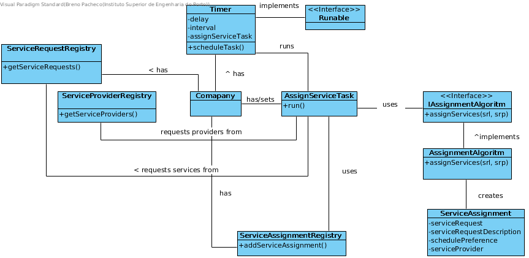

# Realization of UC10 - Assign Service Requests to Service Providers

## Rational

| Home                                                                                                                     | Question: What Class ...                                        | Reply                      | Justification  |
| : ------------------------------------------------- -------------------------------------------------- ----              | : ------------------------------------------------- ----------- | : ---     | : -----        |
| 1. Initiates the assignment of requests to Service Providers. The assignment algorithm and execution times are provided. | ... knows the Timer settings (i.e., algoritm and times)?        | Company                         | IE             |
|                                                                                                                          | ... creates the Timer instance?                                 | Company                           | Creator        |
|                                                                                                                          | ... creates the instance of AssignServicesTask?                 | Company                     | Creator        |
|                                                                                                                          | ... saves the details and scheduling of execution?              | Timer                             | IE             |
|                                                                                                                          | ... triggers the assignment process?                            | Timer                        | Action Trigger |
|                                                                                                                          | ... performs the assignment process?                            | AssignmentTask               | IE             |
|                                                                                                                          | ... creates ServiceAssignment instances?                        | AssignmentAlgoritm      | Creator        |
|                                                                                                                          | ... knows the AssigmentAlgoritm?                                | Company                   | IE             |
|                                                                                                                          | ... holds the ServiceAssignment instances created?              | ServiceAssignmentRegister | IE
|                                                                                                                          | ... knows the ServiceAssignmentRegister?                        | Company                   | IE             |
| 2. Operation completed.                                                                                                  |                                                                 |           |                |

## Sistematization ##

From the rationale it results that the conceptual classes promoted to software classes are:

* ServiceAssigmentTask 
* Timer
* AssigmnentAlgoritm
* Company
* ServiceRequestRegistry
* ServiceProviderRegistry

##	Sequence Diagram

##	Class Diagram

