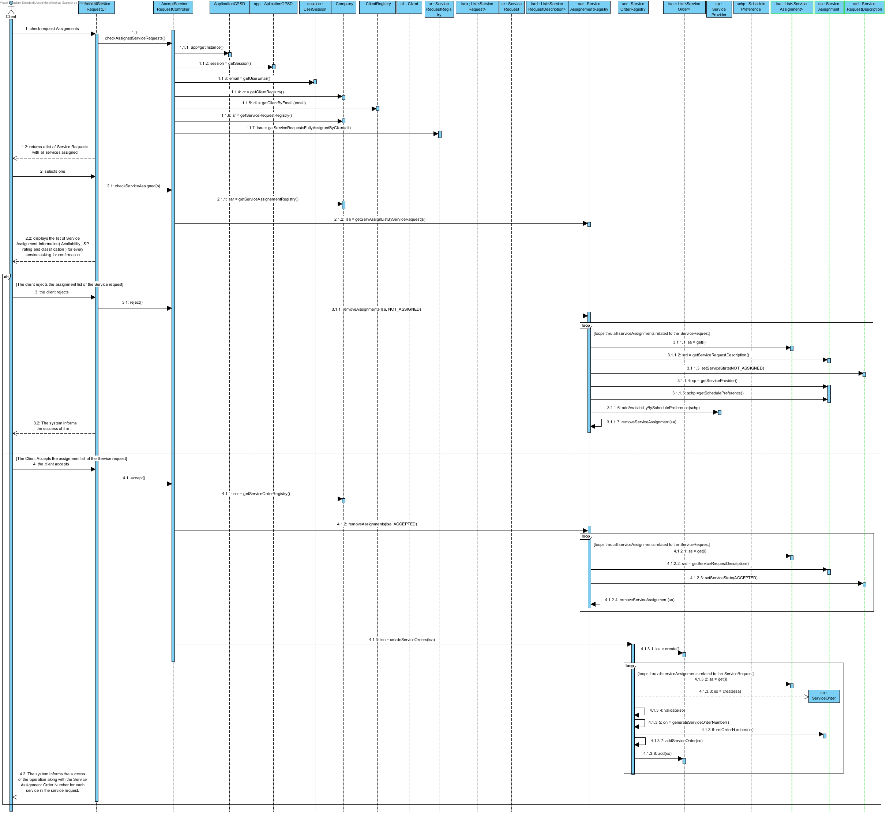
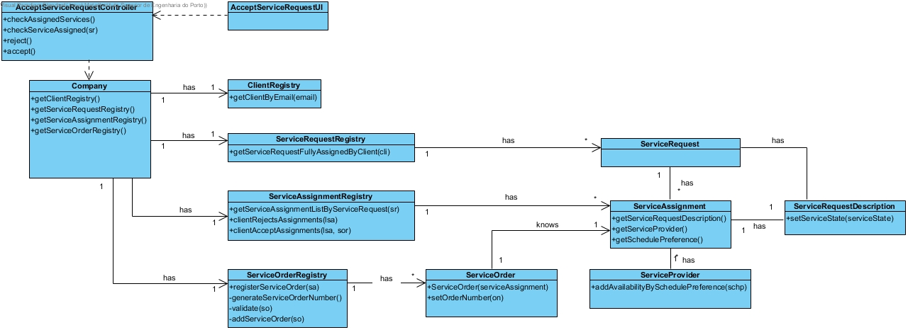

# Realization of UC11 Accept Service Request Assignments

## Rationale

| Main Flow                                                                                        | Question: Witch Class?...                                      | Answer                                       | Justification                                                                                                         |
|:-------------------------------------------------------------------------------------------------------|:------------------------------------------------------------|:-----------------------------------------------|:---------------------------------------------------------------------------------------------------------------------|
|1. The Client begins the Assignment verification. | .. interacts with the user? | AcceptServiceRequestUI | Pure Fabrication |
|| .. controls the UC? | AcceptServiceRequestController | Controller |
|2. The system returns a list of Service Requests with all services assigned.||||
|| .. knows the Client? | ClientRegistry | IE : ClientRegistry has all the information about clients |
|| .. knows ClientRegistry? | Company | LC + HC |
|| .. knows ServiceRequests fully assigned? | ServiceRequestRegistry | IE : ServiceRequestRegistry has information about all the Service Requests |
|3. The Client selects one.||||
|4. The system displays the list of Service Assignment Information( Availability , SP rating and classification ) requesting validation.| .. knows Service assigned? | ServiceAssignedRegistry | IE : ServiceAssignedRegistry has all the information about Service Assignments.|
|| .. who knows ServiceAssignmentRegistry ? | Company | LC + HC |
|5. the client accepts the Assignments.|||| 
|| .. saves service state? | ServiceRequestDescription | IE : The ServiceRequestDescription has information about the state of the request (not assigned, completed, ...) |
|| .. who ServiceRequestDescription? | ServiceAssignment | IE : ServiceAssignment has 1 ServiceRequestDescription |
|| .. creates ServiceOrder? | ServiceOrderRegistry | Creator |
|| .. knows ServiceOrderRegistry? | Company | LC + HC |
|| .. generates Service Order Number? | ServiceOrderRegistry | IE : ServiceOrderRegistry has all the information about Service Orders |
|| .. save ServiceOrder(s)?| ServiceOrderRegistry | IE : ServiceOrderRegistry has information about all the ServiceOrders |
|6. The system informs the success of the operation along with the Service Order Numbers for each service in the service request.||||

## Systematization ##

The conceptual classes from the rationale are promoted to software classes:

 * Company
 * Client
 * ServiceOrder
 * ServiceAssignment
 * ServiceRequest
 * ServiceRequestDescription
 * ServiceProvider

Other software classes (i.e. Pure Fabrication) identified:

 * AcceptServiceRequestUI  
 * AcceptServiceRequestController
 * ClientRegistry
 * ServiceRequestRegistry
 * ServiceAssignmentRegistry
 * ServiceOrderRegistry

##    Sequence Diagram

##    Class Diagram

