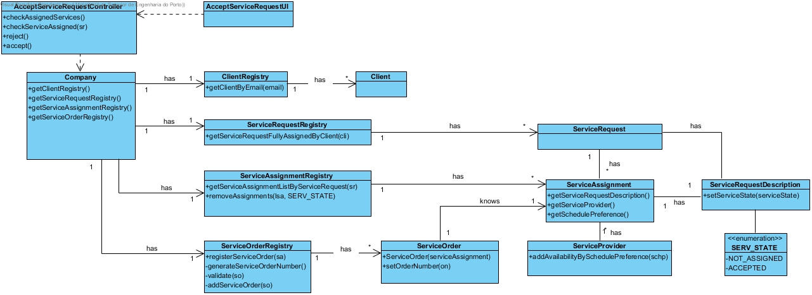

# Realization of UC11 Accept Service Request Assignments

## Rationale

| Main Flow                                                                                        | Question: Witch Class?...                                      | Answer                                       | Justification                                                                                                         |
|:-------------------------------------------------------------------------------------------------------|:------------------------------------------------------------|:-----------------------------------------------|:---------------------------------------------------------------------------------------------------------------------|
|1. The Client begins the Assignment verification.| ... interacts with the user? | AcceptServiceRequestUI | Pure Fabrication |
|| ... controls the UC? | AcceptServiceRequestController | Controller | |
|| ... has information about the client ? | ClientRegistry | IE |
|| ... who knows the ClientRegistry? | Company | HC + LC |
|2. The system displays the Service Assignment Information( Availability , SP rating and classification )| ... has information about service requests assignments? | ServiceAssignmentRegistry | IE |
|| ... who knows the ServiceAssignmentRegistry | Company | HC + LC |
|| ... who has Service Assignment? | ServiceAssignmentRegistry | IE |
|3. The Client Accepts.| ... create/instance ServiceOrder | OrderRegistry | Creator |
|| ... who knows order registry? | Company | HC + LC |
|4. The system informs the success of the operation along with the Service Assignment Order.| ... save the sequential number? | ServiceOrder |IE: instance previously created.|
|| ... notifies the number generated and the success information?| AcceptServiceRequestUI ||
|5. Steps 2 to 4 repeats until the client verify all Assignments.||||

## Systematization ##

The conceptual classes from the rationale are promoted to software classes:

 * Company
 * Client
 * ServiceOrder
 * ServiceAssignment
 * ServiceRequestDescription
 * ServiceProvider
 * SPAvailabilityList
 * Availability

Other software classes (i.e. Pure Fabrication) identified:

 * AcceptServiceRequestUI  
 * AcceptServiceRequestController
 * ClientRegistry
 * ServiceAssignmentRegistry
 * ServiceOrderRegistry

##    Sequence Diagram

##    Class Diagram

