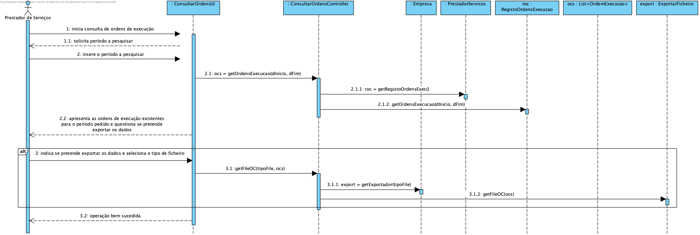
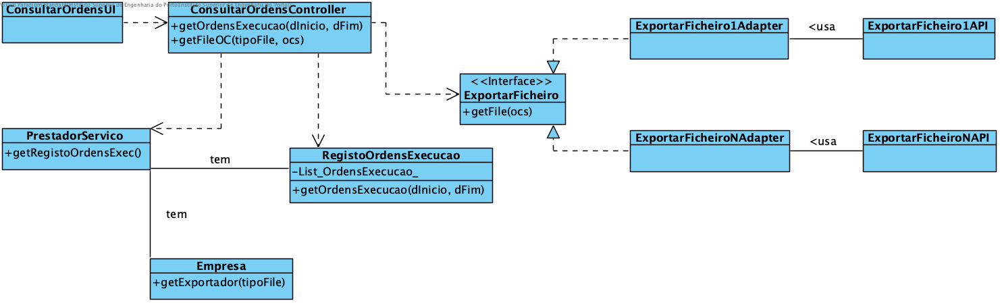

# Realização de UC12 - Consultar Ordens de Execução de Serviços
## Racional

| Fluxo Principal                                                                                        | Questão: Que Classe...                                      | Resposta                                       | Justificação                                                                                                         |
|:-------------------------------------------------------------------------------------------------------|:------------------------------------------------------------|:-----------------------------------------------|:---------------------------------------------------------------------------------------------------------------------|
|1. O prestador de serviços inicia a identificação da sua disponibilidade diária.|... interage com o utilizador?|ConsultarOrdensUI|Pure Fabrication|
||...coordena o UC?|ConsultarOrdensController|Controller|
|2. O sistema solicita um período em que o Prestador pretende consultar as ordens de execução||||
|3. O prestador de serviços introduz os dados solicitados.||||
||...quem conhece a classe RegistoOrdensExecucao?|PrestadorServicos| HC + LC |
||...quem conhece as Ordens de Execução?|RegistoOrdensExecucao| HC + LC |
|4. O Sistema apresenta as ordens de Execução e questiona se se pretende exportar os dados.||||
||...conhece os exportadores de Ficheiros?|Empresa | IE|
||...implementa as particularidades de cada exportador?| ExpotarFicheiroXXXAdapter | IE|
|8. Operação bem sucedida.||||

## Sistematização ##

 Do racional resulta que as classes conceptuais promovidas a classes de software são:
* Empresa
* PrestadorServicos
* ExportarFicheiro

Outras classes de software (i.e. Pure Fabrication) identificadas:  
* ConsultarOrdensUI
* ConsultarOrdensController
* RegistoOrdensExecucao

##	Diagrama de Sequência

##	Diagrama de Classes

