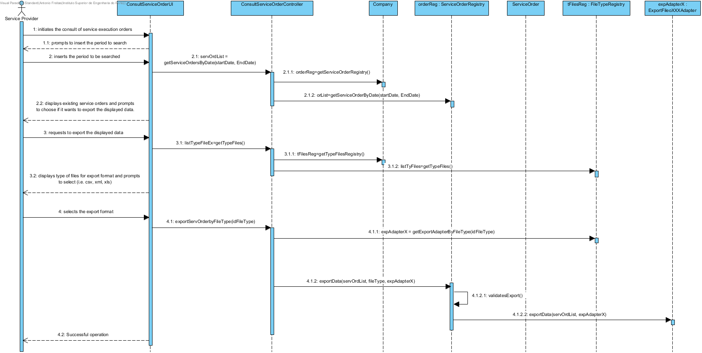
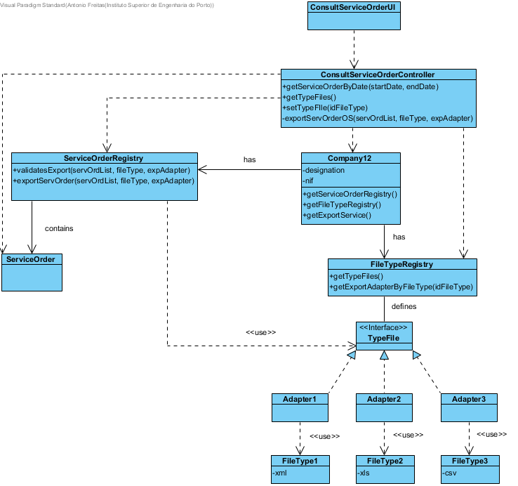

# Realization of UC12 - Preview Service Orders in Main Application

## Rational

| Flow Main                                                                                        | Question: Which class...                                      | Answer                                       | Justification                                                                                                         |
|:-------------------------------------------------------------------------------------------------------|:------------------------------------------------------------|:-----------------------------------------------|:---------------------------------------------------------------------------------------------------------------------|
|1. The Service Provider initiates the consult of service execution orders.|... interacts with the user?|ConsultServiceOrderUI|Pure Fabrication|
||...coordinates the UC?|ConsultServiceOrderController|Controller|
|2. The system prompts to insert the period to search.||||
|3. The Service Provider inserts the period to be searched.||||
||...knows the class ServiceOrderRegistry?|Company|IE|
||...who knows the Service Orders|ServiceOrderRegistry|HC + LC|
|4. The system shows the existing service orders for the selected period and prompts the Service Provider if it wants to export the displayed data.||||
|5. The Service Provider requests to export the displayed data.||||
||...knows the type of exporters of Files?|FileTypeRegistry|HC + LC|
|6. The system displays type of files for export format and prompts to select(i.e. csv, xml, xls).||||
|7. The Service Provider selects the export format.|||||
||...who has the selected orders to export?|ConsultServiceOrderController|coordinates the UC|
||...who is responsible to validate and order the export?|ServiceOrderRegistry|HC+LC|
||...who knows the class responsible to export data|FileTypeRegistry|HC + LC|
||...implements the particularities of each exporter?|ExportFileXXXAdapter|IE|
|8. Successful operation.||||

## Systematization ##

From the rationale results that the following conceptual classes are promoted to software classes are:

 * Company
 * ServiceProvider
 * ExportFileXXXAdapter

Other software classes (i.e. Pure Fabrication) identified:

 * ConsultServiceOrderUI
 * ConsultServiceOrderController
 * ServiceOrderRegistry
 * FileTypeRegistry

##	Detail Diagram

##	Class Diagram

