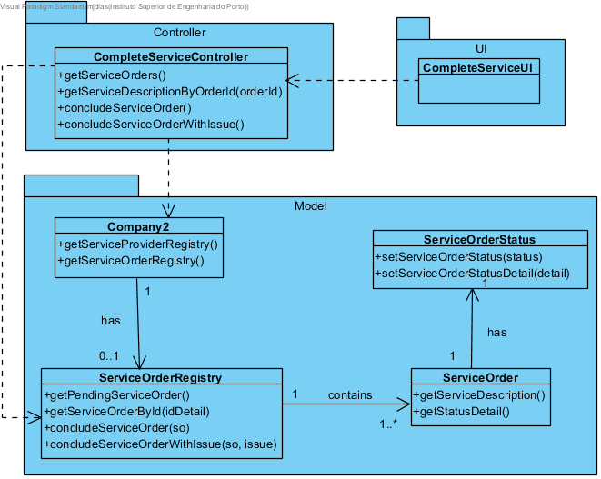

# Realization of UC13 - Complete Service
## Rationale

| Main Flow                                                                                        | Question: Which Class...                                      | Answer                                       | Justification                                                                                                         |
|:-------------------------------------------------------------------------------------------------------|:------------------------------------------------------------|:-----------------------------------------------|:---------------------------------------------------------------------------------------------------------------------|
|1. The Service Provider (SP) initiates the process for completing an execution order.|...interacts with the SP?|CompleteServiceUI|Pure Fabrication|
||...coordinates the UC?|CompleteServiceController|Controller|
|2. The system shows pending service execution orders and requests to select one.|...knows the execution orders?|Company|IE - Information Expert|
||...has the execution orders?|ExecutionOrderRegistry| HC + LC |
||...knows the class ExecutionOrderRegistry?|Company| HC + LC |
||...knows the status of execution orders?|ExecutionOrder|IE|
|3. The Service Provider selects one.||||
|4. The system shows the details of the service of the execution order and asks SP if the service was executed as stipulated.||||
||...knows the service details in the execution orders?|ExecutionOrder|IE|
|5. The SP can confirm or report any occurrence.||||
|6. The service was executed as stipulated, the SP concludes it.|...is responsible for saving the new status of the execution order?|ExecutionOrderStatus|IE|
|7. Something unexpected happened. The system asks for a description of that occurrence.||||
|8. The Service Provider introduce a description reporting the issue and troubleshooting strategy and concludes the service.|...is responsible for saving the new status of the execution order?|ExecutionOrderStatus|IE|
||...is responsible for saving the status detail of the execution order?|ExecutionOrderStatus|IE|
|9. The system stores the information, the execution order changes status to complete and informs the SP of the success of the operation.||||

## Systematization ##

 From rational it results that the conceptual classes promoted to software classes are:  

 * Company  
 * ServiceProvider  
 * ExecutionOrder  
 * ExecutionOrderStatus  

 Other software classes (i.e. Pure Fabrication) identified:  

 * CompleteServiceUI  
 * CompleteServiceController  
 * ExecutionOrderRegistry  

##	Sequence Diagram

##	Class Diagram

