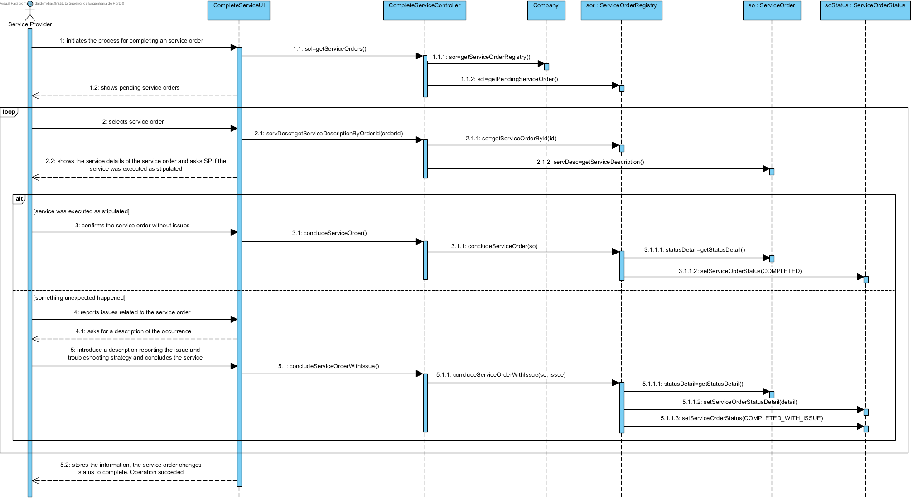

# Realization of UC13 - Complete Service
## Rationale

| Main Flow                                                                                        | Question: Which Class...                                      | Answer                                       | Justification                                                                                                         |
|:-------------------------------------------------------------------------------------------------------|:------------------------------------------------------------|:-----------------------------------------------|:---------------------------------------------------------------------------------------------------------------------|
|1. The Service Provider (SP) initiates the process for completing a service order.|...interacts with the SP?|CompleteServiceUI|Pure Fabrication|
||...coordinates the UC?|CompleteServiceController|Controller|
|2. The system shows pending service orders and requests to select one.|...knows the service orders?|Company|IE - Information Expert|
||...has the service orders?|ServiceOrderRegistry| HC + LC |
||...knows the class ServiceOrderRegistry?|Company| HC + LC |
||...knows the status of service orders?|ServiceOrder|IE|
||...knows the service description of service orders?|ServiceOrder|IE|
|3. The Service Provider selects one.||||
|4. The system shows service details of the service order and asks SP if the service was executed as stipulated.||||
||...knows the service details in the service orders?|ServiceOrder|IE|
|5. The SP can confirm or report any occurrence.||||
|6. The service was executed as stipulated, the SP concludes it.|...is responsible for saving the new status of the service order?|ServiceOrderStatus|IE|
|7. Something unexpected happened. The system asks for a description of that occurrence.||||
|8. The Service Provider introduce a description reporting the issue and troubleshooting strategy and concludes the service.|...is responsible for saving the new status of the service order?|ServiceOrderStatus|IE|
||...is responsible for saving the status detail of the service order?|ServiceOrderStatus|IE|
|9. Steps 3 to 8 are repeated until all the required service orders are concluded.||||
|10. The system stores the information, the service order changes status to complete and informs the SP of the success of the operation.||||

## Systematization ##

 From rational it results that the conceptual classes promoted to software classes are:  

 * Company  
 * ServiceProvider  
 * ServiceOrder  
 * ServiceOrderStatus  

 Other software classes (i.e. Pure Fabrication) identified:  

 * CompleteServiceUI  
 * CompleteServiceController  
 * ServiceOrderRegistry  

##	Sequence Diagram

##	Class Diagram

