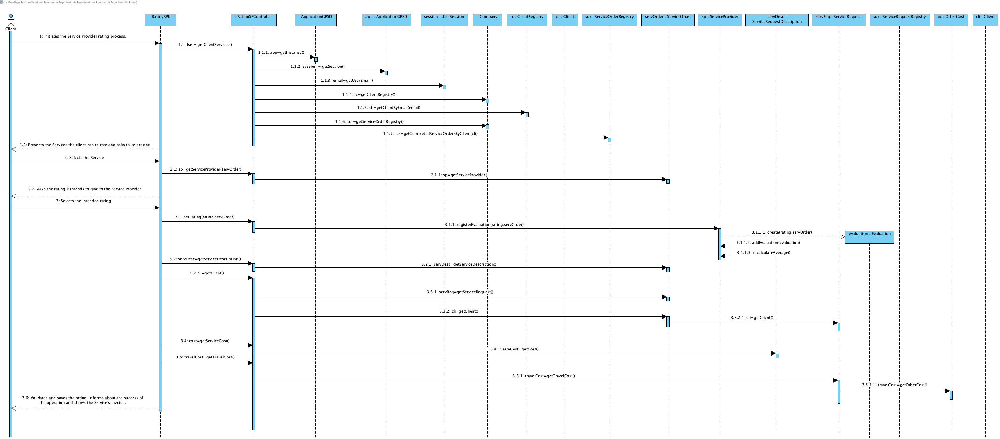
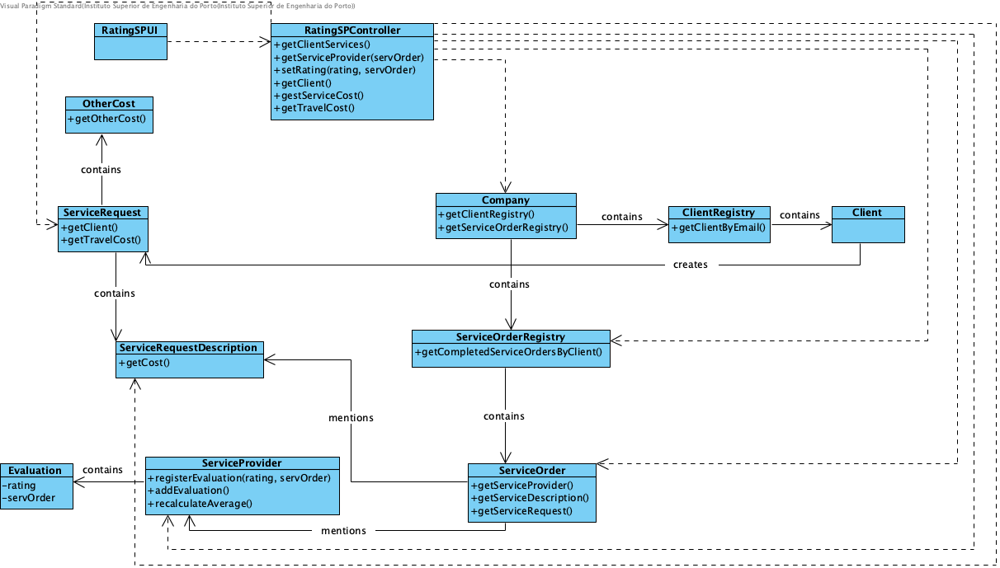

# Realization of UC14 - Rating Service Provider

## Rational

| Main Flow                                                                                        | Question: Which class...                                      | Answer                                       | Justification                                                                                                         |
|:-------------------------------------------------------------------------------------------------------|:------------------------------------------------------------|:-----------------------------------------------|:---------------------------------------------------------------------------------------------------------------------|
| 1. The client initiates the Service Provider rating process. | ... interacts with the user? | RatingSPUI | PureFabrication |
|| ... coordinates the UC? | RatingSPController | Controller|
|| ... knows the Service Orders? | ServiceOrderRegistry | IE|
| 2. The system presents the Services the client has to rate and asks to select one. ||||
| 3. The client selects the Service. | ... knows which Service Provider performed the Service? | ServiceOrder | IE |
| 4. The system asks the rating the Client intends to give to the Service Provider. ||||
| 5. The client selects the intended rating. |...saves the rating related to the Service Order? | Evaluation | IE |
|| ... knows all the ServiceProvider evaluations? | ServiceProvider | IE|
|| ... knows the Client who asked for the Service? | ServiceRequest | IE|
|| ... knows which Service was requested? | ServiceRequestDescription | IE|
|| ... knows the Service's cost? | ServiceRequestDescription | IE|
|| ... knows the Service Request related to the Service Description? | ServiceOrder | IE|
|| ... knows the travel cost? | ServiceRequest | IE|
| 6. The system asks the rating the Client intends to give to the Service Provider. ||||

## Systematization ##

From the rational it results that the conceptual classes promoted to software classes are:

* Company
* Client
* ServiceOrder
* ServiceProvider

Other software classes (i.e. Pure Fabrication) identified:

 * RatingSPUI  
 * RatingSPController
 * ClientRegistry
 * ServiceOrderRegistry

##	Sequence Diagram

##	Class Diagram

