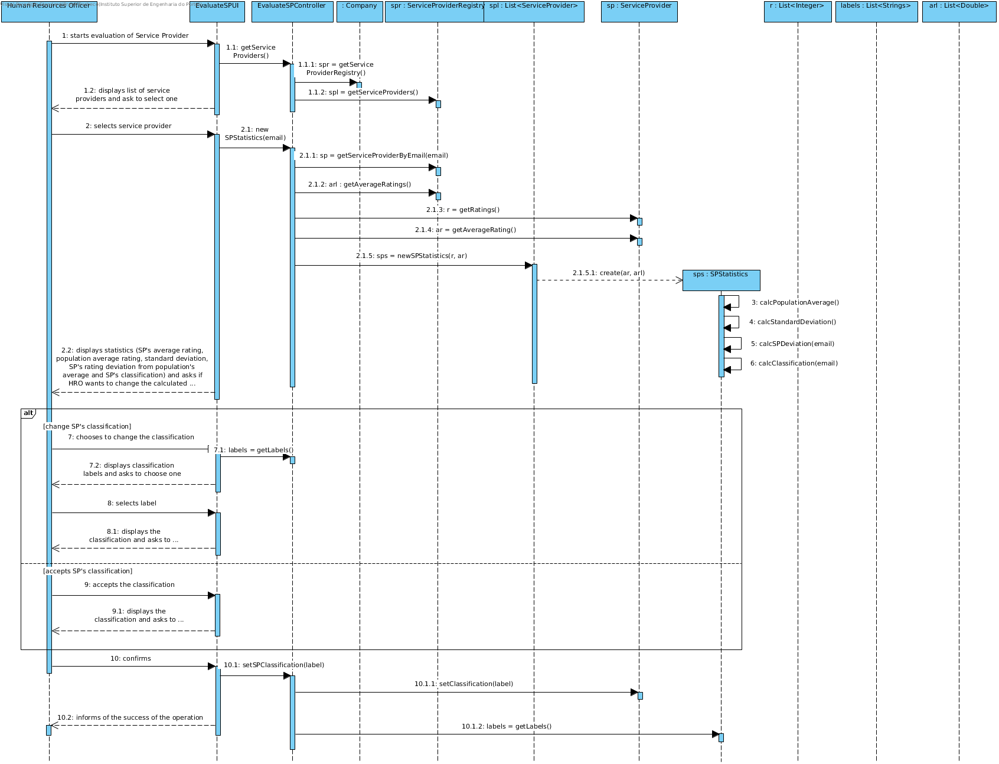
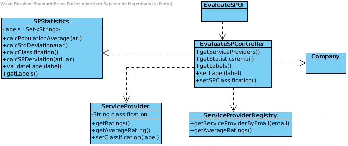

# Realization of UC15 - Evaluate Service Provider

## Rationale

| Main flow                                                                                      | Question: What Class ...                       | Answer                            | Justification                                                                                        |
| : ------------------------------------------------                                             | : -----------------                            | : ------------------------------- | : ------                                                                                             |
| 1. The HRO starts the evaluation of a service provider.                                        | ... interacts with the user?                   | EvaluateSPUI                      | PureFabrication: it is not justified to assign this responsibility to any class in the Domain Model. |
|                                                                                                | ... coordinates the UC?                        | EvaluateSPController              | Controller                                                                                           |
| 2. The system shows him the list of Service Providers registered and requires to select one.   | ... knows the Service Providers?               | ServiceProviderRegistry           | IE: ServiceProviderRegistry aggregates all ServiceProviders                                          |
|                                                                                                | ... knows the ServiceProviderRegistry?         | Company                           | IE: Company has the Register for Service Providers                                                   |
| 3. The HRO selects a Service Provider.                                                         |                                                |                                   |                                                                                                      |
| 4. The system displays the SP's rating distribution, statistics and calculated classification. | ... performs the calculations?                 | SPStatistics                      | PureFabrication: auxiliary class to which a class in the domain model is not justifiable.
|                                                                                                | ... knows the Service Provider's ratings?      | Evaluation                        | IE: Evaluation holds ratings                                                                         |
|                                                                                                | ... has Evaluations?                           | ServiceProvider                   | IE: ServiceProvider has ratings                                                                      |
|                                                                                                | ... can access all SP's ratings?               | ServiceProviderRegistry           | IE: aggregates all SP's                                                                              |
|                                                                                                | ... holds the calculated data?                 | SPStatistics                      | I.E: instance created in last step. Holds calculations                                               |
| 5a. The HRO accepts the classification. (step 8)                                               |                                                |                                   |                                                                                                      |
| 5b. The HRO chooses to modify the classification. (step 6)                                     |                                                |                                   |                                                                                                      |
| 6. The System provides the possible replacing labels and asks the HRO to choose one.           | ... stores the possible labels/classfications? | ServiceProvider                   | IE: ServiceProvider holds the data related to it's own classification                                |
| 7. The HRO chooses ones.                                                                       |                                                | ServiceProvider                   | IE: ServiceProvider holds the data related to it's own classification                                |
| 8. The System registers his choise and informs the HRO of the success of the operation.        | ... stores the selected classification?        |                                   |                                                                                                      |
| 9. The Use Case ends.                                                                          |                                                |                                   |                                                                                                      |

## Systematization

From the rational it results that the conceptual classes promoted to classes of software are:

- Company
- ServiceProviderRegistry
- ServiceProvider

Other software classes (i.e. Pure Fabrication) identified:

- EvaluateSPUI
- EvaluateSPController

## Sequence Diagram

## Class Diagram

