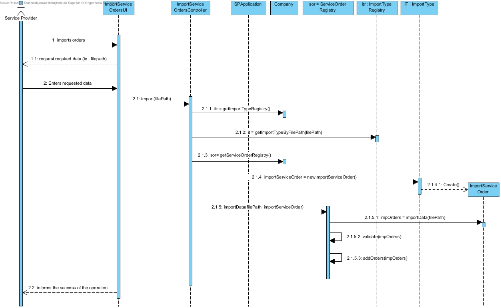
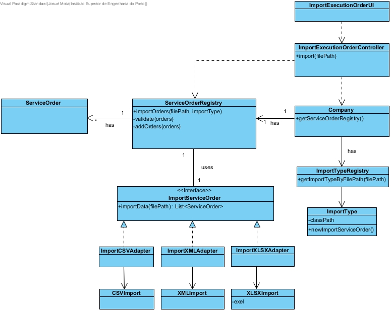

# Realization of UC16 - Import Service Orders

## Rationale

| Main flow                                                                                                       | Question: What Class ...                                        | Answer                            | Justification                                                                                        |
| : ------------------------------------------------ -------------------------------------------------- -----     | : ------------------------------------------- ----------------- | : ------------------------------- |                                                                                                      |
| 1. The Service Provider begins to import orders. | ... interacts with the user?| importServiceOrdersUI | PureFabrication: it is not justified to assign this responsibility to any class in the Domain Model. |
|| controls the UC ? | importServiceOrdersController | Controller |  
| 2. The System requests the required data (i.e. filepath). ||||
| 3. The Service Provider enters the requested data.| .. saves Order Registry ? | ServiceOrderRegistry | IE |
|| .. who knows ServiceOrderRegistry ? | Company | LC + HC |
|| .. knows how to import the file type? | FileTypeRegistry | IE |
|| .. who knows FileTypeRegistry? | Company | LC + HC |
|| .. knows how to import the filetype? | ImportServiceOrder | Adapter (csv, xml, xlsx) |
|| .. create / instantiate ImportxxxAdapter ? | ServiceOrderRegistry | Creator the instance is created using reflection |
|| .. create / Instanciate ServiceOrder(s) from each file type ? | ImportxxxAdapter | Creator |
|| .. saves ServiceOrder(s) ? | ServiceRequestRegistry | Creator rule(2) | 
| 4. The System informs the success of the operation.||||

## Systematization

From the rational it results that the conceptual classes promoted to classes of software
are:

- Company

- ImportServiceOrder

- ServiceOrder

- ServiceOrderRegistry 

- FileTypeRegistry

Other software classes (i.e. Pure Fabrication) identified:

- ImportServiceOrdersUI

- ImportServiceOrdersController

## Sequence Diagram

## Class Diagram

