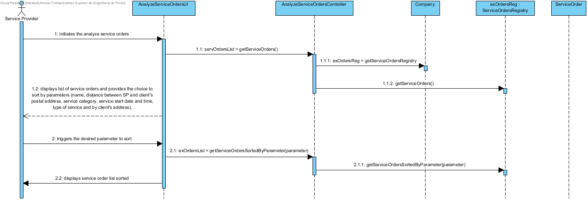

# Realization of UC17 - Analyze Execution Orders

## Rational

| Flow Main                                                                                        | Question: Which class...                                      | Answer                                       | Justification                                                                                                         |
|:-------------------------------------------------------------------------------------------------------|:------------------------------------------------------------|:-----------------------------------------------|:---------------------------------------------------------------------------------------------------------------------|
|1. The Service Provider initiates the analyze service orders.|... interacts with the user?|AnalyzeServiceOrdersUI|Pure Fabrication|
||...coordinates the UC?|AnalyzeServiceOrdersController|Controller|
||...knows the ServiceOrdersRegistry?|Company|IE|
||...knows the Service Order?|ServiceOrdersRegistry|HC + LC|
|2. The systems displays every execution orders and provides the choice to sort the list by the parameters available on execution orders (name, distance between SP and client's postal address, service category, service start date and time, type of service and by client's address).||||
|3. The service provider triggers the desired parameter to sort.|...sorts the list of ServiceOrders?|ServiceOrderRegistry|HC + LC|
||...compares service orders for sorting?|ServiceOrder|IE|
|4. The displays the Servicer Orders sorted.||||

## Systematization ##

From the rationale results that the following conceptual classes are promoted to software classes are:

* Company
* Service Order

Other software classes (i.e. Pure Fabrication) identified:  
* AnalyzeServiceOrdersUI
* AnalyzeServiceOrdersController
* ServiceOrdersRegistry

##	Detail Diagram

##	Class Diagram

