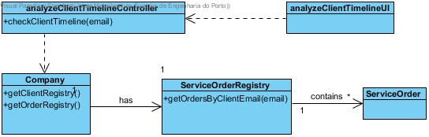

# Realization of UC18 - Analyze Client Timeline

## Rationale

| Main flow                                                                                                       | Question: What Class ...                                        | Answer                            | Justification                                                                                        |
| : ------------------------------------------------ -------------------------------------------------- -----     | : ------------------------------------------- ----------------- | : ------------------------------- |                                                                                                      |
| 1. The Service Provider requests the client timeline overview.| ... interacts with the user?| analyzeClientTimelineUI| PureFabrication: it is not justified to assign this responsibility to any class in the Domain Model. |  
|| controls the UC ? | analyzeClientTimelineController | Controller |  
| 2. The System requests the required data (i.e. Client Email).| | | |
| 3. The Service Provider enters the requested data..| ... who knows Client ? | ServiceOrder | IE |  
|| ... who stores the ServiceOrders?  | ServiceOrderRegistry | IE |
|| ... knows ServiceOrderRegistry? | Company | LC + HC |
| 4. The system returns the information of the services requested by the client (service start date and time, distance from SP facilities, ServiceCategory and client Address).||||  

## Systematization

From the rational it results that the conceptual classes promoted to classes of software
are:

- Company

- ServiceOrder

- Client

- ClientRegistry

- ServiceOrderRegistry 

Other software classes (i.e. Pure Fabrication) identified:

- analyzeClientTimelineUI

- analyzeClientTimelineController

## Sequence Diagram

## Class Diagram

