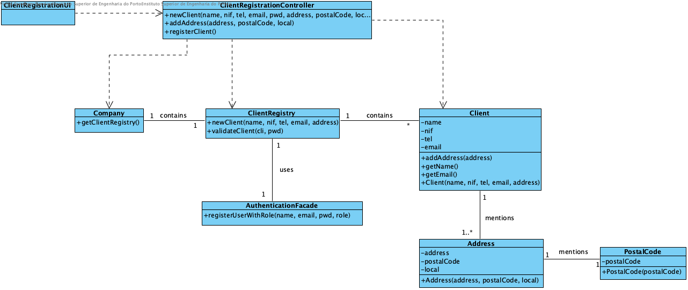

# Realization of UC1 - Client Registration

## Rational

| Main Flow                                                                                        | Question: Which class...                                      | Answer                                       | Justification                                                                                                         |
|:-------------------------------------------------------------------------------------------------------|:------------------------------------------------------------|:-----------------------------------------------|:---------------------------------------------------------------------------------------------------------------------|
| 1. The unregistered user starts the registration as a client. | ... interacts with the user? | ClientRegistrationUI | PureFabrication |
|| ... coordinates the UC? | ClientRegistrationController | Controller|
|| ... create / instance Client? |ClientRegistry|HC + LC (on Company) + Creator (Rule 1) |  
|| ... who knows the ClientRegistry? |Company|HC+LC|
| 2. The system requests the required data (i.e. full name, NIF, telephone contact, email and password). | | ||
| 3. The unregistered user enters the requested data. |...Save the entered data? | Client | Information Expert (IE) - instance created in step 1 |                                  
| 4. The system requests an address.||||
| 5. The unregistered user enters the postal address. | ... create / instance Address? | Client | Creator (Rule 4) |
|| ... save the entered data? | Address | Information Expert (IE) - instance created in this step |
||| PostalCode | IE: Adress has a PostalCode |
| 6. The system validates and stores the entered address. | ... save the created Address instance? |Client | Information Expert (IE) - In MD the Client mentions one or more Addresses |
| 7. Steps 4 to 6 are repeated until all the required postal addresses are entered (minimum 1).||||
| 8. The system validates and presents the data, asking you to confirm them. | ... validates the data of the Client (local validation)? | Client | E: Client has its own data |
| 9. The unregistered user confirms. ||||
| 10. system registers the customer and registered user data and informs the unregistered user of the success of the operation.|... keeps the client registered?|ClientRegistry|IE. the ClientRegistry contains Clients |

## Systematization ##

From the rational it results that the conceptual classes promoted to software classes are:

 * Company
 * Address
 * Postal Code
 * Client
 * ClientRegistry

Other software classes (i.e. Pure Fabrication) identified:

 * ClientRegistrationUI  
 * ClientRegistrationController

##	Sequence Diagram

##	Class Diagram

