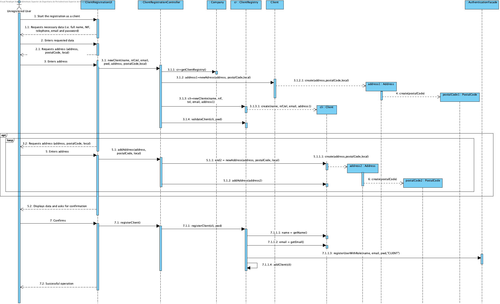

# Realização de UC1 Efetuar Registo como Cliente

## Racional

| Fluxo Principal                                                                                        | Questão: Que Classe...                                      | Resposta                                       | Justificação                                                                                                         |
|:-------------------------------------------------------------------------------------------------------|:------------------------------------------------------------|:-----------------------------------------------|:---------------------------------------------------------------------------------------------------------------------|
|1. O utilizador não registado inicia o registo como cliente.|... interage com o utilizador?|RegistarClienteUI|PureFabrication|
||...coordena o UC?|RegistarClienteController|Controller|
||...cria/instancia Cliente?|RegistoClientes| HC + LC (sobre Empresa) + Creator (Regra 1)|
||...quem conhece o RegistoCliente?|Empresa| HC + LC |
|2. O sistema solicita os dados necessários (i.e. nome completo da pessoa, o NIF, contacto telefónico, email e palavra-passe).| | | |
|3. O utilizador não registado introduz os dados solicitados.| ... guarda os dados introduzidos?|Cliente|Information Expert (IE) - instância criada no passo 1|
|4. O sistema solicita um endereço postal.||||
|5. O utilizador não registado introduz o endereço postal.|...cria/instancia Endereço Postal?|Cliente|Creator (Regra 4)|
|| ... guarda os dados introduzidos?| Endereco Postal|Information Expert (IE) - instância criada neste passo|
|||CodigoPostal| IE: um EnderecoPostal tem um CodigoPostal|
|6. O sistema valida e guarda o endereço introduzido.|... guarda a instância de Endereco Postal criada?| Cliente|Information Expert (IE) - No MD o Cliente menciona um ou mais Endereco Postal|
|7. Os passos 4 a 6 repetem-se enquanto não forem introduzidos todos os endereços postais pretendidos (minimo 1).||||
|8. O sistema valida e apresenta os dados, pedindo que os confirme.|...valida os dados do Cliente (validação local)?|Cliente|E: Cliente possui os seus próprios dados|
||...valida os dados do Cliente (validação global)?|RegistoClientes|IE: O registoClientes contém/agrega Clientes|
|9. O utilizador não registado confirma. ||||
|10. sistema regista os dados de cliente e de utilizador registado e informa o utilizador não registado do sucesso da operação.|...guarda o Cliente registado?|RegistoClientes|IE. o registoclientes contém/agrega Servicos|
|| ... guarda de utilizador deste cliente?  | AutorizacaoFacade | IE. A gestão de utilizadores é responsabilidade do componente externo respetivo cujo ponto de interação é através da classe "AutorizacaoFacade" |   
|| ... notifica o utilizador?  | RegistarClienteUI | |                                               

## Sistematização ##

 Do racional resulta que as classes conceptuais promovidas a classes de software são:

 * Empresa
 * Endereco Postal
 * **Código Postal**
 * Cliente
 * **RegistoClientes**

Outras classes de software (i.e. Pure Fabrication) identificadas:  

 * RegistarClienteUI  
 * RegistarClienteController

**Nota:** Atribuiu-se a responsabilidade de criar instâncias de Endereco Postal ao Cliente.
Contudo, um cliente só é válido quando possui pelo menos um Endereço Postal.
Ou seja, para existir um Cliente é necessário existir um Endereco Postal. 
Assim, não é viável pedir a uma instância de Cliente para criar um Endereco Postal.
Para resolver esta questão a criação de instâncias de Endereço Postal é feita através de uma método estático na classe Cliente. Desta forma, não é necessário existir previamente uma instância cliente. Outras abordagens/alternativas são possíveis.

##	Diagrama de Sequência

##	Diagrama de Classes

