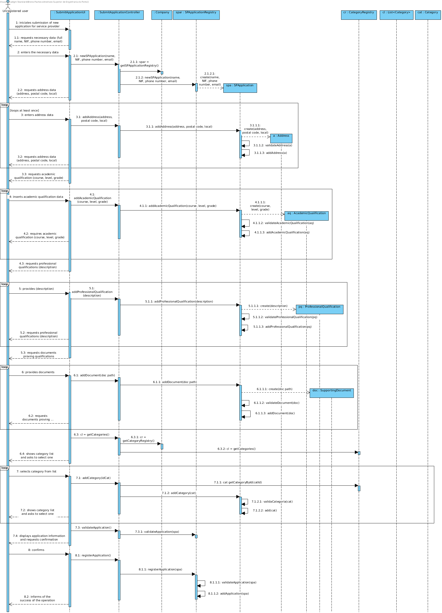

# Realization of UC2 - Submit application for service provider

## Rationale

| Main flow                                                                                                   | Question: What Class ...                                        | Answer                            | Justification                                                                                        |
| : ------------------------------------------------ -------------------------------------------------- ----- | : ------------------------------------------- ----------------- | : ------------------------------- |                                                                                                      |
| 1. The unregistered user initiates the submission of a new application for service provider.                | ... interacts with the user?                                    | SubmitSPApplicationUI             | PureFabrication: it is not justified to assign this responsibility to any class in the Domain Model. |
|                                                                                                             | ... coordinates the UC?                                         | SubmitSPApplicationController     | Controller                                                                                           |
|                                                                                                             | ... creates instanciates SPApplication?                         | SPApplicationRegistry             | Company delegates responsability (HC-LC)                                                             |
| 2. The system requests the necessary data (i.e. full name , NIF, phone number, and email).                  | n / a                                                           |                                   |                                                                                                      |
| 3. The unregistered user enters the requested data.                                                         | ... stores the data entered?                                    | SPApplication                     | Information Expert (IE) - instance created in step 1.                                                |
| 4. The system requests a postal address (i.e. address, postal code, local).                                 | n / a                                                           |                                   |                                                                                                      |
| 5. The unregistered user enters the postal address.                                                         | ... creates instanciates  Address?                              | SPApplication                     | Creator (Rule 4).                                                                                    |
|                                                                                                             | ... stores the data entered?                                    | Address                           | Information Expert (IE) - instance created in this step.                                             |
|                                                                                                             | ... stores the created Postal Address instance?                 | SPApplication                     | Information Expert (IE) - In MD the SPApplication mentions one or more Addresses                     |
| 6. The system requires an academic qualification. (course, level, grade)                                    | n / a                                                           |                                   |                                                                                                      |
| 7. The unregistered user introduces the academic qualification                                              | ... creates Academic Qualification?                             | SPApplication                     | Creator (Rule 1).                                                                                    |
|                                                                                                             | ... stores the data entered?                                    | AcademicQualification             | Information Expert (IE) - instance created in this step.                                             |
|                                                                                                             | ... stores the AcademicQualification instance?                  | SPApplication                     | Creator (Rule 1).
| 8. Steps 6 to 7 are repeated until all academic qualifications have been entered.                           | n / a                                                           |                                   |                                                                                                      |
| 9. The system requires a professional qualification (i.e. description).                                     | n / a                                                           |                                   |                                                                                                      |
| 10. The unregistered user introduces the professional qualification.                                        | ... creates ProfessionalQualification?                          | SPApplication                     | Creator (Rule 1).                                                                                    |
|                                                                                                             | ... stores the data entered?                                    | ProfessionalQualification         | Information Expert (IE) - instance created in this step.                                             |
|                                                                                                             | ... stores the Professional Qualification instance created?     | SPApplication                     | Information Expert (IE) - In the MD the SPApplication mentions professional qualifications.          |
| 11. Steps 9 to 10 are repeated until all professional qualifications have been completed.                   | n / a                                                           |                                   |                                                                                                      |
| 12. The system shows the categories of services available in the system.                                    | ... has the existing categories to list?                        | CategoryRegistry                  | IE: CategoryRegistry aggregates Company's Categories                                                 |
|                                                                                                             | ... has the CategoryRegistry?                                   | Company                           | IE: Company has the Register for Categories                                                          |
| 13. The unregistered user selects the category of services he intends to perform.                           | n / a                                                           |                                   |                                                                                                      |
| 14. The system validates and stores the selected category.                                                  | ... stores the selected category?                               | SPApplication                     | Information Expert (IE) - In the MD the SPApplication mentions categories of services.               |
| 15. Steps 12 to 14 are repeated until all categories are entered.                                           | n / a                                                           |                                   |                                                                                                      |
| 16. The system validates and presents the application's data and asks for confirmation.                     | ... validate the application data (local validation)            | SPApplication                     | Information Expert (IE) - the SPApplication knows its own data.                                      |
|                                                                                                             | ... validate the application data (global validation)           | SPApplicationRegistry             | Information Expert (IE) - the SPApplicationRegistry contains / adds SPApplication.                   |
| 17. The unregistered user confirms the application details.                                                 | n / a                                                           |                                   |                                                                                                      |
| 18. The system registers the new application and informs of the success of the operation.                   | ... stores the SPApplication                                    |                                   |                                                                                                      |
|                                                                                                             | ... inform the unregistered user?                               | SubmitSPApplicationUI             |                                                                                                      |

## Systematization

From the rational it results that the conceptual classes promoted to classes of software
are:

- Company

- Address

- SPApplication

- SPApplicationRegistry

- AcademicQualification

- ProfessionalQualification

- SupportingDocument
 

Other software classes (i.e. Pure Fabrication) identified:

- SubmitSPApplicationUI

- SubmitSPApplicationController

## Sequence Diagram

## Class Diagram

