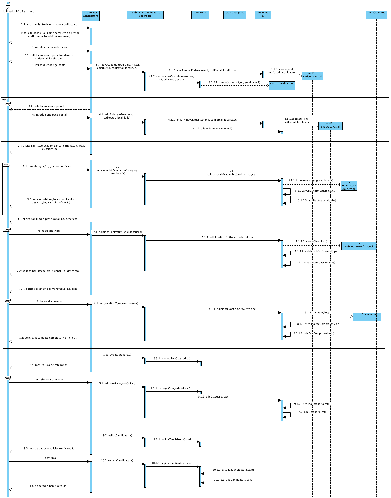
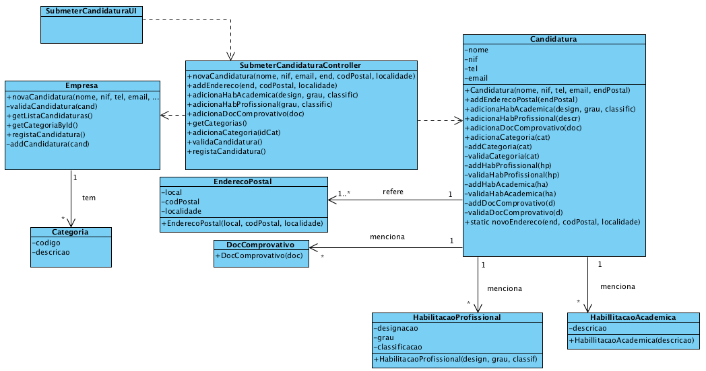

Realização de UC2 Submeter Candidatura a Prestador de Serviço
=============================================================

**(Não foi modificado neste iteração)**

Racional
--------

| Fluxo Principal                                                                                                  | Questão: Que Classe...                                     | Resposta                      | Justificação                                                                                                           |
|------------------------------------------------------------------------------------------------------------------|------------------------------------------------------------|-------------------------------|------------------------------------------------------------------------------------------------------------------------|
| 1. O utilizador não registado inicia a submissão de uma nova candidatura.                                        | ...interage com o utilizador?                              | SubmeterCandidaturaUI         | PureFabrication, pois não se justifica atribuir esta responsabilidade a nenhuma classe existente no Modelo de Domínio. |
|                                                                                                                  | ...coordena o UC?                                          | SubmeterCandidaturaController | Controller                                                                                                             |
|                                                                                                                  | ...cria/instancia Candidatura?                             | Empresa                       | Creator (Regra 1)                                                                                                      |
| 2. O sistema solicita os dados necessários (i.e. nome completo da pessoa, o NIF, contacto telefónico e email).   | n/a                                                        |                               |                                                                                                                        |
| 3. O utilizador não registado introduz os dados solicitados.                                                     | ... guarda os dados introduzidos?                          | Candidatura                     | Information Expert (IE) - instância criada no ponto 1.                                                                 |
| 4. O sistema solicita um endereço postal.                                                                        | n/a                                                        |                               |                                                                                                                        |
| 5. O utilizador não registado introduz o endereço postal.                                                        | ...cria/instancia Endereço Postal?                         | Candidatura                   | Creator (Regra 4).                                                                                                     |
|                                                                                                                  | ... guarda os dados introduzidos?                          | EnderecoPostal                | Information Expert (IE) - instância criada neste passo.                                                                |
| 6. O sistema valida e guarda o endereço introduzido.                                                             | ... guarda a instância de Endereco Postal criada?          | Candidatura                   | Information Expert (IE) - No MD a Candidatura menciona um ou mais Endereco Postal                                      |
| 7. Os passos 4 a 6 repetem-se enquanto não forem introduzidos todos os endereços postais pretendidos (minimo 1). | n/a                                                        |                               |                                                                                                                        |
| 8. O sistema solicita uma habilitação académica.                                                                 |                                                            |                               |                                                                                                                        |
| 9. O utilizador não registado introduz a habilitação académica                                                   | ...cria/instancia Habilitação Académica?                   | Candidatura                   | Creator (Regra 1).                                                                                                     |
|                                                                                                                  | ... guarda os dados introduzidos?                          | HabilitacaoAcademica          | Information Expert (IE) - instância criada neste passo.                                                                |
| 10. O sistema valida e guarda a habilitação académica.                                                           | ... guarda a instância de Habilitação Académica criada?    | Candidatura                   | Information Expert (IE) - No MD a Candidatura menciona habilitações académicas.                                        |
| 11. Os passos 8 a 10 repetem-se enquanto não forem introduzidos todas as habilitações académicas .               | n/a                                                        |                               |                                                                                                                        |
| 12. O sistema solicita uma habilitação profissional.                                                             |                                                            |                               |                                                                                                                        |
| 13. O utilizador não registado introduz a habilitação profissional.                                              | ...cria/instancia Habilitação Profissional?                | Candidatura                   | Creator (Regra 1).                                                                                                     |
|                                                                                                                  | ... guarda os dados introduzidos?                          | HabilitacaoProfissional       | Information Expert (IE) - instância criada neste passo.                                                                |
| 14. O sistema valida e guarda a habilitação profissional.                                                        | ... guarda a instância de Habilitação profissional criada? | Candidatura                   | Information Expert (IE) - No MD a Candidatura menciona habilitações profissionais.                                     |
| 15. Os passos 12 a 14 repetem-se enquanto não forem introduzidos todos as habilitações profissionais.            | n/a                                                        |                               |                                                                                                                        |
| 16. O sistema solicita documentos comprovativos.                                                                 | n/a                                                        |                               |                                                                                                                        |
| 17. O utilizador não registado introduz documento comprovativo.                                                  | ...cria/instancia Documento Comprovativo?                  | Candidatura                   | Creator (Regra 1).                                                                                                     |
|                                                                                                                  | ... guarda os dados introduzidos?                          | Documento Comprovativo               | Information Expert (IE) - instância criada neste passo.                                                                |
| 18. O sistema valida e guarda documento comprovativo.                                                            | ... guarda a instância de Documento Comprovativo criada?   | Candidatura                   | Information Expert (IE) - No MD a Candidatura menciona documentos comprovativos.                                       |
| 19. Os passos 16 a 18 repetem-se enquanto não forem introduzidos todos os documentos comprovativos.            | n/a                                                        |                               |                                                                                                                        |
| 20. O sistema mostra as categorias de serviços disponíveis no sistema.                                           | ...conhece as categorias existentes a listar?              | Empresa                       | IE: Empresa tem/agrega todas as Categorias.                                                                            |
| 21. O utilizador não registado seleciona a categoria dos serviços que se propõe realizar.                        | | | 
|22. O sistema valida e guarda a categoria selecionada.                                                                                                           | ...guarda categoria selecionada?                           | Candidatura                   | Information Expert (IE) - No MD a Candidatura menciona categorias de serviços.                                         |
| 23. Os passos 20 a 22 repetem-se enquanto não forem introduzidas todas as categorias.                            |                                                            |                               |                                                                                                                        |
| 24. O sistema valida e apresenta os dados da candidatura ao utilizador não registado, pedindo que os confirme. | ...valida os dados da Candidatura (validação local)       | Candidatura   | Information Expert (IE) - a Candidatura conhece os seus próprios dados.                                                         
|  | ...valida os dados da Candidatura (validação global)       | Empresa                       | Information Expert (IE) - a Empresa contém/agrega Candidatura.                                                         
| 25. O utilizador não registado confirma os dados da candidatura.                                                 |      |                       |                                                   |
| 26. O sistema regista a nova candidatura e informa o utilizador não registado do sucesso da operação.            | ...guarda a candidatura especificada /criada?              | Empresa                       | Information Expert (IE) – No MD a Empresa contém/agrega Candidatura.                                                   |
|                                                                                                                  | ...informa o utilizador não registado?                     | SubmeterCandidaturaUI         |                                                                                                                        |

Sistematização
--------------

Do racional resulta que as classes conceptuais promovidas a classes de software
são:

-   Empresa

-   EnderecoPostal

-   Candidatura

-   HabilitacaoAcademica

-   HabilitacaoProfissional

-   Documento Comprovativo
 

Outras classes de software (i.e. Pure Fabrication) identificadas:

-   SubmeterCandidaturaUI

-   SubmeterCandidaturaController

**Nota:** Atribuiu-se a responsabilidade de criar instâncias de Endereco Postal
à Candidatura. Contudo, uma candidatura só é válida quando possui pelo menos um
Endereço Postal. Ou seja, para existir uma Candidatura é necessário existir um
Endereco Postal. Assim, não é viável pedir a uma instância de Candidatura para
criar um Endereco Postal. Para resolver esta questão a criação de instâncias de
Endereço Postal é feita através de uma método estático na classe Candidatura.
Desta forma, não é necessário existir previamente uma instância candidatura.
Outras abordagens/alternativas são possíveis.

Diagrama de Sequência
---------------------

Diagrama de Classes
-------------------

