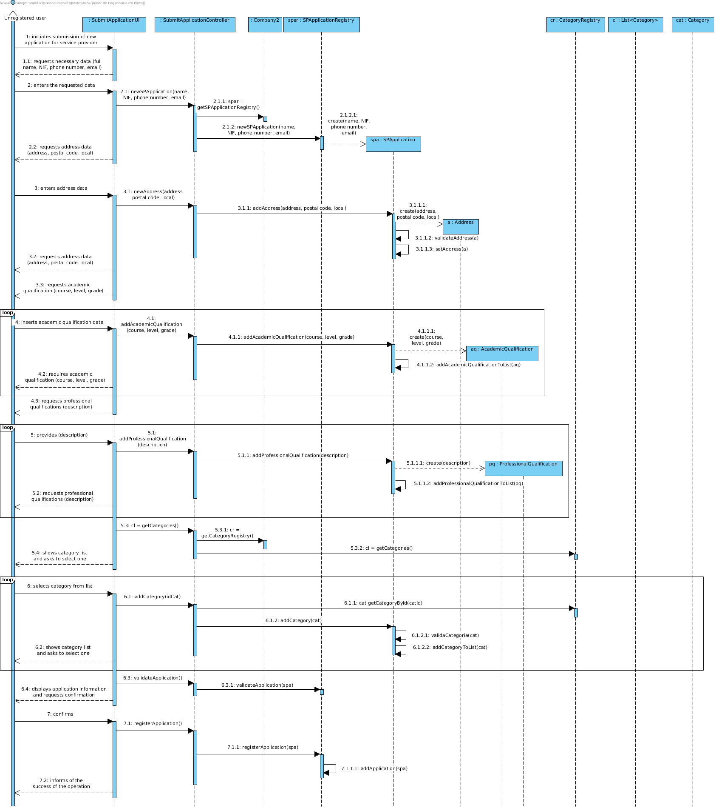
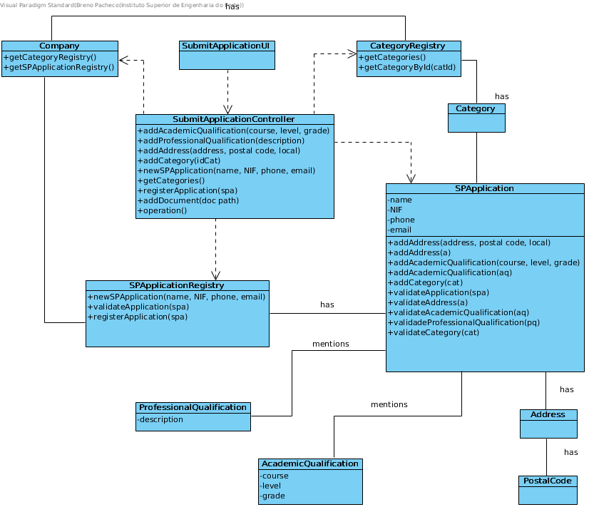

# Realization of UC2 - Submit application for service provider

## Rationale

| Main flow                                                                                                       | Question: What Class ...                                        | Answer                            | Justification                                                                                        |
| : ------------------------------------------------ -------------------------------------------------- -----     | : ------------------------------------------- ----------------- | : ------------------------------- |                                                                                                      |
| 1. The unregistered user initiates the submission of a new application for service provider.                    | ... interacts with the user?                                    | SubmitSPApplicationUI             | PureFabrication: it is not justified to assign this responsibility to any class in the Domain Model. |
|                                                                                                                 | ... coordinates the UC?                                         | SubmitSPApplicationController     | Controller                                                                                           |
|                                                                                                                 | ... creates instanciates SPApplication?                         | SPApplicationRegistry             | Company delegates responsability (HC-LC)                                                             |
| 2. The system requests the necessary data (i.e. full name , NIF, phone number, and email).                      | n / a                                                           |                                   |                                                                                                      |
| 3. The unregistered user enters the requested data.                                                             | ... stores the data entered?                                    | SPApplication                     | Information Expert (IE) - instance created in step 1.                                                |
| 4. The system requests a postal address.                                                                        | n / a                                                           |                                   |                                                                                                      |
| 5. The unregistered user enters the postal address.                                                             | ... creates instanciates Postal Address?                        | SPApplication                     | Creator (Rule 4).                                                                                    |
|                                                                                                                 | ... stores the data entered?                                    | Address                           | Information Expert (IE) - instance created in this step.                                             |
| 6. The system validates and stores the entered address.                                                         | ... stores the created Postal Address instance?                 | SPApplication                     | Information Expert (IE) - In MD the SPApplication mentions one or more Addresses                     |
| 7. Steps 4 to 6 are repeated until all the required postal addresses are entered (minimum 1).                   | n / a                                                           |                                   |                                                                                                      |
| 8. The system requires an academic qualification.                                                               |                                                                 |                                   |                                                                                                      |
| 9. The unregistered user introduces the academic qualification                                                  | ... creates Academic Qualification?                             | SPApplication                     | Creator (Rule 1).                                                                                    |
|                                                                                                                 | ... stores the data entered?                                    | AcademicQualification             | Information Expert (IE) - instance created in this step.                                             |
| 10. The system validates and holds the academic qualification.                                                  | ... do you have the Academic Enrollment instance set up?        | SPApplication                     | Information Expert (IE) - In the MD the SPApplication mentions academic qualifications.              |
| 11. Steps 8 to 10 are repeated until all academic qualifications have been entered.                             | n / a                                                           |                                   |                                                                                                      |
| 12. The system requires a professional qualification.                                                           |                                                                 |                                   |                                                                                                      |
| 13. The unregistered user introduces the professional qualification.                                            | ... creates ProfessionalQualification?                          | SPApplication                     | Creator (Rule 1).                                                                                    |
|                                                                                                                 | ... stores the data entered?                                    | ProfessionalQualification         | Information Expert (IE) - instance created in this step.                                             |
| 14. The system validates and holds the professional qualification.                                              | ... stores the Professional Qualification instance created?     | SPApplication                     | Information Expert (IE) - In the MD the SPApplication mentions professional qualifications.          |
| 15. Steps 12 to 14 are repeated until all professional qualifications have been completed.                      | n / a                                                           |                                   |                                                                                                      |
| 16. The system requests supporting documents.                                                                   | n / a                                                           |                                   |                                                                                                      |
| 17. The unregistered user introduces supporting document.                                                       | ... create / instance SupportingDocument?                       | SPApplication                     | Creator (Rule 1).                                                                                    |
|                                                                                                                 | ... stores the data entered?                                    | SupportingDocument                | Information Expert (IE) - instance created in this step.                                             |
| 18. The system validates and holds supporting document.                                                         | ... stores the instance of SupportingDocument created?          | SPApplication                     | Information Expert (IE) - In the MD the SPApplication mentions supporting documents.                 |
| 19. Steps 16 to 18 are repeated until all supporting documents have been entered.                               | n / a                                                           |                                   |                                                                                                      |
| 20. The system shows the categories of services available in the system.                                        | ... has the existing categories to list?                        | CategoryRegistry                  | IE: CategoryRegistry aggregates Company's Categories                                                 |
|                                                                                                                 | ... has the CategoryRegistry?                                   | Company                           | IE: Company has the Register for Categories                                                          |
| 21. The unregistered user selects the category of services he intends to perform.                               |                                                                 |                                   |                                                                                                      |
| 22. The system validates and stores the selected category.                                                      | ... stores the selected category?                               | SPApplication                     | Information Expert (IE) - In the MD the SPApplication mentions categories of services.               |
| 23. Steps 20 to 22 are repeated until all categories are entered.                                               |                                                                 |                                   |                                                                                                      |
| 24. The system validates and presents the application's data and asks for confirmation.                         | ... validate the application data (local validation)            | SPApplication                     | Information Expert (IE) - the SPApplication knows its own data.                                      |
|                                                                                                                 | ... validate the application data (global validation)           | SPApplicationRegistry             | Information Expert (IE) - the SPApplicationRegistry contains / adds SPApplication.                   |
| 25. The unregistered user confirms the application details.                                                     |                                                                 |                                   |                                                                                                      |
| 26. The system registers the new application and informs the unregistered user of the success of the operation. | ... stores the SPApplication                                    |                                   |                                                                                                      |
|                                                                                                                 | ... inform the unregistered user?                               | SubmitSPApplicationUI             |                                                                                                      |

## Systematization

From the rational it results that the conceptual classes promoted to classes of software
are:

- Company

- Address

- SPApplication

- SPApplicationRegistry

- AcademicQualification

- ProfessionalQualification

- SupportingDocument
 

Other software classes (i.e. Pure Fabrication) identified:

- SubmitSPApplicationUI

- SubmitSPApplicationController 

## Sequence Diagram

## Class Diagram

