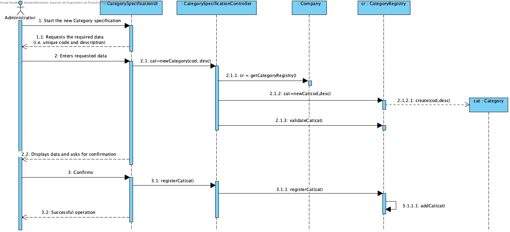

# Realization of UC3 - Category Specification

## Rational

| Main Flow                                                                                        | Question: Which Class...                                      | Answer                                       | Justification                                                                                                         |
|:-------------------------------------------------------------------------------------------------------|:------------------------------------------------------------|:-----------------------------------------------|:---------------------------------------------------------------------------------------------------------------------|
| 1. The Administrative begins to specify a new category. | ... interact with the user? | CategorySpecificationUI | Pure Fabrication, since it is not justified to assign this responsibility to any class in the Domain Model. |
|| ... coordinates the UC? | CategorySpecificationController | Controller. ||
|| ... create / instance Category?| CategoryRegistry | HC + LC (on Company) + Creator (Rule 1) ||
|| ... who knows the CategoryRegistry? |Company|HC+LC|
| 2. The system requests the required data (i.e. unique code and description).||||
| 3. The Administrative enters the requested data.| ... save the data entered? | Category | Information Expert (IE) - instance created in step 1 |
| 4. The system validates and presents the data to the Administrative, asking to confirm them.| ... validate the Category data (local validation)? | CategoryRegistry | IE |
| 5. The administrative confirms. ||||
| 6. The system records the data and informs the administrative of the success of the operation. |... save the Category specified / created?|CategoryRegistry| IE |
|| ... notify the user?| Specify CategoryUI |||

## Systematization ##

 From the rational it results that the conceptual classes promoted to software classes are:

 * Company
 * Category

Other software classes (i.e. Pure Fabrication) identified:

 * CategorySpecificationUI  
 * CategorySpecificationController

##	Sequence Diagram

##	Diagrama de Classes

