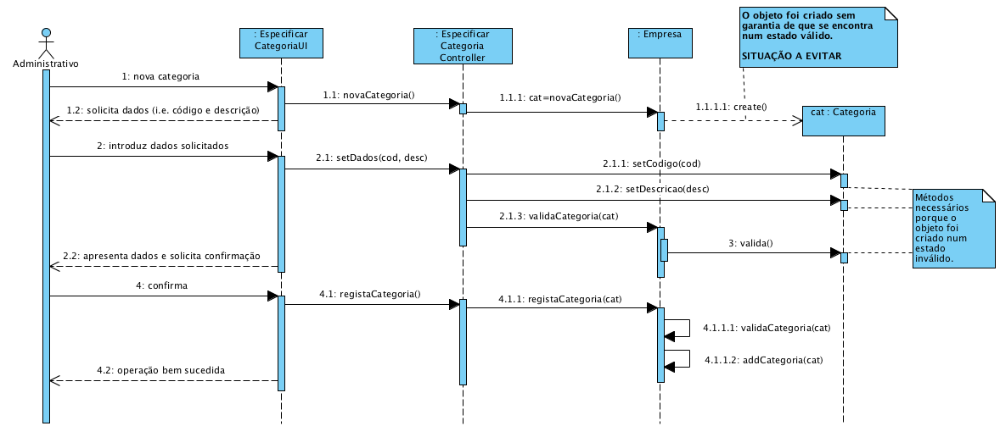

# Realização de UC3 Especificar Categoria

**(Não foi modificado neste iteração)**

## Racional

| Fluxo Principal                                                                                        | Questão: Que Classe...                                      | Resposta                                       | Justificação                                                                                                         |
|:-------------------------------------------------------------------------------------------------------|:------------------------------------------------------------|:-----------------------------------------------|:---------------------------------------------------------------------------------------------------------------------|
| 1. O administrativo inicia a especificação de uma nova categoria. | ... interage com o utilizador? | EspecificarCategoriaUI.                          | Pure Fabrication, pois não se justifica atribuir esta responsabilidade a nenhuma classe existe no Modelo de Domínio. |
|| ... coordena o UC?                                                                              | EspecificarCategoriaController                                | Controller.                                    |                                                                                                                      |
|| ... cria/instancia Categoria?          | Empresa                                               | Creator (Regra 1)                              |                                                                                                                      |
| 2.	O sistema solicita os dados necessários (i.e. código único e descrição). |                  |                                                |                                                                                                                      |
| 3.	O administrativo introduz os dados solicitados.   | ... guarda os dados introduzidos?                    | Categoria                                     | Information Expert (IE) - instância criada no passo 1                                                                                              |
| 4.	 O sistema valida e apresenta os dados ao administrativo, pedindo que os confirme.                                                             | ... valida os dados da Categoria (validação local)? | Categoria                                     | IE: Categoria possui os seus próprios dados                                                                                                                   |
|| ... valida os dados da Categoria (validação global)?                                           | Empresa                                               | IE: A Empresa contém/agrega Categorias |                                                                                                                      |
| 5. O administrativo confirma.                                                                     |                                                             |                                                |                                                                                                                      |
| 6.	O sistema regista os dados e informa o administrativo do sucesso da operação.                           | ... guarda a Categoria especificada/criada?                            | Empresa                                 | IE. No MD a Empresa contém/agrega Categorias                                                                 |
|| ... notifica o utilizador?                                                                                   | EspecificarCategoriaUI                                        |                                                |                                                                                                                      |

## Sistematização ##

 Do racional resulta que as classes conceptuais promovidas a classes de software são:

 * Empresa
 * Categoria

Outras classes de software (i.e. Pure Fabrication) identificadas:  

 * EspecificarCategoriaUI  
 * EspecificarCategoriaController

##	Diagrama de Sequência

São apresentadas duas alternativas distintas.
Considera-se a alternativa 2 mais adequada e preferivel relativamente à alternativa 1.

### Alternativa 1

**Esta alternativa respeita as decisões do racional anterior, mas tem margem de melhoria.**

### Alternativa 2

**Esta alternativa também respeita as decisões do racional anterior.**

Esta abordagem considera que os métodos **"get"** e **"set"** devem ser evitados/minimizados (cf. [aqui](https://www.javaworld.com/article/2073723/core-java/why-getter-and-setter-methods-are-evil.html)).

Esta alternativa implica a existência de um construtor com parametros em Categoria.
Desta forma, não é necessário recorrer aos métodos **"set"**.
Os métodos "set" a existirem serão privados da classe Categoria.

Esta alternativa assume ainda que os objetos:

* aquando da sua criação estão imediatamente válidos (caso contrário ocorreria uma excepção);
* só aceitam modificações ao seu estado atual que conduzam a um outro estado válido.

Assim, não é necessário validar localmente o objeto categoria criado. Contudo, a empresa continua a realizar as validações globais (e.g. não existem duplicados).

**RECOMENDA-SE A ADOÇÃO DESTA ABORDAGEM/ALTERNATIVA.**

##	Diagrama de Classes

O diagrama de classes apresentado está em conformidade com o diagrama de sequência da alternativa 2.

