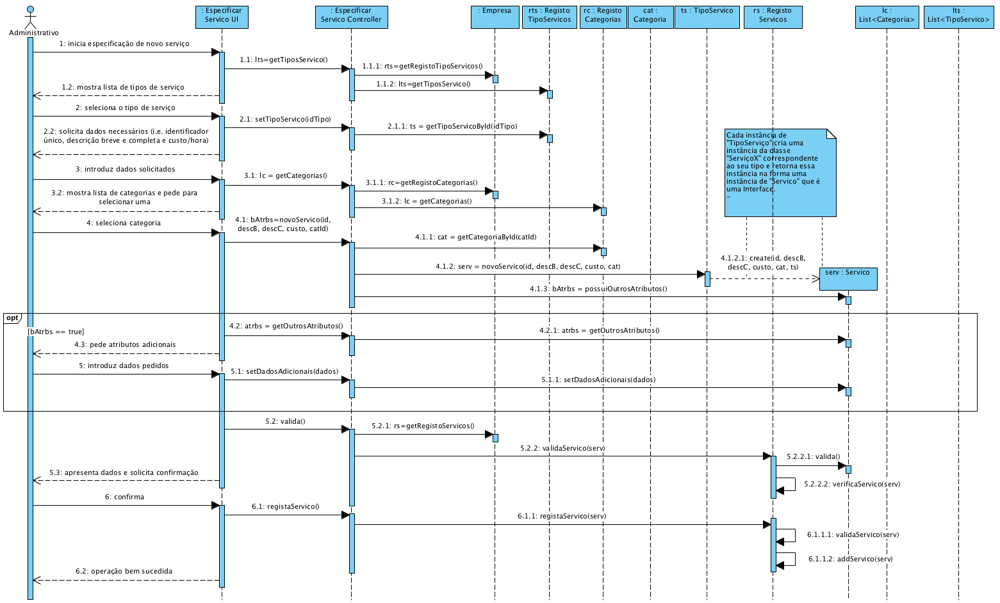
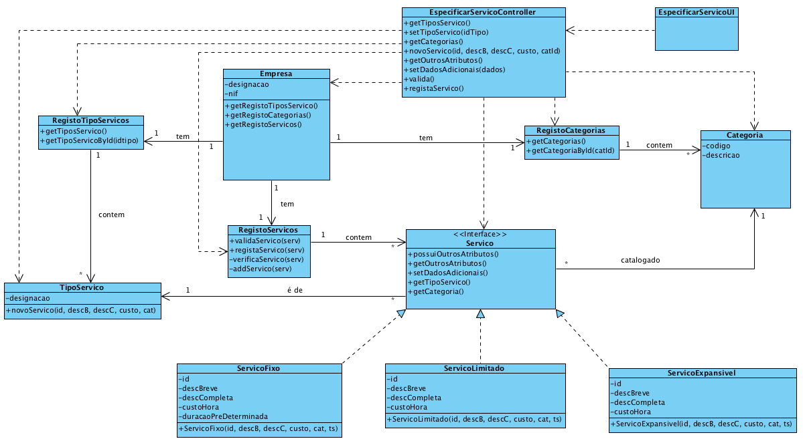

# Realização de UC4 Especificar Serviço

## Racional

| Fluxo Principal                                                                                        | Questão: Que Classe...                                      | Resposta                                       | Justificação                                                                                                         |
|:-------------------------------------------------------------------------------------------------------|:------------------------------------------------------------|:-----------------------------------------------|:---------------------------------------------------------------------------------------------------------------------|
| 1. O administrativo inicia a especificação de um novo serviço.| ... interage com o utilizador?| EspecificarServicoUI| PureFabrication |
||...coordena o UC?|EspecificarServicoController| Controller |
||...cria/instancia Servico?|Tipo Serviço| Pela aplicação do Creator (R1) seria a Empresa. Mas, por aplicação de HC+LC a Empresa delegaria essa responsabilidade em RegistoServiços. Acresce que o "serviço" a criar depende do seu tipo. Ora, quem conhece a classe correspondente ao tipo de serviço a criar é "TipoServiço". |
|2. **O sistema mostra os tipos de serviços suportados e pede para selecionar um.**|...conhece os tipos de serviços suportados?|RegistoTipoServicos|IE: no MD a Empresa tem TipoServico. Por aplicação de HC+LC delega em RegistoTipoServicos|
|3. **O administrativo seleciona o tipo de serviço pretendido.**|... guarda o tipo de serviço selecionado?|Servico|IE. O serviço é de um tipo - instancia de serviço criada.|
| 4. O sistema solicita os dados necessários (i.e. identificador único, descrição breve e completa e o custo/hora). | | | |
| 5. O administrativo introduz os dados solicitados. | ... guarda os dados introduzidos?| Servico | Information Expert (IE) - instância criada anteriormente|
| 6. O sistema mostra a lista de categorias existentes para que seja selecionada uma.| ...conhece as categorias existentes a listar?| RegistoCategorias| IE: Empresa tem/agrega todas as Categoria e por aplicação de HC+LC delega em RegistoCategorias|
| 7. O administrativo seleciona a categoria em que pretende catalogar o serviço.| ... guarda a categoria selecionada?| Servico| IE: Servico catalogado numa Categoria - instância criada anteriormente|
|**8. O sistema pede dados adicionais caso o tipo de serviço o justifique.**|...sabe se são necessário mais dados?|Serviço|IE.: instância criada anteriormente|
|**9. O adminstrativo introduz os dados pedidos.**|... guarda os dados adicionais?|Servico|IE.: instância criada anteriormente|
| 10. O sistema valida e apresenta os dados ao administrativo, pedindo que os confirme.| ...valida os dados do Serviço (validação local)?| Servico| IE: Servico possui os seus próprios dados|
| | ...valida os dados do Serviço (validação global)?| RegistoServico | IE: A Empresa contém/agrega Serviços e delega em RegistoServiços(HC+LC)|| 
| 11. O administrativo confirma.| | | |
| 12. O sistema regista os dados e informa o administrativo do sucesso da operação.| ...guarda o Servico especificado/criado?| RegistoServicos | IE. No MD a Empresa contém/agrega Servicos  e delega em RegistoServicços (HC+LC)|
|| ... notifica o utilizador?                                                                                   | EspecificarServicoUI                                        |                                                |                                                                                                                      

## Sistematização ##

 Do racional resulta que as classes conceptuais promovidas a classes de software são:

 * Empresa
 * TipoServico
 * Servico
 * Categoria

Outras classes de software (i.e. Pure Fabrication) identificadas:  

 * EspecificarServicoUI  
 * EspecificarServicoController
 * RegistoTipoServicos
 * RegistoServicos
 * RegistoCategorias

##	Diagrama de Sequência

##	Diagrama de Classes

