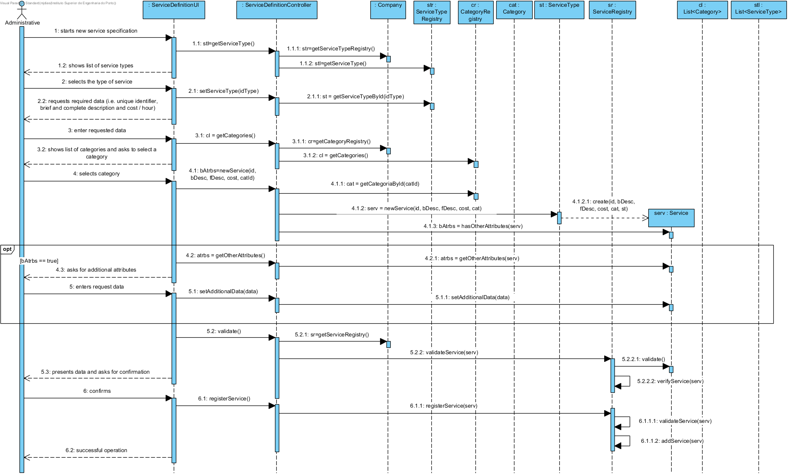
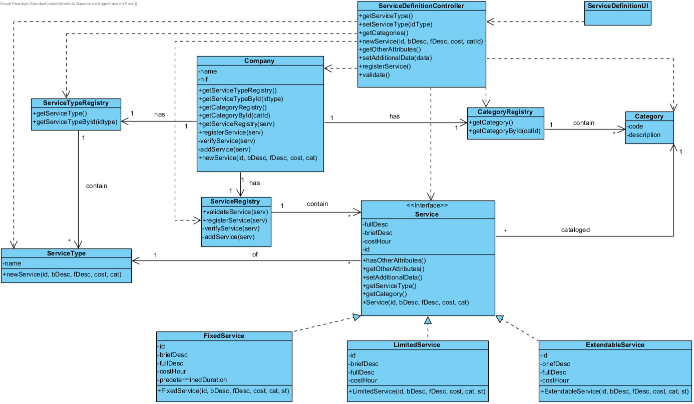

# Realization of UC4 Service Definition

## Rationale

| Main Flow                                                                                        | Question: which Class...                                      | Answer                                       | Justification                                                                                                         |
|:-------------------------------------------------------------------------------------------------------|:------------------------------------------------------------|:-----------------------------------------------|:---------------------------------------------------------------------------------------------------------------------|
| 1. The administrative begins to specify a new service.| ...interacts with user?| ServiceDefinitionUI| PureFabrication |
||...coordinates UC?|ServiceDefinitionController| Controller |
||...creates/instances Service?|ServiceType| By the application of Creator (R1) would be the Company. But, by application of HC + LC, the Company would delegate this responsibility to ServiceRegistry. In addition, the "service" to be created depends on its type. However, who knows the class corresponding to the type of service to be created is "ServiceType". |
| 2. The system shows types of services supported and asks to select one.|...knows the types of services supported?|ServiceTypeRegistry|IE: In Domain Model (DM) the Company has ServiceType. By application of HC + LC delegates in ServiceTypeRegistry|
| 3. The administrative selects the wanted type of service.|...keeps the selected service type?|Service|IE. Service is of a type - created service instance.|
| 4. The system requests the required data (i.e. unique identifier, brief and complete description and cost per hour). | | | |
| 5. The administrative enters the requested data. | ...keeps the data entered?| Service | Information Expert (IE) - previously created instance|
| 6. The system shows the list of existing categories so that one is selected.| ...knows the existing categories to list?| CategoryRegistry| IE: Company has / aggregates all Category and by application of HC + LC delegates in CategoryRegistry|
| 7. The administrative selects the category in which he wants to catalogue the service.| ...keeps the selected category?| Service| IE: Categorized service in a Category - instance created previously|
|8. The system requests additional data if the type of service warrants it.|...knows if more data is needed?|Service|IE.: previously created instance|
| 9. The admin enters the requested data.|...keeps the additional data?|Service|IE.: previously created instance|
| 10. System validates and presents data to the administrative, asking him to confirm them.| ... validates the Service data (local validation)?| Service| IE: Service has its own data|
| | ...validates Service data (global validation)?| ServiceRegistry | IE: The Company contains / aggregates Services and delegates to ServiceRegistry (HC+LC)||
| 11. The administrative confirms.| | | |
| 12. System records data and informs the success of the operation.| ...keeps the specified / created service?| ServiceRegistry | IE. In the DM the Company contains / aggregates Services and delegates in ServiceRegistry (HC+LC)|
|| ... notifies user?                                                                                   | ServiceDefinitionUI                                        |                                                |                                                                                                                      

## Systematization ##

 From rational it results that the conceptual classes promoted to software classes are:

 * Company
 * ServiceType
 * Service
 * Category

Other software classes (i.e. Pure Fabrication):  

 * ServiceDefinitionUI  
 * ServiceDefinitionController
 * ServiceTypeRegistry
 * ServiceRegistry
 * CategoryRegistry

##	Sequence Diagram

##	Class Diagram

