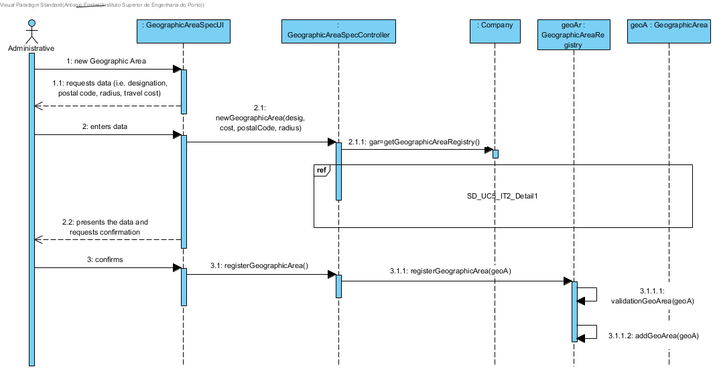
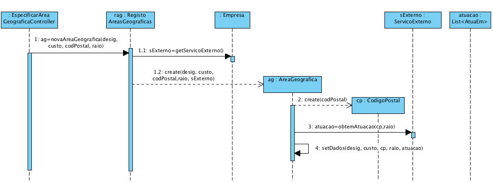
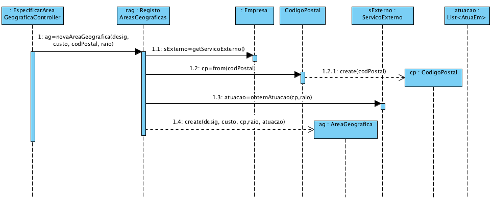
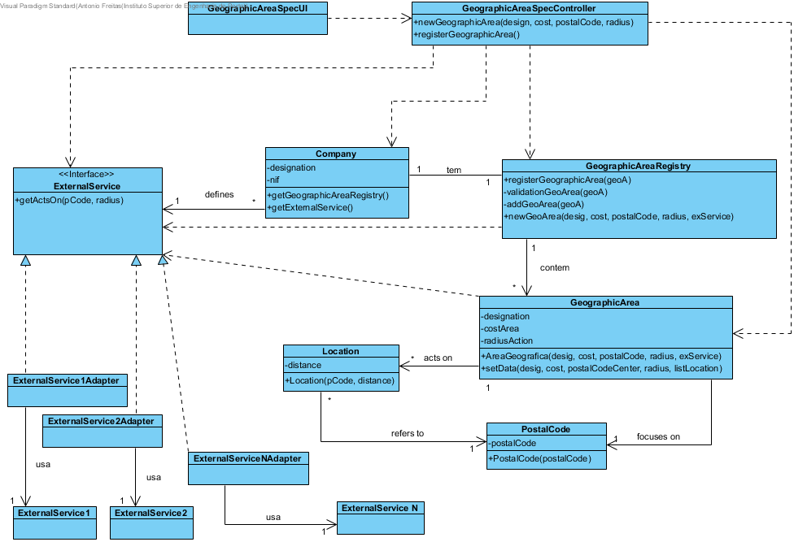

# Realização de UC5 Especificar Área Geográfica

## Racional

| Fluxo Principal                                                                                        | Questão: Que Classe...                                      | Resposta                                       | Justificação                                                                                                         |
|:-------------------------------------------------------------------------------------------------------|:------------------------------------------------------------|:-----------------------------------------------|:---------------------------------------------------------------------------------------------------------------------|
| 1. O administrativo inicia a especificação de uma nova área geográfica. | ... interage com o utilizador? | EspecificarAreaGeograficaUI.                          | Pure Fabrication, pois não se justifica atribuir esta responsabilidade a nenhuma classe existe no Modelo de Domínio. |
|| ... coordena o UC?                                                                              | EspecificarAreaGeograficaController                                | Controller.                                    |                                                                                                                      |
|| ... cria/instancia área geográfica?          | RegistoAreasGeograficas                                               | Creator (Regra 1) + HC+LC : Empresa delega em RegistoAreasGeograficas                             |                                                                                                                      |
| 2. O sistema solicita os dados necessários (i.e. designação, **código postal, raio**, custo de deslocação).  |                  |                                                |                                                                                                                      |
| 3.	O administrativo introduz os dados solicitados.   | ... guarda os dados introduzidos?                    |Área Geográfica                                    | Information Expert (IE) - instância criada no passo 1                                                                                              |
| 4.	 **O sistema obtém os códigos postais cobertos pela nova area geográfica**, valida e apresenta os dados e ao administrativo, pedindo que os confirme.                                                              | ... valida os dados da área geográfica (validação local)? | Área Geográfica                                     | IE: Área Geográfica possui os seus próprios dados                                                                                                                   |
|| ... valida os dados da Área Geográfica (validação global)?                                           | RegistoAreasGeograficas                                               | IE: RegistoAreasGeograficas contém/agrega AreasGeograficas |                                                                                                                      |
||...disponibiliza os códigos postais num raio de ação|ServicoExterno|IE: no MD ServicoExterno fornece essa informação. |
||...qual é o resultado expetável do ServicoExterno|List\<AtuaEm>|IE: no MD ServicoExterno informa várias "AtuaEm". |
||... conhece o ServicoExterno|Empresa|IE: no MD Empresa define ServicoExterno. Protected Variation sobre ServicoExterno visto que o sistema deve suportar vários serviços externos|
||...implementa as particularidades de cada serviço externo em concreto?|ServicoExtenoXXXAdapter|ProtectedVariation + Adapter|
| 5. O administrativo confirma.                                                                     |                                                             |                                                |                                                                                                                      |
| 6.	O sistema regista os dados e informa o administrativo do sucesso da operação.                           | ... guarda a área geográfica  especificada/criada?                            | Empresa                                 | IE. No MD a Empresa atua em várias áreas geográficas                                                                |
|| ... notifica o utilizador?                                                                                   | EspecificarCategoriaUI                                        |                                                |                                                                                                                      |

## Sistematização ##

 Do racional resulta que as classes conceptuais promovidas a classes de software são:

 * Empresa
 * Área Geográfica
 * ServicoExterno
 * AtuaEm

Outras classes de software (i.e. Pure Fabrication) identificadas:  

 * EspecificarAreaGeograficaUI  
 * EspecificarAreaGeograficaController
 * RegistoAreasGeograficas

##	Diagrama de Sequência
### Solução Base

**Esta solução base é complementada/detalhada com uma das alternativas abaixo apresentadas.
Aplicou-se _"Interaction Use"_ para que o Diagrama de Sequência referencie o diagrama que detalha/complementa este.**

### Detalhe - Alternativa A

### Detalhe - Alternativa B

### Detalhe - Outras Alternativas

Outras alternativas são possíveis e aceitáveis.
Por exemplo, uma alternativa semelhante à alternativa A mas que adote a forma de criação de "CodigoPostal" usada na alternativa B (através do método "from").

**Contudo, a forma de criação de "CódigoPostal" da alternativa A (através do seu construtor) está mais coerente com as restante proposta de solução.**

##	Diagrama de Classes
De acordo com a alternativa A.

