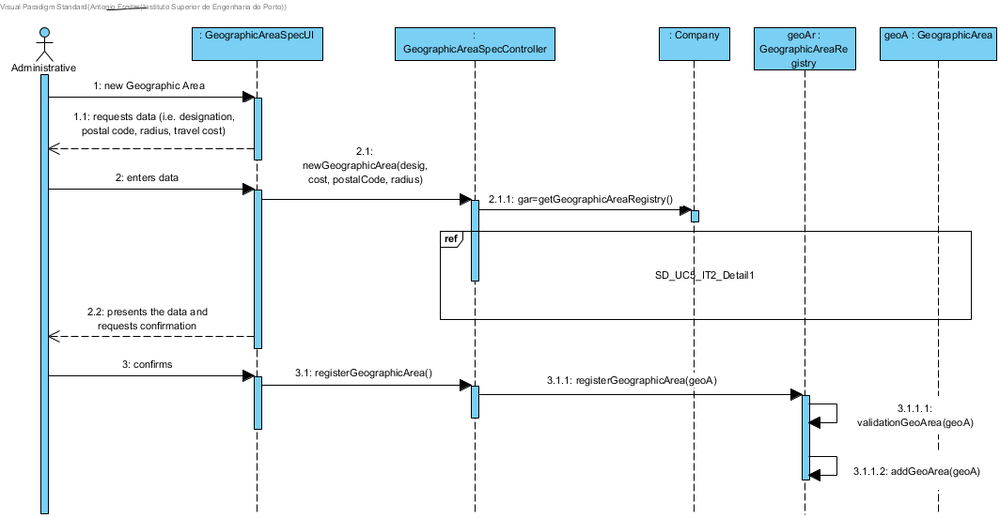
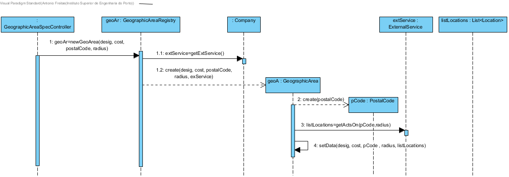
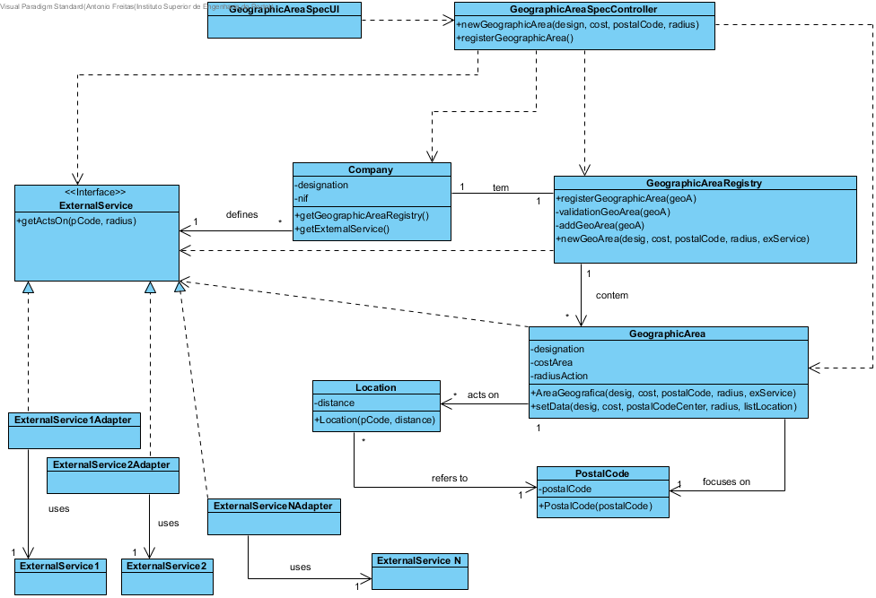

# Realization of UC5  Specify Geographic Area

## Rational

  | Flow Main                                                                                        | Questions: Which class...                                      | Answer                                       | Justification                                                                                                         |
|:-------------------------------------------------------------------------------------------------------|:------------------------------------------------------------|:-----------------------------------------------|:---------------------------------------------------------------------------------------------------------------------|
| 1. The administrative begins to specify a new geographical area. | ... interacts with the user? | GeographicAreaSpecUI.                          | Pure Fabrication, because it is not justified to attribute this responsibility to any class existing in the Domain Model. |
|| ... coordinates the UC?                                                                              | GeographicAreaSpecController                                | Controller.                                    |                                                                                                                      |
|| ... create/instance Geographic Area?          | GeographicAreaRegistry                                               | Creator (Rule 1) + HC+LC : Company delegates to GeographicAreaRegistry                              |                                                                                                                      |
| 2. The system requests the required data (i.e. designation, postal code, radius, travel cost).  |                  |                                                |                                                                                                                      |
| 3.	The administrator enters the requested data.   | ...saves the submitted data?                    |Geographic Area                                    | Information Expert (IE) - instance created in step 1                                                                                              |
| 4.	 The system obtains the postal codes covered by the new geographical area, validates the gathered data and presents it to the administrative, requesting to confirm the data.                                                              | ... validates the data of the new Geographic Area (local validation?) | Geographic Area                                     | IE: Geographic Area has its own data                                                                                                                    |
|| ... validates the data of the new Geographic Area (global validation)?                                           | GeographicAreaRegistry                                               | IE: GeographicAreaRegistry contains/adds Geographic Area |                                                                                                                      |
||...provides the available postal codes available within a radius/range of action|ExternalService|IE: in Domain Model External Service provides this information. |
||...what is the expected outcome from ExternalService|List\<Location>|IE: in the Domain Model the ExternalService provides information about several "Location" lists. |
||... knows the ExternalService|Company|IE: the Domain Model defines the ExternalService. Protected Variation regarding ExternalService since the system must support several external services|
||...implements the particularities of each external service in concrete?|ExternalServiceXXXAdapter|ProtectedVariation + Adapter|
| 5. The administrative confirms.                                                                     |                                                             |                                                |                                                                                                                      |
| 6.	The system records the data and informs the administrative the success of the operation.                           | ... saves the specified / created geographic area?                            | Company                                 | IE. In the Domain Model the company operates in several geographical areas                                                                |
|| ... notifies the user?                                                                                   | GeographicAreaSpecUI                                        |                                                |                                                                                                                      |

## Systematization ##

 From the rationale results that the following conceptual classes are promoted to software classes are:

 * Company
 * GeographicArea
 * ExternalService
 * Location

Other software classes (i.e. Pure Fabrication) identified:  

 * GeographicAreaSpecUI  
 * GeographicAreaSpecController
 * GeographicAreaRegistry

##	Sequence Diagram
### Solução Base

**It was applied _"Interaction Use"_ so that the Sequence Diagram has a reference to the diagram that details / complements the main diagram.**

### Detail Diagram

##	Class Diagram

