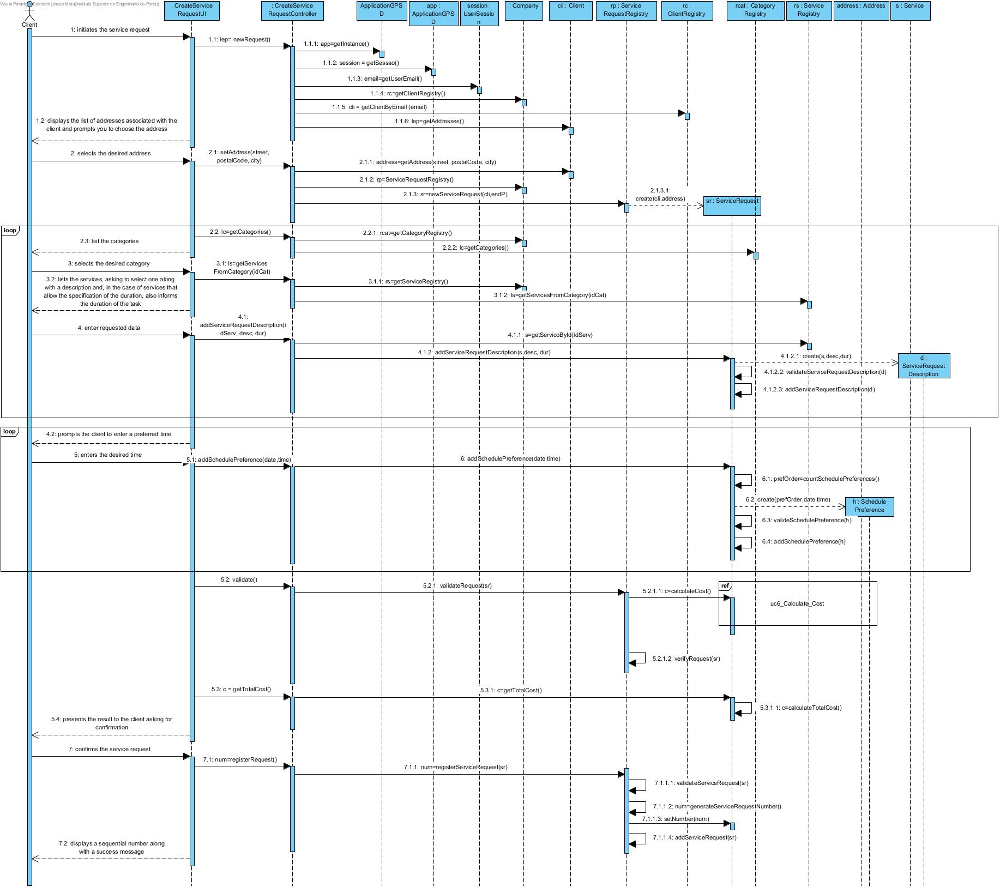
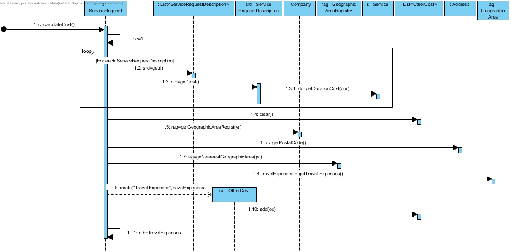
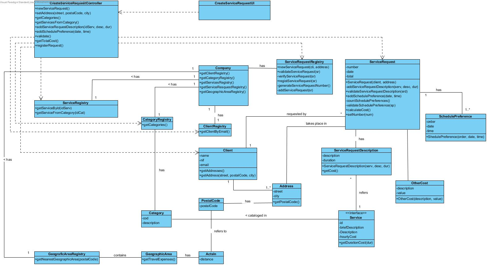

# Realization of UC6 Create Service request

## Rationale

| Main Flow                                                                                        | Question: Witch Class?...                                      | Answer                                       | Justification                                                                                                         |
|:-------------------------------------------------------------------------------------------------------|:------------------------------------------------------------|:-----------------------------------------------|:---------------------------------------------------------------------------------------------------------------------|
|1. The client initiates the service request.  | ... interacts with the user? | CreateServiceRequestUI | Pure Fabrication |
|| ... controlls the UC? | CreateServiceRequestController | Controller | |
|| ... create/instantiate Service Request? | ServiceRequestRegistry | Creator (rule 1) + HC + LC | |
|2. The system displays the list of addresses associated with the client. |... knows the customer's postal addresses? | Client | IE: The client has one or more Address. |
|3. The client selects the desired address. | ... saves the desired address?| ServiceRequest|IE: Instance previously created. In domain model a ServiceRequest takes place in one address. |
|4. The system presents the categories of the services and asks the client to select one|... who has the information about categories? | CategoryRegistry | IE: CategoryRegistry has Category|
|5. The client selects the desired category. | | | |
|6. The system presents the services of this category, asking the client to select one of them along with a description of the task and, in the case of services that allow the specification of the duration, also informs the duration of the task. | ...has the services of a specified category? | ServiceRegistry | IE: ServiceRegistry has Service information. |
|||Service|IE: In the DM the service has information about its own category.|
|7.The client selects the desired service and enters the description and estimated duration. | |||
|8. The system validates and stores the information entered. |...saves the information?|ServiceRequestDescription|IE:In the DM a ServiceRequest has 1 or more ServiceRequestDescription.|
||...create/instantiate ServiceRequestDescription?|ServiceRequest|Creator (rule 1)|
||...validates the data?(local)| ServiceRequestDescription |IE|
||...validates the data?(global)| ServiceRequest |IE|
|9. Steps 4 through 8 are repeated until all services desired by the customer are specified ||||
|10. The system requests the required data (i.e. start date and time) to execute the task. ||||
|11. The client enters the desired time.||||
|12. The system validates and saves the time.|...validate and save the indicated time?|SchedulePreference|IE|
||| PedidoPrestacaoServico |IE: the DM a ServiceRequest has SchedulePreference |
||...create/instantiate SchedulePreference?|ServiceProvider|Creator(rule 1)|
|13. Steps 10 through 12 are repeated until at least one time is set.||||
|14. The system validates the request, calculates the estimated cost, and presents the result to the client asking them to confirm. |... validates the data?(local validation?)|ServiceRequest|IE|
||... validates the request? (global validation)|ServiceRequestRegistry|IE: ServiceRequestRegistry has information about all the Service Resquests|
||...calculates the total cost?|ServiceRequest|IE: knows all the services requested and the address.|
||| ServiceRequestDescription |IE: knows the duration and the service. |
||| Service |IE: knows the cost per hour.|
||...save the travel cost?|OtherCost|IE: in DM an ServiceRequest has several OutroCusto|
||...create/instantiate OtherCost| ServiceRequest |Creator (rule 1)|
|15. The client confirms the request. ||||
|16. The system registers it, assigns it a sequential number, ** sends the request information by email to the client ** and presents it to the client together with a message of success. | ... generates the sequential number? | ServiceRequest |IE.: knows all the requests.|
||...save the sequential number?|ServiceRequest|IE: instance previously created.|
||...saves request?| RegistoPrestacaoServico |IE: ServiceRequestRegistry saves all the requests.|
||...notifies the number generated and the success information?| CreateServiceRequestUI ||

## Systematization ##

 The conceptual classes from the rationale are promoted to software classes:

 * Company
 * Client
 * Service
 * Category
 * ServiceRequest
 * ServiceRequestDescription
 * SchedulePreference
 * OtherCost

Other software classes (i.e. Pure Fabrication) identified:

 * CreateServiceRequestUI  
 * CreateServiceRequestController
 * ClientRegistry
 * CategoryRegistry
 * ServiceRegistry
 * ServiceRequestRegistry
 * GeographicAreaRegistry

##    Sequence Diagram

##    Class Diagram

