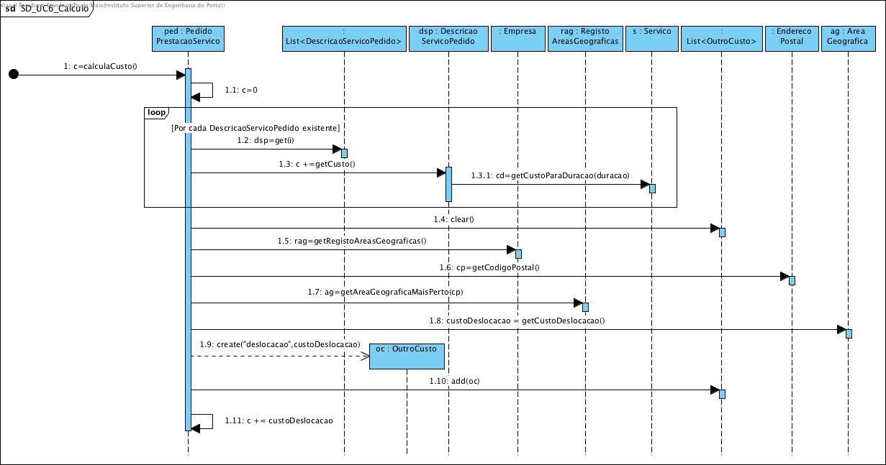
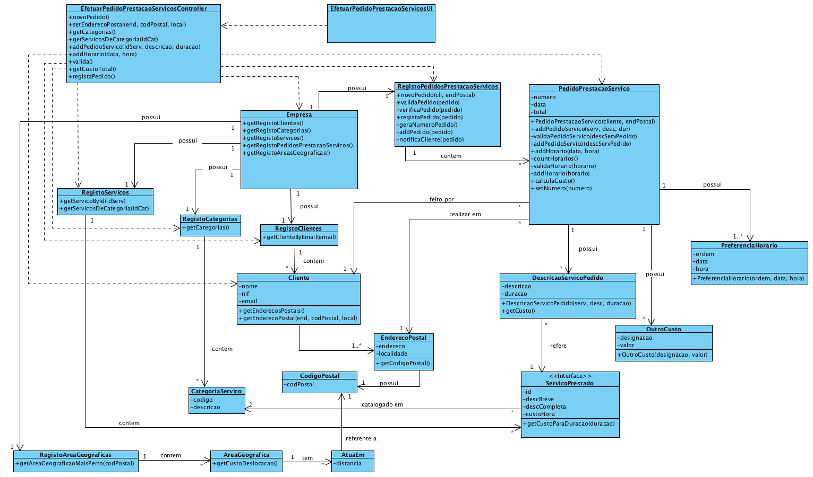

# Realização de UC6 Efetuar Pedido de Prestação de Serviços

## Racional

| Fluxo Principal                                                                                        | Questão: Que Classe...                                      | Resposta                                       | Justificação                                                                                                         |
|:-------------------------------------------------------------------------------------------------------|:------------------------------------------------------------|:-----------------------------------------------|:---------------------------------------------------------------------------------------------------------------------|
|1. O cliente inicia o pedido de prestação de serviços.  | ... interage com o utilizador? | EfetuarPedidoPrestacaoServicosUI | Pure Fabrication, pois não se justifica atribuir esta responsabilidade a nenhuma classe existe no Modelo de Domínio. |
|| ... coordena o UC? | EfetuarPedidoPrestacaoServicosController | Controller | |
|| ... cria/instancia Pedido de Prestação Serviços? | RegistoPedidoPrestacaoServiços | Creator (regra 1) + HC +LC sobre Empresa| |
|2. O sistema mostra os endereços postais associados ao cliente e pede-lhe para escolher o endereço no qual pretende que os serviços sejam prestados. |... conhece os endereços postais do cliente? | Cliente | IE: O Cliente possui 1 ou mais Endereço Postais |
|3. O cliente seleciona o endereço postal pretendido. | ... guarda o endereço postal selecionado? | PedidoPrestacaoServico|IE: Instância criada anteriormente. No MD um PedidoPrestacaoServico realiza-se num EnderecoPostal. |
|4. O sistema apresenta as categorias de serviços e pede ao cliente para selecionar uma.|... conhece as categorias existentes? | RegistoCategorias | IE: RegistoCategorias possui Categoria|
|5. O cliente seleciona a categoria pretendida. | | | |
|6. O sistema apresenta os serviços dessa categoria, pedindo ao cliente para selecionar um deles e complemente com uma descrição representativa da tarefa a executar e, no caso de serviços que permitam a especificação da duração, também informa qual é a duração esperada para a execução da tarefa. | ...conhece os serviços de uma dada categoria? | RegistoServicos | IE: RegistoServicos conhece todos os Servico. |
|||Servico|IE: No MD conhece a Categoria em que está catalogado.|
|7. O cliente seleciona o serviço pretendido e introduz a descrição e duração estimada. | |||
|8. O sistema valida e guarda a informação introduzida. |...guarda os dados introduzidos?|DescricaoServicoPedido|IE:No MD um Pedido tem várias DescricaoServicoPedido com estes dados.|
||...cria/instancia DescricaoServicoPedido?|PedidoPrestacaoServico|Creator (regra 1)|
||...valida os dados?(local)| DescricaoServicoPedido |IE: são os seus próprios dados.|
||...valida os dados?(global)| PedidoPrestacaoServico |IE: conhece todas as suas  descrições.|
|9. Os passos 4 a 8 repetem-se até que todos os serviços pretendidos pelo cliente estejam especificicados. ||||
|10. O sistema solicita a introdução de um horário (data e hora de início) preferido para a execução da tarefa. ||||
|11. O cliente introduz o horário pretendido.|||| 
|12. O sistema valida e guarda o horário introduzido.|...valida e guarda o horário indicado?|PreferenciaHorario|IE: são os dados deste conceito.|
||| PedidoPrestacaoServico |IE: no MD um PedidoPrestacaoServico possui várias PreferenciaHorario |
||...cria/instancia PreferenciaHorario?|PedidoPrestacaoServico|Creator(regra 1)|
|13. Os passos 10 a 12 repetem-se até que pelo menos um horário esteja definido.
|14. O sistema valida o pedido, calcula o custo estimado e apresenta o resultado ao cliente pedindo-lhe que confirme. |... valida o pedido?(validação local)|PedidoPrestacaoServico|IE: conhece a sua própria informação.|
||...valida o pedido? (validação global)|RegistoPrestacaoServico|IE: RegistoPrestacaoServico conhece todos os Pedidos|
||...calcula o custo total?|PedidoPrestacaoServico|IE: conhece todos os serviços pedidos e o endereço postal onde estes serão prestados.|
||| DescricaoServicoPedido |IE: conhece a duração e o serviço pretendido.|
||| Servico |IE: conhece o seu custo/hora.|
||...guarda o custo deslocação?|OutroCusto|IE: no MD um Pedido tem vários OutroCusto|
||...cria/instancia OutroCusto| PedidoPrestacaoServico |Creator (regra 1)|
|15. O cliente confirma o pedido. 
|16. O sistema regista-o, atribui-lhe um número sequencial, **envia a informação do pedido por email ao cliente** e apresenta-o ao cliente juntamente com uma mensagem de sucesso. | ... gera o numero sequencial? | RegistoPrestacaoServico |IE.: conhece todos os pedidos já recebidos.|
||...guarda o numero sequencial?|PedidoPrestacaoServico|IE: instancia criada anteriormente.|
||...guarda o Pedido?| RegistoPrestacaoServico |IE: RegistoPrestacaoServico recebe todos os Pedidos.|
||...notifica por email o cliente?| RegistoPrestacaoServico ||
||...notifica o numero gerado e a informação de sucesso?| EfetuarPedidoPrestacaoServicosUI ||

## Sistematização ##

 Do racional resulta que as classes conceptuais promovidas a classes de software são:

 * Empresa
 * Cliente
 * Serviço
 * Categoria
 * PedidoServico
 * DescricaoServicoPedido
 * PreferenciaHorario
 * OutroCusto

Outras classes de software (i.e. Pure Fabrication) identificadas:  

 * EfetuarPedidoPrestacaoServicosUI  
 * EfetuarPedidoPrestacaoServicosController
 * RegistoClientes
 * RegistoCategorias
 * RegistoServicos
 * RegistoPedidosServicosPrestados
 * RegistoAreasGeograficas

##	Diagrama de Sequência

##	Diagrama de Classes

