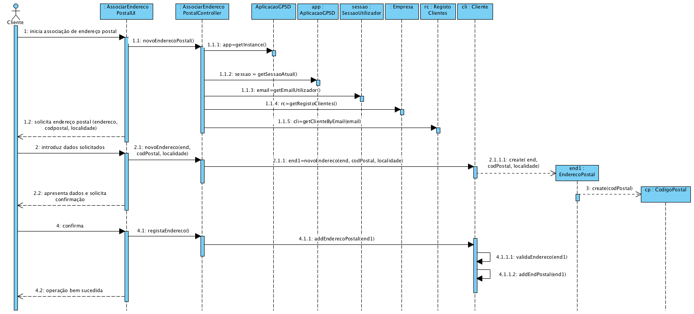
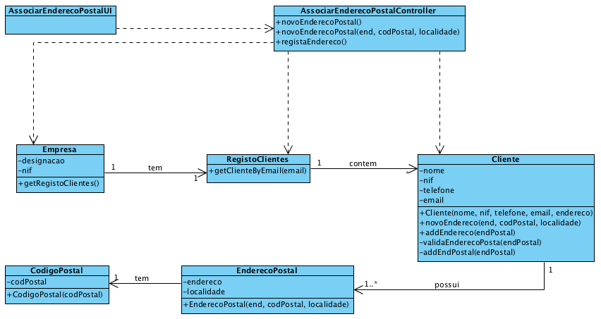

Realization of UC7 Add new address to client
==========================================

Rationale
--------

| Main Flow                                                                     | Question: Which class...                             | Answer                         | Justification                                                                                            |
|-------------------------------------------------------------------------------|----------------------------------------------------|----------------------------------|---------------------------------------------------------------------------------------------------------|
| 1. The Client begins the process of adding a new address.                     | ... interacts with the user?                       | AddNewAddressToClientUI          | PureFabrication |
|                                                                               | ...controls the UC?                                  | AddNewAddressToClientController  | Controller                                                                                              |
| 2. The system requests the required data (Address).                           | n/a                                                |                                  |                                                                                                         |
| 3. The Client enters the requested data.                                      | ... create/ instantiate Address?            | Client                           | Creator (rule 4)                                                                                       |
|                                                                               | ... save the data               ?                  | Address                    | IE - instance created in the first step                                                                       |
|||PostalCode|IE. Address has a PostalCode|
| 4. The system validates and displays the data, asking for confirmation.       | ...validates the address data (local validation)?  | Address                    | IE  |
|                                                                               | ...validates the address data (global validation)? | Client                           | IE: Client has/aggregates all Postal Addresses.                                                           |
| 5. The Client confirms.                                                       |                                                    |                                  |                                                                                                         |
| 6. The system ** adds the new address to the Client ** and informs of the success of the operation. | ...save the created Postal Address?                       | Client                   | IE: Client has/aggregates all Postal Addresses.                                      |
|                                                                               | ... notifies the user?                             | AddNewAddressToClientUI         |                                                                                                         |

Systematization
--------------

From the rationale, the following conceptual classes are promoted to software classes : 

- Company

- Client

- Address

- PostalCode

Other software classes (i.e. Pure Fabrication) identified:

-   AddNewAddressToClientUI

-   AddNewAddressToClientController

Sequence Diagram
---------------------

Class Diagram
-------------------

