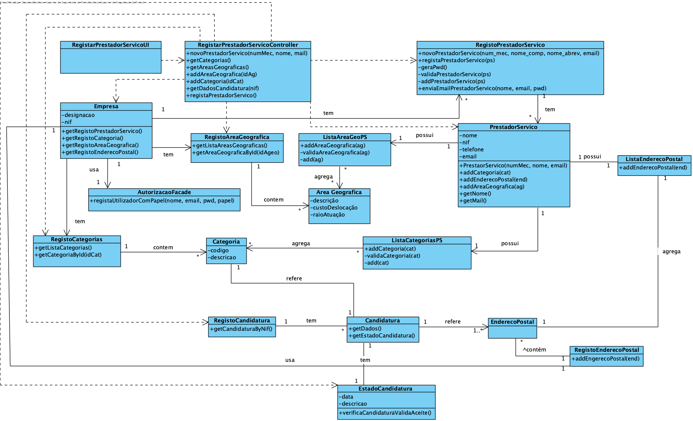

# Realização de UC8 Registar Prestador de Serviço

## Racional

| Fluxo Principal                                                                                        | Questão: Que Classe...                                      | Resposta                                       | Justificação                                                                                                         |
|:-------------------------------------------------------------------------------------------------------|:------------------------------------------------------------|:-----------------------------------------------|:---------------------------------------------------------------------------------------------------------------------|
|1. O FRH inicia o registo de Prestador de Serviço.|... interage com o FRH?|RegistarPrestadorServiçoUI|PureFabrication UI|
||...coordena o UC?|RegistarPrestadorServiçoController|PureFabrication Controller|
||...cria/instancia Prestador de Serviço?|RegistoPrestadorServiço| Padrão HC + LC (sobre Empresa) + Creator (Regra 1)|
|2. O sistema solicita o NIF do Prestador de Serviços.| | | |
|3. O FRH insere os dados solicitados | ...sabe o estado da Candidatura? | EstadoCandidatura | IE |
||...guarda as Candidaturas a Prestador de Serviços?|RegistoCandidaturas| Padrão HC + LC (sobre Empresa)|
||...guarda os dados dos candidatos a Prestador de Serviços?|Candidatura| IE |
|4. O sistema apresenta o nome e solicita confirmação. O FRH ou aceita ou opta por editar o nome. ||||
|| ... guarda o nome?|Prestador de Serviço|Information Expert (IE) - instância criada no passo 1|
|5. O sistema apresenta o email e solicita confirmação. O FRH ou aceita ou opta por editar o email. ||||
|| ... guarda o email?|Prestador de Serviço|Information Expert (IE) - instância criada no passo 1|
|6. O sistema apresenta o contacto telefónico e solicita confirmação. O FRH ou aceita ou opta por editar o contacto telefónico. ||||
|| ... guarda o contacto telefónico?|Prestador de Serviço|Information Expert (IE) - instância criada no passo 1|
|7. O sistema apresenta o Endereço Postal e solicita confirmação. O FRH ou aceita ou opta por editar o Endereço Postal. ||||
||... conhece os endereços postais?|RegistoEnderecoPostal|Information Expert (IE)|
||... guarda os endereços postais? | RegistoEnderecoPostal|Information Expert (IE)|
|8. O passo 6 repete-se para todos os Endereços Postais da Candidatura.||||
|9. O sistema apresenta a Categoria e solicita confirmação. O FRH ou aceita ou opta por editar a Categoria. ||||
||...conhece as categorias?|RegistoCategoria|Information Expert (IE)|
||... guarda as categorias carregadas da candidatura | RegistoCategoria |Information Expert (IE) - No MD o Prestador de Serviço está habilitado em uma ou mais categorias|
|10. O sistema valida e apresenta os dados, pedindo que os confirme.|...valida os dados do Prestador de Serviço (validação local)?|Prestador de Serviço|IE: Prestador de Serviço possui os seus próprios dados|
||...valida os dados do Prestador de Serviço (validação global)?|RegistoPrestadorServiço|IE: O RegistoPrestadorServiço contém/agrega Prestadores de Serviço|
|11. O FRH confirma. ||||
|12. O sistema **regista os dados de Prestador de Serviço e de Prestador de Serviço registado, notifica o Prestador de Serviço dos seus dados de acesso** e informa o FRH do sucesso da operação.|...guarda o Prestador de Serviço registado?|RegistoPrestadorServiço|IE. o RegistoPrestadorServiço contém/agrega Prestadores de Serviço|
|| ... guarda os dados de utilizador deste Prestador de Serviço?  | AutorizacaoFacade | IE. A gestão de utilizadores é responsabilidade do componente externo respetivo cujo ponto de interação é através da classe "AutorizacaoFacade" |   
|| ... notifica o Prestador de Serviço dos seus dados de acesso  | RegistoPrestadorServiço | IE: possui os dados para o fazer.|                                               

## Sistematização ##

 Do racional resulta que as classes conceptuais promovidas a classes de software são:

 * Empresa
 * FRH
 * Prestador de Serviço
 * Categoria
 * Área Geográfica

Outras classes de software (i.e. Pure Fabrication) identificadas:  

 * RegistarPrestadorServiçoUI  
 * RegistarPrestadorServiçoController
 * RegistoPrestadorServiço
 * RegistoCategoria
 * RegistoÁreaGeográfica
 * RegistoEnderecoPostal
 * Autorização/Facade

##	Diagrama de Sequência

##	Diagrama de Classes

