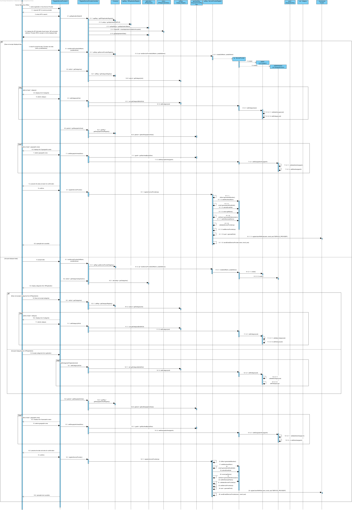

# Realização de UC8 Registar Prestador de Serviço

## Racional

| Fluxo Principal                                                                                        | Questão: Que Classe...                                      | Resposta                                       | Justificação                                                                                                         |
|:-------------------------------------------------------------------------------------------------------|:------------------------------------------------------------|:-----------------------------------------------|:---------------------------------------------------------------------------------------------------------------------|
|1. O FRH inicia o registo de Prestador de Serviço.|... interage com o FRH?|RegistarPrestadorServiçoUI|PureFabrication UI|
||...coordena o UC?|RegistarPrestadorServiçoController|PureFabrication Controller|
||...cria/instancia Prestador de Serviço?|RegistoPrestadorServiço| Padrão HC + LC (sobre Empresa) + Creator (Regra 1)|
|2. O sistema solicita o NIF do prestador de serviços a registar. |
|3. O FRH introduz o NIF do prestador de serviços.|... guarda o NIF?|Prestador de Serviço|Information Expert (IE) - instância criada no passo 1|
||...sabe o estado da Candidatura?| EstadoCandidatura | IE |
||...guarda as Candidaturas a Prestador de Serviços?|RegistoCandidaturas| Padrão HC + LC (sobre Empresa)|
||...guarda os dados dos candidatos a Prestador de Serviços?|Candidatura| IE |
|4. O sistema apresenta os dados do prestador de serviços (i.e. nome completo, NIF, email institucional, endereço postal, contacto telefónico).|...guarda os dados carregados?|RegistarPrestadorServiçoController|PureFabrication Controller - aguarda decisão do utilizador|
|5. O sistema apresenta a hipostese de o FRH escolher confirmar os dados apresentados ou de introduzir os dados - **alternate.**|..quem controla a decisão?|RegistarPrestadorServiçoController - coordenada UC|
|6. a. **O FRH não aceita os dados e inicia introdução manual dos dados.**|
|6.a.1. O FRH introduz os dados solicitados.|... guarda os dados introduzidos?|Prestador de Serviço|Information Expert (IE) - instância criada no passo 1|
|6.a.2 O sistema mostra as categorias de serviços existentes e solicita uma.|...conhece as categorias?|RegistoCategoria|Information Expert (IE)|
|6.a.3 O FRH seleciona a categoria de serviço pretendida.|||||
|6.a.4 O sistema valida e guarda a categoria selecionada.|... guarda a categoria selecionada| Prestador de Serviço (inclui a lista de categorias do PS)|Information Expert (IE) - No MD o Prestador de Serviço está habilitado em uma ou mais categorias|
|6.a.5 Os passos 6.a.2 a 6.a.4 repetem-se enquanto não forem selecionadas todas as categorias pretendidas (minimo 1).||||
|6.a.6 O sistema mostra as áreas geográficas existentes e solicita uma.|...conhece as áreas geográficas?|RegistoÁreaGeográfica|IE|
|6.a.7 O FRH seleciona a área geográfica pretendida.||||
|6.a.8 O sistema valida e guarda a àrea geográfica selecionada.|... guarda a área geográfica seleccionada?| Prestador de Serviço (inclui a lista de áreas geográficas do PS) |Information Expert (IE) - No MD o Prestador de Serviço atua em uma ou mais áreas geográficas|
|6.a.9 Os passos 6.a.6 a 6.a.8 repetem-se enquanto não forem selecionadas todas as áreas geográficas pretendidas (minimo 1).||||
|6.a.10 O sistema valida e apresenta os dados, pedindo que os confirme.|...valida os dados do Prestador de Serviço (validação local)?|Prestador de Serviço|IE: Prestador de Serviço possui os seus próprios dados|
||...valida os dados do Prestador de Serviço (validação global)?|RegistoPrestadorServiço|IE: O RegistoPrestadorServiço contém/agrega Prestadores de Serviço|
|6.a.11 O FRH confirma. ||||
|6.a.12 O sistema **regista os dados de Prestador de Serviço e de Prestador de Serviço registado, notifica o Prestador de Serviço dos seus dados de acesso** e informa o FRH do sucesso da operação.|...guarda o Prestador de Serviço registado?|RegistoPrestadorServiço|IE. o RegistoPrestadorServiço contém/agrega Prestadores de Serviço|
|| ... guarda os dados de utilizador deste Prestador de Serviço?  | AutorizacaoFacade | IE. A gestão de utilizadores é responsabilidade do componente externo respetivo cujo ponto de interação é através da classe "AutorizacaoFacade" |   
|| ... notifica o Prestador de Serviço dos seus dados de acesso  | RegistoPrestadorServiço | IE: possui os dados para o fazer.|
|6. b. **O FRH aceita e confirma os dados fornecidos pelo sistema**|
|6.b.1 O sistema mostra as categorias de serviços da candidatura|...tem os dados da Candidaturas a Prestador de Serviços?|RegistoCandidaturas| Padrão HC + LC (sobre Empresa)|
||...conhece as categorias?|RegistoCategoria|Information Expert (IE)|
|6.2. O sistema apresenta hipotese de escolher confirmar as categorias apresentadas ou de escolher novamente categorias.- **alternate.**|
|6.2.c.1 **O FRH não aceita as categorias e inicia a selecção de novas categorias**|
|6.2.c.2 O sistema mostra as categorias de serviços existentes e solicita uma.|...conhece as categorias?|RegistoCategoria|Information Expert (IE)|
|6.2.c.3 O FRH seleciona a categoria de serviço pretendida.|||||
|6.2.c.4 O sistema valida e guarda a categoria selecionada.|... guarda a categoria selecionada| Prestador de Serviço (inclui a lista de categorias do PS)|Information Expert (IE) - No MD o Prestador de Serviço está habilitado em uma ou mais categorias|
|6.2.c.5 Os passos 6.2.c.2 a 6.2.c.4 repetem-se enquanto não forem selecionadas todas as categorias pretendidas (minimo 1).||||
|6.2.c.6 O sistema mostra as áreas geográficas existentes e solicita uma.|...conhece as áreas geográficas?|RegistoÁreaGeográfica|IE|
|6.2.c.7 O FRH seleciona a área geográfica pretendida.||||
|6.2.c.8 O sistema valida e guarda a àrea geográfica selecionada.|... guarda a área geográfica seleccionada?| Prestador de Serviço (inclui a lista de áreas geográficas do PS) |Information Expert (IE) - No MD o Prestador de Serviço atua em uma ou mais áreas geográficas|
|6.2.c.9 Os passos 6.a.6 a 6.a.8 repetem-se enquanto não forem selecionadas todas as áreas geográficas pretendidas (minimo 1).||||
|6.2.c.10 O sistema valida e apresenta os dados, pedindo que os confirme.|...valida os dados do Prestador de Serviço (validação local)?|Prestador de Serviço|IE: Prestador de Serviço possui os seus próprios dados|
||...valida os dados do Prestador de Serviço (validação global)?|RegistoPrestadorServiço|IE: O RegistoPrestadorServiço contém/agrega Prestadores de Serviço|
|6.2.c.11 O FRH confirma. ||||
|6.2.c.13 O sistema **regista os dados de Prestador de Serviço e de Prestador de Serviço registado, notifica o Prestador de Serviço dos seus dados de acesso** e informa o FRH do sucesso da operação.|...guarda o Prestador de Serviço registado?|RegistoPrestadorServiço|IE. o RegistoPrestadorServiço contém/agrega Prestadores de Serviço|
|| ... guarda os dados de utilizador deste Prestador de Serviço?  | AutorizacaoFacade | IE. A gestão de utilizadores é responsabilidade do componente externo respetivo cujo ponto de interação é através da classe "AutorizacaoFacade" |   
|| ... notifica o Prestador de Serviço dos seus dados de acesso  | RegistoPrestadorServiço | IE: possui os dados para o fazer.|
|6.2.d.1 **O FRH aceita as categorias - prossegue UC**|*******
|7. O sistema mostra as áreas geográficas existentes e solicita uma.|...conhece as áreas geográficas?|RegistoÁreaGeográfica|IE|
|8. O FRH seleciona a área geográfica pretendida.||||
|9. O sistema valida e guarda a àrea geográfica selecionada.|... guarda a área geográfica seleccionada?| Prestador de Serviço (inclui a lista de áreas geográficas do PS) |Information Expert (IE) - No MD o Prestador de Serviço atua em uma ou mais áreas geográficas|
|10. Os passos 8 a 10 repetem-se enquanto não forem selecionadas todas as áreas geográficas pretendidas (minimo 1).||||
|11. O sistema valida e apresenta os dados, pedindo que os confirme.|...valida os dados do Prestador de Serviço (validação local)?|Prestador de Serviço|IE: Prestador de Serviço possui os seus próprios dados|
||...valida os dados do Prestador de Serviço (validação global)?|RegistoPrestadorServiço|IE: O RegistoPrestadorServiço contém/agrega Prestadores de Serviço|
|12. O FRH confirma. ||||
|13. O sistema **regista os dados de Prestador de Serviço e de Prestador de Serviço registado, notifica o Prestador de Serviço dos seus dados de acesso** e informa o FRH do sucesso da operação.|...guarda o Prestador de Serviço registado?|RegistoPrestadorServiço|IE. o RegistoPrestadorServiço contém/agrega Prestadores de Serviço|
|| ... guarda os dados de utilizador deste Prestador de Serviço?  | AutorizacaoFacade | IE. A gestão de utilizadores é responsabilidade do componente externo respetivo cujo ponto de interação é através da classe "AutorizacaoFacade" |   
|| ... notifica o Prestador de Serviço dos seus dados de acesso  | RegistoPrestadorServiço | IE: possui os dados para o fazer.|          

## Sistematização ##

 Do racional resulta que as classes conceptuais promovidas a classes de software são:

 * Empresa
 * FRH
 * Prestador de Serviço
 * Categoria
 * Área Geográfica
 * Candidatura

Outras classes de software (i.e. Pure Fabrication) identificadas:  

 * RegistarPrestadorServiçoUI  
 * RegistarPrestadorServiçoController
 * RegistoPrestadorServiço
 * RegistoCategoria
 * RegistoÁreaGeográfica
 * RegistoCandidaturas
 * Autorização/Facade

##	Diagrama de Sequência

**Nota:** O PrestadorServico possui duas listas (ListaCategoriasPS e ListaAreaGeoPS) obtidas por aplicação de HC+LC. Contudo, optou-se por não expor essas listas para o exterior. Ou seja, a delegação de responsabilidades que ocorreu não é conhecida do resto do sistema (i.e. delegação privada de responsabilidades).

##	Diagrama de Classes

