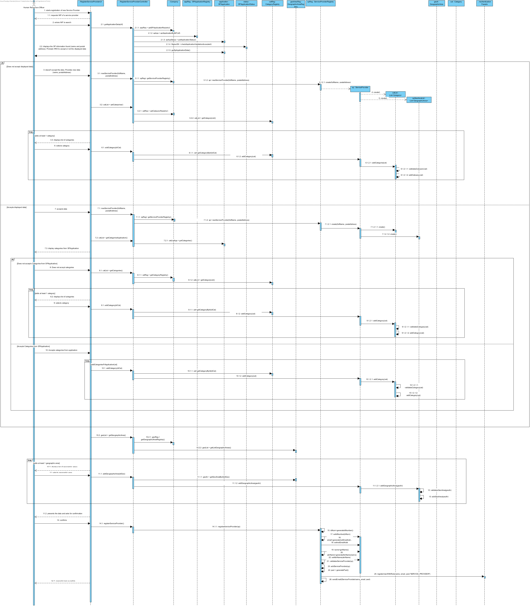
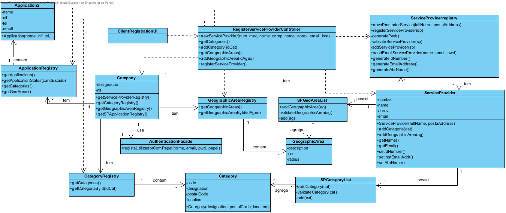

# Realization of UC8 Register Service Provider

## Rationale

| Main Flow                                                                                        | Question: Which class...                                      | Answer                                       | Justification                                                                                                         |
|:-------------------------------------------------------------------------------------------------------|:------------------------------------------------------------|:-----------------------------------------------|:---------------------------------------------------------------------------------------------------------------------|
|1. The HRO starts the registration of Service Provider (SP).|... interacts with the HRO?|RegisterServiceProviderUI|PureFabrication UI|
||...coordinates the UC?|RegisterServiceProviderController|PureFabrication Controller|
||...creates/instance ServiceProvider?|RegisterServiceProvider| Standard HC + LC (on Company) + Creator (Rule 1)|
|2. The system requests the NIF of the service provider to register. |
|3. The HRO enters the NIF of the service provider.|... saves NIF?|ServiceProvider|Information Expert (IE) - instance created in step 1|
||...knows the state of the SPApplication?| SPApplicationStatus | IE |
||...keeps the SPApplication?|SPApplicationRegistry| Standard HC + LC (on Company)|
||...keeps the data of the candidates for ServiceProviders?|SPApplication| IE |
|4. The system displays the SP information found (i.e. full name, **NIF**, postal address).|...saves the loaded data?|RegisterServiceProviderController|PureFabrication Controller - awaits user decision|
|5. The System prompts HRO to accept or not the displayed data - **alternate 1**|...controls the decision?|RegisterServiceProviderController - coordinates UC|
|5.a **The HRO does not accept data and starts manual data entry (full name and postal address).**|
|5.a.1 The HRO enters the requested data.|... keeps the data entered?|ServiceProvider|Information Expert (IE) - instance created in step 1|
|5.a.2 The system displays list of categories and requests one.|...knows the categories?|CategoryRegistry|Information Expert (IE)|
|5.a.3 The HRO selects a category.|||||
|5.a.4 The system validates and saves the selected category.|...keeps the selected category?| ServiceProvider (includes the SP category list)|Information Expert (IE) - In DM the ServiceProvider is enabled in one or more categories|
|5.a.5 Steps 5.a.2 to 5.a.4 repeat until all the desired categories are selected (minimum 1).||||
|5.b **The HRO accepts and confirms the data provided by the system**|
|5.b.1 The system shows the categories of the application.|...has the data for the SPApplication?| SPApplicationRegistry | Standard HC + LC (on Company)|
||...knows the categories?|CategoryRegistry|Information Expert (IE)|
|6. The system proposes that HRO accept or reject the categories included in the SP application. - **alternate 2**|
|6.a **The HRO does not accept categories and starts a new category selection**|
|6.a.1 The system displays list of categories and requests one.|...knows the categories?|CategoryRegistry|Information Expert (IE)|
|6.a.2 The HRO selects a category.|||||
|6.a.3 The system validates and saves the selected category.|...saves the selected category?| ServiceProvider (includes the SP category list)|Information Expert (IE) - In DM the ServiceProvider is enabled in one or more categories|
|6.a.4 Steps 6.a.1 to 6.a.3 repeat until all the desired categories are selected (minimum 1).||||
|6.b **HRO accepts categories - UC continues**||||
|6.b.1 The system allows HRO to add categories to existing ones, shows the list of categories and requests one..|...knows the categories?|CategoryRegistry|Information Expert (IE)|
|6.b.2 The HRO selects a category.|||||
|6.b.3 The system validates and saves the selected category.|...saves the selected category?| ServiceProvider (includes the SP category list)|Information Expert (IE) - In DM the ServiceProvider is enabled in one or more categories|
|6.b.4 Steps 6.b.1 to 6.b.3 repeat until all desired categories are selected..||||
|7. The system shows the existing geographic areas and requests one..|...knows the geographical areas?|GeographicAreaRegistry|IE|
|8. The HRO selects the intended geographical area.||||
|9. The system validates and saves the selected geographic area.|...keeps the selected geographic area?| ServiceProvider (includes the list of geographical areas of the SP) |Information Expert (IE) - In DM ServiceProvider operates in one or more geographic areas|
|10. Steps 8 to 10 repeat until all the desired geographic areas are selected (minimum 1)..||||
|11. The system validates and displays data, asking to confirm.|...validates the ServiceProvider data (local validation)?|ServiceProvider|IE: ServiceProvider has its own data|
||...validates the ServiceProvider data (global validation)?|RegisterServiceProvider|IE: RegisterServiceProvider contains/adds service providers|
|12. The HRO confirms. ||||
|13. The system **registers the SP data and the registered SP, notifies the SP of his access credentials** and informs the HRO of the success of the operation..|...generates the id number? | RegisterServiceProvider | IE the id number is automatically generated randomly|
||...generates the institutional email address? | RegisterServiceProvider | IE automatically generates the institutional email (with the data of the id number and Company name)|
||...generates the abbreviated name? | RegisterServiceProvider | IE automatically generates the abbreviated name (with full name data)|
||...keeps the registered service provider?|RegisterServiceProvider|IE. RegisterServiceProvider contains/adds Service Providers|
||...saves the user data of this ServiceProvider? | AuthorizationFacade | IE. User management is the responsibility of the respective external component whose point of interaction is through the class "AuthorizationFacade" |   
||...notifies the ServiceProvider of his authentication info?  | RegisterServiceProvider | IE: has the data to do|          

## Systematization ##

 From rational it results that the conceptual classes promoted to software classes are:

 * Company
 * HRO
 * ServiceProvider
 * Category
 * GeographicArea
 * SPApplication
 * SPApplicationStatus

Other software classes (i.e. Pure Fabrication) identified:  

 * RegisterServiceProviderUI  
 * RegisterServiceProviderController
 * RegisterServiceProvider
 * CategoryRegistry
 * GeographicAreaRegistry
 * SPApplicationRegistry
 * AuthorizationFacade

##	Sequence Diagram

** Note: ** The Service Provider has two lists (SPcatList and SPgeoAreaList) obtained by application of HC + LC. However, it was decided not to expose these lists abroad. That is, the delegation of responsibilities that occurred is not known from the rest of the system (i.e. private delegation of responsibilities).

##	Class Diagram

