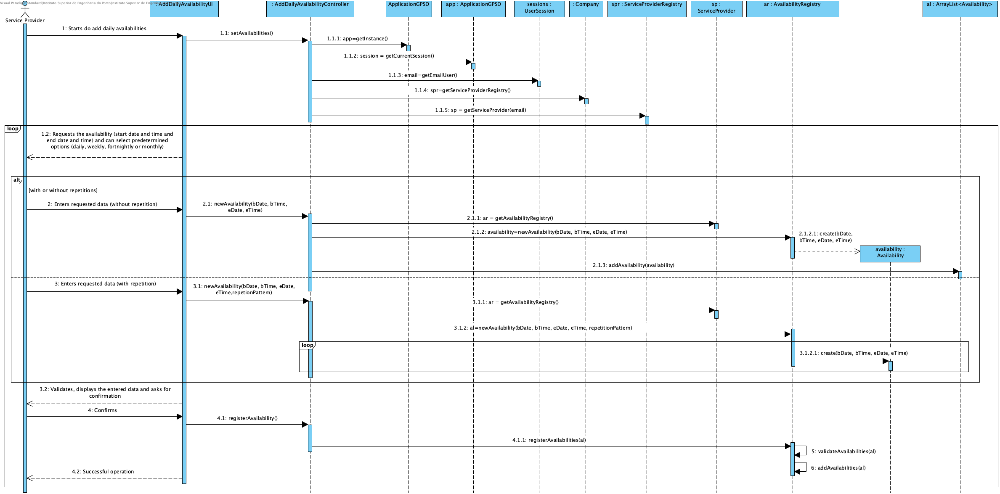
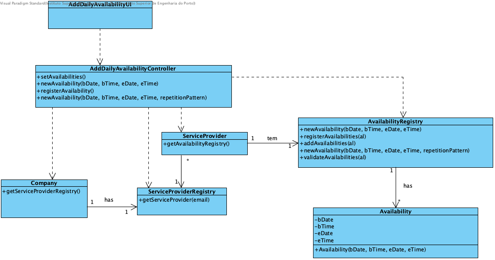

# Realization of UC9 - Add Daily Availability

## Rational

| Fluxo Principal                                                                                        | Question: Which Class...                                      | Resposta                                       | Justification                                                                                                         |
|:-------------------------------------------------------------------------------------------------------|:------------------------------------------------------------|:-----------------------------------------------|:---------------------------------------------------------------------------------------------------------------------|
| 1. The service provider initiates the identification of their daily availability. | ... interacts with the user? | AddAvailabilityUI | Pure Fabrication |
|| ... coordinates the UC? | AddAvailabilityController | Controller |
|| ... create/instance Availability? | ServiceProvider | Creator (rule 2). In the DM Service Provider has several Availability |
|| ... who knows the class ServiceProvider? | ServiceProviderRegistry | HC + LC |
|| ... who knows the class ServiceProviderRegistry? | Company | HC + LC |
||... stores daily availabilities? | AvailabilityRegistry | IE |
| 2. The system requests a period (starting date/time and ending datetime) where the service provider is available to perform services. |||
| 3. The service provider enters the requested data. |... save the entered data?| Availability | Information Expert (IE) - instance created in step 1 |
| 4. The system validates and displays the data for confirmation. | ... validates the entered data (global validation) | AvailabilityRegistry |IE|
| 5. The service provider confirms.||||
| 6. The system saves the availability period and informs the service provider of the success of the operation. ||||
| 7. Steps 2 to 6 are repeated until the availability of the service provider is identified.||||

## Systematization ##

From the rational it results that the conceptual classes promoted to classes of software are:

 * Company
 * ServiceProvider
 * Availability
 * AvailabilityRegistry

Other software classes (i.e. Pure Fabrication) identified:

 * AddAvailabilityUI
 * AddAvailabilityController

##	Sequence Diagram

##	Class Diagram

