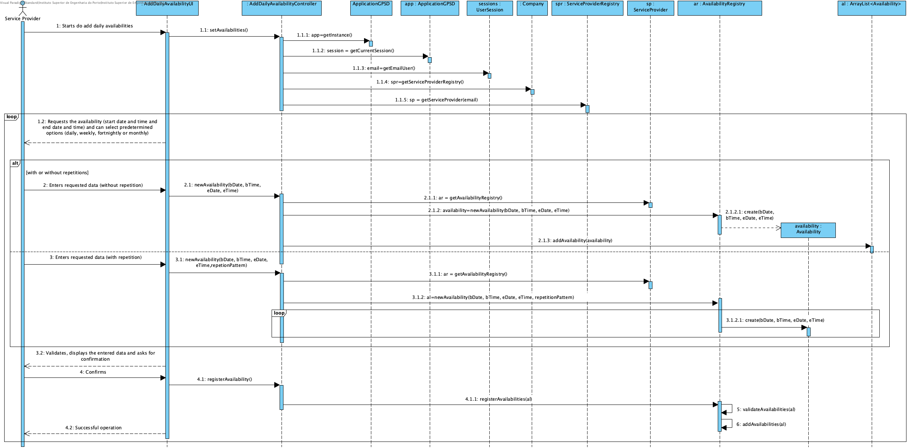

# Realização de UC9 - Indicar Disponibilidade Diária

## Racional

| Fluxo Principal                                                                                        | Questão: Que Classe...                                      | Resposta                                       | Justificação                                                                                                         |
|:-------------------------------------------------------------------------------------------------------|:------------------------------------------------------------|:-----------------------------------------------|:---------------------------------------------------------------------------------------------------------------------|
|1. O prestador de serviços inicia a identificação da sua disponibilidade diária.|... interage com o utilizador?|IndicarDisponibilidadeDiariaUI|Pure Fabrication|
||...coordena o UC?|IndicarDisponibilidadeDiariaController|Controller|
||...cria/instancia Disponibilidade?|PrestadorServiços| Creator (regra 2). No MD PrestadorServiços indica várias Disponibilidade|
||...quem conhece a classe PrestadorServiços?|RegistoPrestadorServiços| HC + LC |
||...quem conhece a classe RegistoPrestadorServiços?| Empresa| HC + LC |
|2. O sistema solicita um período (data e horário de início e data e horário de fim, padrão do período de disponibilidade) em que o prestador de serviços tem disponibilidade para efetuar serviços.| | ||
|3. O prestador de serviços introduz os dados solicitados.| ... guarda os dados introduzidos?|Disponibilidade| Information Expert (IE) - instância criada no passo 1|
|4. O sistema valida e apresenta os dados pedindo confirmação.|...valida os dados introduzidos (validação local)?| Disponibilidade| IE: Disponibilidade possui os seus próprios dados|
| |...valida os dados introduzidos (validação global)?|PrestadorServiços | IE: PrestadorServiços conhece todas as suas Disponibilidade|
|5.O prestador de serviços confirma.| | ||
|6. 6. O sistema regista o período de disponibilidade do prestador de serviços e informa o prestador de serviços do sucesso da operação.|... guarda Disponibilidade?| PrestadorServiços | IE: PrestadorServiços conhece todas as suas Disponibilidade|
|7. Os passos 2 a 6 repetem-se até que a disponibilidade do prestador de serviços esteja identificada.||||
                                        
## Sistematização ##

 Do racional resulta que as classes conceptuais promovidas a classes de software são:

 * Empresa
 * PrestadorServiços
 * Disponibilidade

Outras classes de software (i.e. Pure Fabrication) identificadas:  

 * IndicarDisponibilidadeDiariaUI
 * IndicarDisponibilidadeDiariaController
 * RegistoPrestadorServiço

##	Diagrama de Sequência

##	Diagrama de Classes

