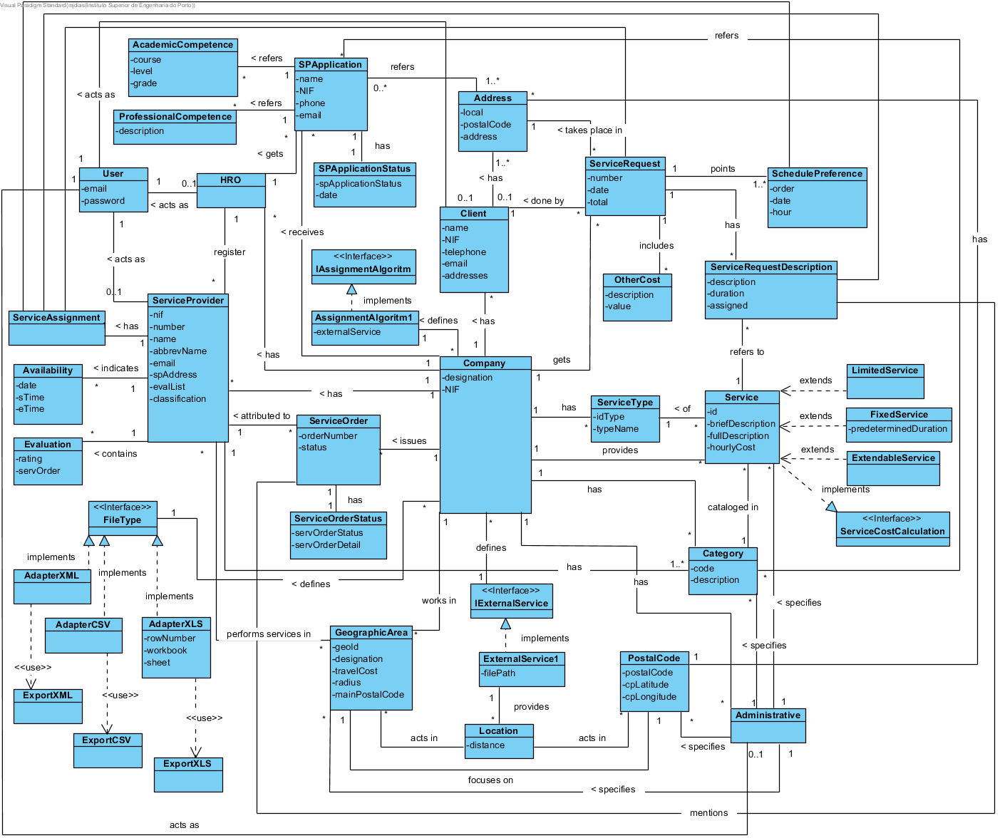

# OO Analysis #

### Rationale for identifying domain classes ###

### _Categories List_ ###

**Business Transactions**

* Request Service;
* Application

---

**Lines of transactions**

* Preference Time
* Service Request Description
* Other additional cost

---

**Products or services related to transactions**

* Service
* Fixed Service
* Limited Service
* Expandable Service

---

**Records (of transactions)**

*  

---  

**People's roles**

* Administrative
* Human Resources (HRO)
* Client
* Service provider
* User
* Unregistered User

---

**Places**

* Geographical area
* Address
* Postal Code

---

**Events**

*

---

**Physical objects**

*

---

**Specifications and descriptions**

* (Specify) Category
* (Specify) Service
* Academic Qualification
* Professional Qualification
* Availability
* Type of service
* Application Status
* Service Order

---

**Catalogs**

*  

---

**Sets**

*

---

**Sets elements**

*  

---

**Organizations**

*  Company

---

**Other systems (external)**

* (User Management Component)
* External Service

---

**(Financial) records, work, contracts, legal documents**

*

---

**Financial instruments**

*  

---

**Referred documents / to perform the tasks**

* Proof Document  

---

###**Rationale on identifying associations between classes**

| Concept (A) 		|  Association   		|  Concept (B) |
|----------	   		|:-------------:		|------:       |
| Administrative | specifies | Category |
| | specifies | Services |
| | specifies | Geographic Area |
| | works for | Company |
| | acts as | User |
| Company | provides | Services |
| | has | Category |
| | acts in | Geographic Area |
| | has | Customer |
| | has | Administrative |
| | has | FRH |
| | has | Service Provider |
| | receive | Request for Provision of Services |
| | receive | Application to Service Provider |
| | define | External Service |
| | have (several) | Type of Service |
|| emits | Service Order |
|| has | Assignment algorithm |
| Service | cataloged in | Category |
| | is requested in | Service Request |
| | referred to in | Service Request Description |
| | is of (one) | Type of Service |
| Fixed Service | is a specialization of | Service |
| | has | Pre-determined duration |
| Service Limited | is a specialization of | Service |
| Expandable Service | is a specialization of | Service |
| Customer | has | Postal Address |
| | acts as | User |
| | realizes | Service Requests |
| Category | catalogs | Service |
| | mentioned in | Application to Service Provider |
| | mentioned in | Service Provider |
| Service Provider | acts as | User |
| | indicates (several) | Services |
| | performs services in (several) | Geographic Area |
| | performs cataloged services in (several) | Category |
| FRH | acts as | User |
| | registers | Service Providers |
| | evaluates | Service Providers |
| Application to Service Provider | mentions | Postal code
| | mentions | Academic Qualification
| | mentions | Professional Qualification
| | mentions | Category of Service
| | has attached | Proof Document
| | has | Application Status
| Service Request | is made by | Customer |
| | includes | Other Additional Cost |
| | indicates | Preferred Time |
| | has | Service Request Description |
| | to be held in | Postal Address |
| Service Request Description | it | Request for Provision of Services |
| | reference | Service |
| Geographic Area | focuses on | Post Code |
| | resorts to | External Service |
| | acts in (several) | Post Code |
| External Service | provides | (Distance + Postal Code) |
| Postal Address | has (a) | Postal Code |
| Service Order | attributed to | Service provider
| | relating to | Request for Service |

## Domain Model

