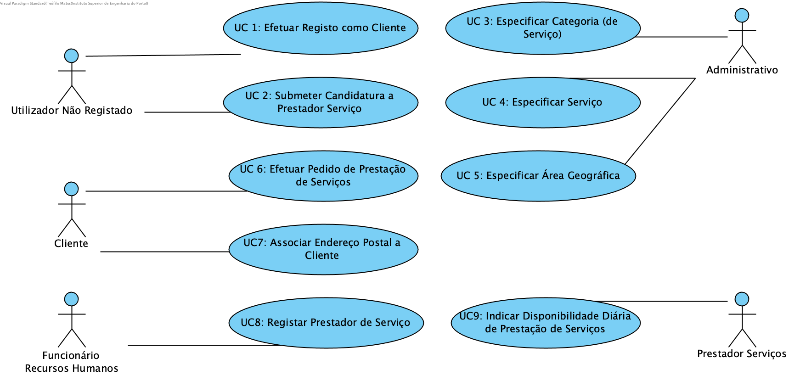

# Use Cases Diagram

# Use Cases
| UC    | Descrição                                                                                                  |
| :---- | :------------------------------------------------------------------------                                  |
| UC1   | [Efetuar Registo como Cliente](CasosUso/UC1_EfetuarRegistoCliente.md)                                      |
| UC2   | [Submeter Candidatura a Prestador Serviço](CasosUso/UC2_SubmeterCandidaturaPrestadorServico.md)            |
| UC3   | [Especificar Categoria (de Serviço)](CasosUso/UC3_EspecificarCategoria.md)                                 |
| UC4   | [Especificar Serviço](CasosUso/UC4_EspecificarServico.md)                                                  |
| UC5   | [Especificar Área Geográfica](CasosUso/UC5_EspecificarAreaGeografica.md)                                   |
| UC6   | [Efetuar Pedido Prestação de Serviços](CasosUso/UC6_EfetuarPedidoPrestacaoServicos.md)                     |
| UC7   | [Associar Endereço Postal a Cliente](CasosUso/UC7_AssociarEnderecoPostal.md)                               |
| UC8   | [Registar Prestador de Serviço](CasosUso/UC8_RegistarPrestadorServiço.md)                                  |
| UC9   | [Indicar Disponibilidade Diária de Prestação de Serviços](CasosUso/UC9_IndicarDisponibilidadeDiaria.md)    |
| UC10  | [Afetar Prestadores a Pedidos de Prestação de Serviços](CasosUso/UC10_AfetarPrestadoresAPedidos.md)        |
| UC11  | [Decidir Sobre Periodo Proposto Para Realização de Serviços](CasosUso/UC11_DecidirSobrePeriodoProposto.md) |
| UC12  | [Consultar Ordens de Execução de Serviço](CasosUso/UC12_ConsultarOrdensDeExecucaoServico.md)               |
