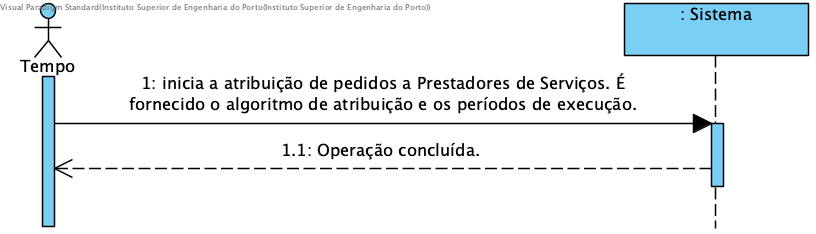

# UC10 - Afetar Prestadores a Pedidos

## Formato Breve
O Scheduler inicia a atribuição de Prestadores de Serviço a Pedidos consoante a configuração selecionada (i.e. algoritmo de atribuição e período de execução).

## SSD

## Formato Completo

### Ator principal

Tempo

### Partes interessadas e seus interesses
* **Prestador de serviços:** tem interesse em realizar serviços requisitados por Clientes.
* **Empresa:** tem interesse em que os pedidos sejam distribuídos pelos Prestadores de Serviços para que os serviços sejam realizados.
* **Cliente:** tem interesse em ver os seus pedidos serem atribuídos a um Prestador da forma mais célere possível.

### Pré-condições
* Existência de Prestadores de Serviços registados no Sistema.
* Existência de pedidos no estado Submetido.

### Pós-condições
* O processo de atribuição de pedidos fica configurado e é executado conforme configurado.

## Cenário de sucesso principal (ou fluxo básico)

1. O Tempo inicia a atribuição de pedidos a Prestadores de Serviços. É fornecido o algoritmo de atribuição e os períodos de execução.
2. Operação concluída.

### Extensões (ou fluxos alternativos)
1a. Configurações não se encontram implementadas.
>	1. O sistema informa quais os dados em falta.
>	2. Caso de uso termina

### Requisitos especiais
\-

### Lista de Variações de Tecnologias e Dados
\-

### Frequência de Ocorrência
\-

### Questões em aberto

\-
