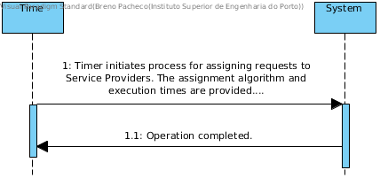

# UC10 - Assign Service Requests to Service Providers

## Brief Format
The Scheduler initiates the assignment of Service Providers to Orders depending on the selected configuration (i.e., assignment algorithm and execution period).

## SSD

## Full Description

### Main actor

Time

### Stakeholders and their interests
* ** Service Provider: ** is interested in performing services requested by Customers.
* ** Company: ** is interested in assigning Services to Service Providers so that services requested by clients may be performed.
* ** Client: ** is interested in having their requested services assigned to a Provider as quickly as possible.

### Preconditions
* Existence of Service Providers registered in the System.
* Existence of Service Requests in submitted state (not yet assigned).

### Postconditions
* The assignment process is configured and runs as configured.

## Main success scenario

1. Time starts the process of assigning requests to Service Providers. The assignment algorithm and execution times are provided for the execution of assignments.
2. Operation completed.

### Extensions (Alternative Flows)
1a. Settings are not implemented.
> 1. The system generates a report about the missing data.
> 2. End of Use Case.

### Special Requirements
\ -

### List of Technologies and Data Variations
\ -

### Frequency of Occurrence
\ -

### Open questions

\ -
-
