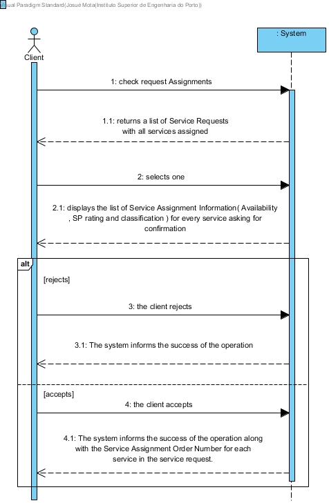

# UC11 - Accept Service Request Assignments

## Brief Description

The Client begins the Assignment verification. The system displays the Service Assignment Information( Availability , SP rating and classification ). The Client Accepts. The system informs the success of the operation along with the Service Assignment Order

## SSD

## Full Description

### Primary Actor

Client

### Stakeholders and Interests
* **Client:** wants to decide whether to accept or reject the Service Provider and availability.
* **Company:** wants the client to have control over the Request Assignment decision.

### Preconditions
n/a

### Postconditions
ServiceOrder Assignment is registered in the system.

## Main Success Scenario

1. The Client begins the Assignment verification.
2. The system displays the Service Assignment Information( Availability , SP rating and classification )
3. The Client Accepts.
4. The system informs the success of the operation along with the Service Assignment Order
5. Steps 2 to 4 repeats until the client verify all Assignments.

### Exception Conditions (alternative flow)

*a. The Client requests the Assignment verification to be cancelled.

> The use case ends.

3a. The Client Rejects
> 1. The system informs the success of the operation.

### Special Requirements
\-

### Variations in technologies and data
\-

### Frequency of occurrence
\-

### Open Questions

* Is it possible to accept all the Service Assignments at once?
* Do I have to save rejected Service Assignments?
* How often does this use case occur?