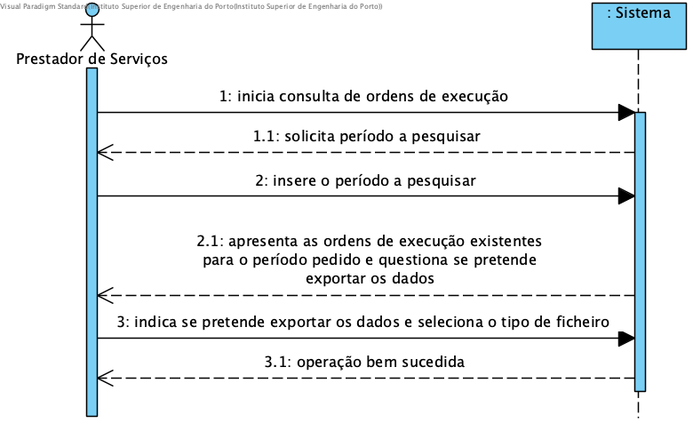

# UC12 - Preview Service Orders in Main Application

## Brief Description

The Service Provider starts consultation service execution orders. The system requests the period for the execution orders. The provider indicates the period. The system shows the service execution orders and asks if the service provider wants to export this data.

## SSD

## Full Description,

### Primary Actor

Service Provider

### Stakeholders and purposes
* **Service Provider:** Service Provider is interested in consulting the execution of orders assigned to it in a given period
* **Company:** Company has an interest in keeping providers informed about its execution orders.

### Preconditions

### Postconditions

## Main Success scenario (or basic flow)
1. The Service Provider initiates the consult of service execution orders.
2. The system prompts to insert the period to search.
3. The Service Provider inserts the period to be searched.
4. The system shows the existing service orders for the selected period and prompts the Service Provider if it wants to export the displayed data.
5. The Service Provider chooses whether to export the data and if so, selects the export format.
6. Successful operation.

### Exception conditions (alternative flow)

*a. The Service Provider requests the cancellation of Preview Service Orders.
> The use case ends.

3a. Inserted period is invalid.
> 1. The system informs that the inserted period is invalid.
> 2. The system allows the Service Provider to re-enter a valid period.
  > 2a. The Service Provider does not change the inserted period. The use case ends.

4a. The system is not able to find service orders for the inserted period.
> 1. The system informs that there are no service orders for the provided period.
> 2. The system allows to re-enter a new period for search (step 3).
  > 2a. The Service Provider does not change the inserted period. The use case ends.

4b. The Service Provider does not want to export the displayed data.
> 1. The service provider cancels the export of data. The use case ends.

5a. The Service Provider fails to selects the format to export the data.
> 1 The use case ends.*

### Special requirements
\-

### Variations in technologies and data
\-
The system must have a list of possible format compatible to export the data, configured in the configuration file for the app.

### Frequency of occurrence
\-

### Open questions
\-
