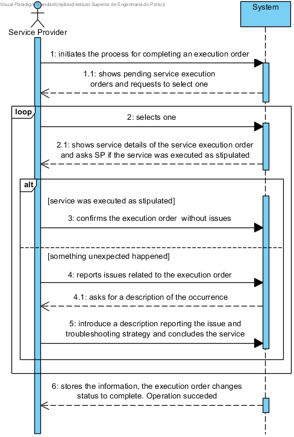

# UC13 - Complete Service

## Brief Description

The Service Provider (SP) initiates the process for completing an execution order. The system shows pending service execution orders and requests to select one. The Service Provider selects one. The system shows the details of the execution order and asks SP if the service was executed as stipulated. The SP can confirm or report any occurrence. If the service was executed as stipulated, the SP concludes it. If something unexpected happened, the system asks for a description of that occurrence. The Service Provider introduce a description reporting the issue and troubleshooting strategy and concludes the service. The system stores the information and the execution order changes status to complete.

## SSD

## Full Description

### Primary Actor

Service Provider

### Stakeholders and purposes
* **Service Provider:** Service Provider is interested in completing the execution of service orders assigned to him
* **Company:** Company is interested in knowing the status of the execution orders

### Preconditions
Existence of pending execution order

### Postconditions

## Main Success scenario (or basic flow)
1. The Service Provider (SP) initiates the process for completing a service order.
2. The system shows pending service execution orders and requests to select one.
3. The Service Provider selects one.
4. The system shows the details of the service order and asks SP if the service was executed as stipulated.
5. The SP can confirm or report any occurrence.
6. If the service was executed as stipulated, the SP concludes it.
7. If something unexpected happened. The system asks for a description of that occurrence.
8. The Service Provider introduce a description reporting the issue and troubleshooting strategy and concludes the service.
9. The system stores the information, the execution order changes status to complete and informs the SP of the success of the operation.

### Exception conditions (alternative flow)
*a. The SP requests cancellation of the process for completing a service order.

2a. The system does not find any pending execution order.
> 1. SP is alerted. The use case ends.*

### Special requirements
\-

### Variations in technologies and data
\-

### Frequency of occurrence
\-

### Open questions

* Does the use case allows to complete more than one execution order at a time?
* After the SP reports an issue and respective troubleshooting strategy, how /when it can be applied to solve the issue?
* How often does this use case occur?
